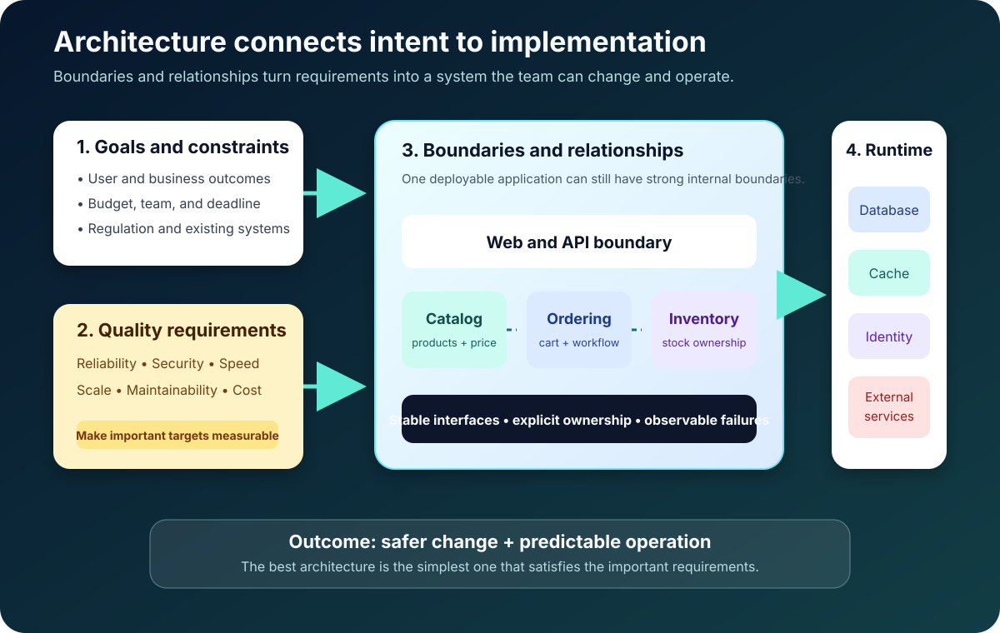

The first time many developers hear *software architecture*, they imagine an enormous diagram: dozens of boxes, arrows in every direction, and perhaps a cloud in the corner for good measure.

That picture is not completely wrong. It is just where architecture becomes visible, not where it begins.

Architecture begins much earlier, with decisions such as these:

- Should the ordering code be allowed to update inventory data directly?
- What happens to checkout when the payment provider is unavailable?
- Can one part of the application be changed without redeploying everything?
- Which problems are important today, and which ones are still imaginary?

These decisions create the shape of a system. At first, that shape can feel invisible. Later, when the product grows, it determines whether a change takes an afternoon or an entire quarter.

That is the simplest useful way to think about software architecture: **it is the structure that controls the cost of change**.



## Architecture becomes obvious when something changes

Imagine a small online store built by four developers.

The first version is one application. It shows products, accepts orders, updates inventory, and sends payment requests. Traffic is modest, deployments are simple, and everybody understands most of the code.

Then the business succeeds.

A mobile application needs the same ordering features. A second payment provider is added. Seasonal traffic becomes unpredictable. Inventory updates slow down checkout, and a payment outage now affects parts of the site that have nothing to do with payments.

The team did not suddenly forget how to write code. The system's original boundaries simply stopped matching the way the business needed to change.

This is why architecture is not a synonym for complexity. A simple architecture can be excellent, and a sophisticated architecture can be disastrous. The question is whether the structure fits the system's real requirements, risks, and team.

## A definition you can actually use

The [Software Engineering Institute](https://www.sei.cmu.edu/blog/reflections-on-20-years-of-software-architecture-a-presentation-by-linda-northrop/) describes software architecture through a system's structures: the software elements, their externally visible properties, and the relationships between them.

Translated into everyday language, architecture answers three questions:

1. **What are the important parts?** A web client, ordering module, database, message broker, or identity provider might be one of them.
2. **What does each part promise to the others?** This could be an API, an event format, a performance expectation, or an ownership rule.
3. **How do those parts interact?** They may call one another, exchange events, share infrastructure, or deliberately remain isolated.

Notice what is missing from that definition: architecture is not one perfect diagram.

A code diagram can show modules and dependencies. A runtime diagram can show requests, messages, and failures. A deployment diagram can show containers, regions, and networks. A data diagram can show ownership, replication, and consistency.

Each view answers a different question. Trying to put all of them into one diagram usually produces something impressive but unreadable.

## The online store does not need microservices yet

Return to our four-person store team. A modular monolith is a sensible starting point: one deployable application, divided into modules with explicit responsibilities.

```text
storefront/
|-- catalog/       # product search and pricing
|-- ordering/      # carts, orders, and order state
|-- inventory/     # stock ownership and reservation
|-- identity/      # local authorization rules
|-- payments/      # interface plus provider adapters
`-- platform/      # database, HTTP, logging, configuration
```

The folder structure alone does not create architecture. The rules do.

For example, `ordering` can ask `inventory` to reserve stock through a defined interface, but it cannot update inventory tables directly. Payment providers sit behind an adapter, so their external contracts do not spread across the application. Durable state lives in PostgreSQL, while application instances remain stateless enough to run behind a load balancer.

This design keeps deployment simple without turning the codebase into an undivided block. If ordering later needs a different owner, release schedule, or scaling profile, the team already has a boundary to discuss.

Could the team start with microservices instead? Certainly. But it would also inherit network failures, distributed tracing, service authentication, independent deployments, and harder data consistency on day one.

Architecture is not about selecting the most powerful option. It is about refusing complexity until the problem earns it.

## Every architecture style sends you a bill

The [Azure Architecture Center](https://learn.microsoft.com/en-us/azure/architecture/guide/architecture-styles/) makes an important point: every architecture style has benefits and challenges. A style is a package of constraints and tradeoffs, not a maturity level.

| Style | Why teams choose it | The bill that arrives later |
| --- | --- | --- |
| Layered architecture | Familiar separation of presentation, business, and data concerns | Layers can become pass-through shells with hidden coupling |
| Modular monolith | Strong internal boundaries with simple deployment | Shared process and database require discipline |
| Microservices | Independent ownership, releases, or scaling | Networking, observability, data consistency, and operations become harder |
| Event-driven architecture | Independent reactions and asynchronous workloads | Ordering, duplicate delivery, and debugging require deliberate handling |
| Serverless architecture | Managed operations for event-driven or variable workloads | Platform limits, cold starts, and vendor coupling may matter |

Real systems often combine styles. The store can be a modular monolith internally, expose HTTP APIs, and publish a small number of integration events. Architectural purity is much less valuable than understandable consequences.

## Architecture is really a conversation about quality

Functional requirements tell us what the store must do: show products, place orders, or issue refunds.

Architecture is often shaped more strongly by quality requirements:

- **Availability:** How much downtime can checkout tolerate?
- **Performance:** Which requests have a latency target?
- **Scalability:** What workload will grow, and by how much?
- **Security:** Which assets, identities, and trust boundaries matter?
- **Maintainability:** How safely can the team change one feature?
- **Cost:** What can the business afford to build and operate?

The wording matters. "The site should be fast" cannot guide a decision. "The product page should meet a 300 ms server-side latency target at expected peak traffic" can be measured and challenged.

Major cloud frameworks use the same kind of multi-dimensional thinking. The [AWS Well-Architected Framework](https://docs.aws.amazon.com/wellarchitected/latest/framework/the-pillars-of-the-framework.html) reviews operational excellence, security, reliability, performance efficiency, cost optimization, and sustainability. The [Google Cloud Well-Architected Framework](https://docs.cloud.google.com/architecture/framework) organizes guidance around similarly broad concerns and encourages systems that can evolve as requirements change.

These frameworks are useful even if you are not building a giant cloud platform. They remind you that optimizing one quality can damage another. More redundancy may improve availability while increasing cost and operational burden. More abstraction may improve flexibility while making simple code harder to follow.

There is no architecture without tradeoffs. There are only tradeoffs you have named and tradeoffs waiting to surprise you.

## Architecture, design, and code are not the same thing

The boundaries are fuzzy, but impact is a useful guide.

- **Architecture** decides the major boundaries and consequences. Ordering owns order state; inventory owns stock.
- **Design** decides how one boundary works internally. Payment providers use a strategy interface.
- **Code** implements that design. `StripePaymentAdapter` handles one provider's API and tests.

A decision becomes architectural when many features, teams, deployments, or data flows begin to depend on it. That means architecture is not reserved for someone with *architect* in a job title. A developer changes the architecture whenever they change data ownership, dependency direction, a public contract, or a deployment boundary.

## Make the decision before drawing the diagram

The most reliable architecture process starts with questions, not products.

First, what outcome must the system create, and for whom? Next, what is constrained by budget, deadlines, existing skills, regulation, or data location? Which two or three quality attributes genuinely shape the solution? Who owns each responsibility and each piece of data?

Only then should the team compare options.

The [Azure design principles](https://learn.microsoft.com/en-us/azure/architecture/guide/design-principles/) emphasize ideas such as designing for change, using managed services appropriately, and making systems observable. In practice, this means evaluating operational cost alongside development convenience and testing the riskiest assumptions with evidence.

If a cache is supposed to solve a latency problem, measure it. If a queue is supposed to absorb a traffic spike, load-test it. If a regional design is supposed to survive a failure, run the failure exercise.

Then record the result in an architecture decision record, or ADR:

```markdown
# ADR-007: Keep ordering in the main application

## Context
Four developers own the product. Ordering does not require independent scale.

## Decision
Keep ordering behind a module API in the modular monolith.

## Consequences
Deployment stays simple. Ordering cannot deploy independently.

## Revisit when
Ordering needs a separate owner, release cadence, or scaling profile.
```

The last section is the most valuable. "Revisit when" prevents today's reasonable decision from quietly becoming a permanent law.

## Documentation should answer a question

Architecture documentation does not need to become a museum of diagrams.

A small system may need only:

- A context diagram showing users and external systems
- A deployment view showing applications and data stores
- A component view for the most important boundaries
- ADRs for decisions that would otherwise be forgotten
- Operational facts such as owners, objectives, dependencies, and failure behavior

Keep these artifacts close to the implementation and update them when boundaries change. A plain diagram that matches production is worth more than a beautiful diagram of last year's system.

## The mistakes beginners are encouraged to make

The first mistake is choosing technology before identifying the problem. "We should use Kubernetes and microservices" sounds like an architecture, but it is only a shopping list.

The second is copying the architecture of a much larger company. A system designed for thousands of engineers and global traffic may be actively harmful to a four-person team.

The third is drawing boxes without defining rules. Labels such as "order service" and "inventory service" mean little until interfaces, data ownership, and failure behavior are clear.

The fourth is ignoring operations. The system must be deployed, monitored, secured, backed up, and recovered. If the architecture works only on a developer's laptop, it is unfinished.

## A checklist for your next system

Before implementation begins, ask:

- Can the team explain the system's purpose and constraints in plain language?
- Are the important quality requirements measurable?
- Does every major part have a clear responsibility?
- Is data ownership explicit?
- Are trust boundaries and external dependencies visible?
- Have deployment, monitoring, failure, backup, and recovery been considered?
- Is this the simplest option that satisfies the real requirements?
- Are the riskiest assumptions supported by evidence?
- Are the important tradeoffs recorded, including when to revisit them?

Software architecture does not have to begin with a committee, a certification, or a wall-sized diagram. It begins when a team makes an important structural decision and takes responsibility for its consequences.

Start with the simplest shape that solves today's problem. Protect the boundaries that make change safer. Measure the qualities that matter. Then let evidence, rather than fashion, tell you when the architecture should evolve.

## Continue learning

- [Spring Boot Layered Architecture: Controller, Service, and Repository](/posts/spring-boot-layered-architecture/)
- [Android App Architecture: UI, Domain, and Data Layers](/posts/android-app-architecture-ui-domain-data-layers/)
- [System Design Caching: Cache-Aside, Expiration, and Invalidation](/posts/system-design-caching-cache-aside-expiration-invalidation/)
- [REST and GraphQL Pagination Strategies](/posts/rest-graphql-pagination-offset-cursor-link-strategies/)

## Sources

- [Software Engineering Institute: Reflections on Software Architecture](https://www.sei.cmu.edu/blog/reflections-on-20-years-of-software-architecture-a-presentation-by-linda-northrop/)
- [Microsoft Azure Architecture Center: Architecture Styles](https://learn.microsoft.com/en-us/azure/architecture/guide/architecture-styles/)
- [Microsoft Azure Architecture Center: Design Principles](https://learn.microsoft.com/en-us/azure/architecture/guide/design-principles/)
- [AWS Well-Architected Framework: The Pillars](https://docs.aws.amazon.com/wellarchitected/latest/framework/the-pillars-of-the-framework.html)
- [Google Cloud Well-Architected Framework](https://docs.cloud.google.com/architecture/framework)
