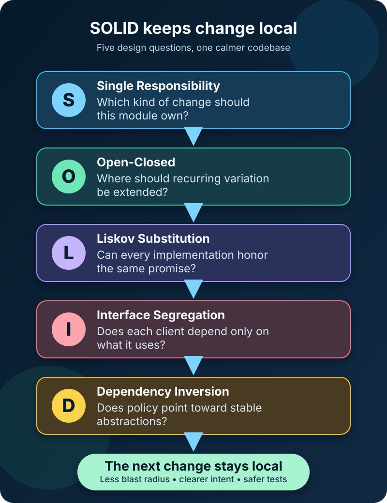

A product manager asks for one small checkout change: customers should be able to collect an order instead of having it shipped.

The request sounds like a new option in a dropdown. Then the team opens the code.

Shipping prices live inside the checkout class. The same class saves orders, formats receipts, and sends email. A long `switch` knows every delivery type. Tests need a database and an email server even when they only check a price.

The feature is still small. The *blast radius* is not.

This is the problem SOLID tries to reduce. **SOLID is a set of five design principles for keeping change focused, contracts trustworthy, and important policy independent from implementation details.** The letters stand for Single Responsibility, Open-Closed, Liskov Substitution, Interface Segregation, and Dependency Inversion.

They are not a command to create an interface for every class. They are questions to ask when code has become difficult to change safely.



## SOLID in one minute

| Principle | Practical question | Pressure it reduces |
| --- | --- | --- |
| Single Responsibility | Which kind of change should this module own? | Unrelated work tangled together |
| Open-Closed | Can new behavior be added behind a stable boundary? | Repeated edits to proven code |
| Liskov Substitution | Can every implementation honor the same promise? | Surprising subtype behavior |
| Interface Segregation | Does each client depend only on what it uses? | Wide, unstable contracts |
| Dependency Inversion | Does policy depend on abstractions rather than details? | Business logic tied to frameworks and infrastructure |

The table makes the principles look separate. In useful designs they reinforce one another. A small interface can support extension, honest implementations can be substituted, and business policy can depend on that stable contract instead of a database or provider.

## Start with the change, not the acronym

Imagine this abbreviated TypeScript checkout service:

```typescript
class CheckoutService {
  complete(order: Order, delivery: "standard" | "express"): void {
    const shipping = delivery === "standard" ? 5 : 12;
    order.total += shipping;
    database.save(order);
    email.send(order.customerEmail, `Paid ${order.total}`);
  }
}
```

It works for two delivery choices. Pickup creates several reasons to edit it: pricing rules change, storage changes, receipt wording changes, and delivery choices change. A failing email might even prevent an otherwise valid order from being saved.

SOLID does not tell us the one correct class diagram. It helps us see why this code resists change.

## S: Single Responsibility separates reasons to change

The Single Responsibility Principle is frequently shortened to “a class should do one thing.” That phrase can mislead. What counts as one thing: completing checkout, charging money, or running an entire application?

Robert C. Martin frames the principle around change: keep together code that changes for the same reason, and separate code that changes for different reasons. His longer explanation connects those reasons to the people or roles asking for them.

In our checkout, delivery pricing may change because of logistics policy. Persistence may change because of platform work. Receipt content may change because of customer communication or regulation. Those are distinct pressures even if one use case coordinates all three.

A better division gives each detail an owner:

```typescript
interface DeliveryPolicy {
  feeFor(order: Order): number;
}

interface OrderWriter {
  save(order: Order): void;
}

interface ReceiptSender {
  sendReceipt(order: Order): void;
}
```

The checkout service may still orchestrate the workflow. Responsibility does not mean every class must contain one method. It means a module has a coherent reason to change.

Splitting mechanically can be just as harmful as never splitting. Five classes named `OrderHelper` do not create clarity. Separate code when the change pressures, rules, or owners are genuinely different.

## O: Open-Closed creates a safe place for variation

The Open-Closed Principle says a module should be open for extension but closed for modification. That does **not** mean old source files must never change. Bug fixes, refactoring, and new understanding all require edits.

The useful idea is narrower: when a known dimension varies repeatedly, create a stable boundary so the next variation can be added without reopening every caller.

Delivery pricing is such a dimension:

```typescript
class StandardDelivery implements DeliveryPolicy {
  feeFor(order: Order): number {
    return order.total >= 50 ? 0 : 5;
  }
}

class StorePickup implements DeliveryPolicy {
  feeFor(_order: Order): number {
    return 0;
  }
}
```

Pickup becomes a new implementation rather than another branch in every checkout path. The stable contract is “calculate the delivery fee for this order”; implementations carry the varying rules.

Do not predict twenty kinds of variation before the second one exists. A direct conditional is often clearer than a premature plugin system. Apply Open-Closed where change is real, recurring, and expensive—not everywhere variation is theoretically possible.

## L: Liskov Substitution protects the promise

An interface is valuable only if its implementations mean the same thing to callers.

The Liskov Substitution Principle says, in practical terms, that code written for a general type should continue to work when given any valid subtype. Liskov and Wing's behavioral subtyping work goes beyond matching method names: subtype behavior must preserve properties expected of the supertype.

Suppose `DeliveryPolicy.feeFor` promises to accept any valid order and return a non-negative fee. This implementation breaks that promise:

```typescript
class InternationalDelivery implements DeliveryPolicy {
  feeFor(order: Order): number {
    if (!order.postalCode) throw new Error("Postal code required");
    return 25;
  }
}
```

The type checker is satisfied, but a caller that safely uses `StandardDelivery` can now fail after substitution. The subtype quietly strengthened the input requirement.

There are several honest repairs. Make the required destination part of every valid `Order`, expose eligibility separately, or create a narrower contract for delivery methods that require an address. The right choice depends on the domain. The principle simply refuses the lie.

Liskov Substitution is not limited to class inheritance. It applies to interface implementations, adapters, mocks, plugin contracts, and any code expected to be interchangeable. A test double that returns states the real service never can also violates the caller's assumptions.

## I: Interface Segregation keeps dependencies narrow

Imagine the platform team offers one convenient interface:

```typescript
interface OrderRepository {
  save(order: Order): void;
  findById(id: string): Order | undefined;
  exportCsv(): string;
  purgeBefore(date: Date): number;
}
```

Checkout only saves orders, yet it depends on reading, reporting, and retention operations. A small change to an unrelated method can force more implementations, mocks, and clients to change.

Interface Segregation says clients should not be forced to depend on operations they do not use. Checkout can depend on `OrderWriter`; an order page can use `OrderReader`; an archival job can use a retention-specific contract.

This does not require one-method interfaces everywhere. Cohesive operations used by the same clients belong together. The smell is a client that needs only a thin slice of a broad contract—or a fake implementation full of “not supported” methods.

Interfaces are shaped for consumers, not for the convenience of the biggest implementation.

## D: Dependency Inversion points code toward policy

Without Dependency Inversion, the checkout service might construct `PostgresOrderWriter` and `SendGridReceiptSender` directly. Its business workflow then depends on database and email details.

Dependency Inversion asks high-level policy to depend on abstractions, while low-level details also implement those abstractions. The source-code arrows point inward toward the stable business need:

```typescript
class CheckoutService {
  constructor(
    private readonly delivery: DeliveryPolicy,
    private readonly orders: OrderWriter,
    private readonly receipts: ReceiptSender,
  ) {}

  complete(order: Order): void {
    order.total += this.delivery.feeFor(order);
    this.orders.save(order);
    this.receipts.sendReceipt(order);
  }
}
```

The application entry point can connect this policy to concrete infrastructure. Tests can connect it to small in-memory implementations. The checkout logic no longer knows whether an order is stored in PostgreSQL, a file, or a test array.

Dependency injection and Dependency Inversion are related but different. Passing dependencies through the constructor is an injection technique. Inversion is the design decision that makes the high-level module own and depend on the abstract contract. A dependency-injection container cannot rescue a design whose business rules still import framework details everywhere.

## What changes after applying SOLID?

Return to the pickup request.

With a stable `DeliveryPolicy`, the team adds `StorePickup`. Because every policy honors the same contract, checkout can substitute it safely. Because checkout depends on the small `OrderWriter` and `ReceiptSender` interfaces, tests do not need the entire infrastructure stack. And because pricing, persistence, and messaging have separate reasons to change, the feature touches fewer unrelated files.

That is the central value: **a change should travel through the smallest honest part of the system**.

SOLID cannot guarantee that outcome. Poor boundaries can wear all five labels. But the principles give a team concrete questions for a code review:

- Are unrelated change pressures mixed here?
- Is the same variation handled by conditionals in many places?
- Can every implementation fulfill the contract without surprises?
- Does this client depend on operations it never uses?
- Do business rules import infrastructure details?

## Common ways SOLID goes wrong

The first failure is treating principles as laws. A two-case `switch` is not automatically a design defect. Indirection has a cost: more names, files, navigation, and decisions.

The second is equating Single Responsibility with tiny classes. Size can reveal a problem, but cohesion matters more than line count.

The third is creating interfaces only for testing. An abstraction should describe a meaningful boundary or variation. If it merely repeats every method of one concrete class, it may add ceremony without freedom.

The fourth is assuming inheritance is required. Composition, functions, modules, tagged unions, and higher-order functions can all support the same goals. SOLID emerged from object-oriented design, but its deeper concerns—cohesion, contracts, client-specific boundaries, and dependency direction—apply more broadly.

Finally, teams sometimes apply all five principles before they understand what changes. Refactoring after evidence is often safer than designing an elaborate extension system around guesses.

## The takeaway

SOLID is best understood as a way to control the cost of change.

Single Responsibility separates different change pressures. Open-Closed places recurring variation behind a stable boundary. Liskov Substitution makes that boundary trustworthy. Interface Segregation keeps each client's dependency small. Dependency Inversion protects business policy from replaceable details.

Use the principles when code gives you evidence: shotgun edits, surprising implementations, oversized contracts, difficult tests, or policy tangled with infrastructure. The goal is not a codebase full of interfaces. It is a codebase where the next reasonable request feels as small in the implementation as it sounded in the meeting.

## Related reading

- [Object-Oriented Programming Explained: The Four Core Principles](/posts/object-oriented-programming-principles/)
- [What Is Software Architecture? A Beginner's Guide](/posts/software-architecture-beginners-guide/)
- [Spring Boot Layered Architecture: Controller, Service, and Repository](/posts/spring-boot-layered-architecture/)

## Sources

- [Robert C. Martin: Solid Relevance](https://blog.cleancoder.com/uncle-bob/2020/10/18/Solid-Relevance.html)
- [Robert C. Martin: The Single Responsibility Principle](https://blog.cleancoder.com/uncle-bob/2014/05/08/SingleReponsibilityPrinciple.html)
- [Robert C. Martin: The Open Closed Principle](https://blog.cleancoder.com/uncle-bob/2014/05/12/TheOpenClosedPrinciple.html)
- [Liskov and Wing: A Behavioral Notion of Subtyping](https://www.cs.cmu.edu/~wing/publications/LiskovWing94.pdf)
- [Microsoft Learn: Dangers of Violating SOLID Principles in C#](https://learn.microsoft.com/en-us/archive/msdn-magazine/2014/may/csharp-best-practices-dangers-of-violating-solid-principles-in-csharp)
