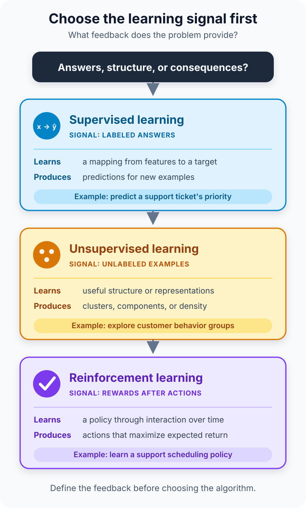

A product team has a year of customer data and a familiar instruction: “Use machine learning to make this better.”

That request sounds specific until the team asks what *better* means.

Should the system predict which support tickets need urgent attention? Discover groups of customers whose behavior looks similar? Or choose a sequence of assignments and learn from the result of each one?

Those are not three versions of the same task. They provide three different kinds of feedback. One gives the model correct answers. One provides data without answers. One reveals consequences after actions.

That is the practical difference between **supervised, unsupervised, and reinforcement learning**. The important question is not which approach sounds most advanced. It is this: **what learning signal does the problem genuinely provide?**

## The shortest useful comparison

In supervised learning, the training examples include the outcome the model should learn to predict. In unsupervised learning, the model looks for useful structure without a supplied target. In reinforcement learning, an agent acts in an environment and learns a strategy from rewards that may arrive immediately or much later.

| Approach | Feedback available during learning | Typical goal | Familiar tasks |
| --- | --- | --- | --- |
| Supervised learning | Features paired with labels or target values | Predict an outcome for a new example | Classification and regression |
| Unsupervised learning | Examples without a target label | Reveal structure or form a useful representation | Clustering, dimensionality reduction, density estimation |
| Reinforcement learning | Rewards produced by actions in an environment | Learn a policy that maximizes expected return | Control, resource allocation, games, sequential decisions |

The table is a starting point, not a rule that every real system fits neatly. Production systems often combine approaches. Still, identifying the feedback first prevents a surprisingly common mistake: choosing an algorithm before defining the problem.

## Supervised learning starts with an answer key

Suppose the product team wants to route incoming support tickets. Historical tickets contain the message, account information, product area, and a final priority assigned by an experienced support agent.

Each training example has **features**—the information available to the model—and a **label**—the answer it should learn to predict. Training adjusts the model so its predictions move closer to those known labels. The resulting classifier can then estimate a priority for a new ticket whose final outcome is not yet known.

This is supervised learning because the target is explicit. NIST describes it as learning to predict explicit labels or output values, while [Google’s supervised-learning guide](https://developers.google.com/machine-learning/intro-to-ml/supervised) frames training as learning the relationship between features and labels.

Two task types dominate the beginner examples:

- **Classification** predicts a category, such as `urgent`, `normal`, or `low priority`.
- **Regression** predicts a numeric value, such as resolution time in hours.

The answer key makes evaluation comparatively direct. Hide a representative labeled test set from training, make predictions for it, and compare those predictions with the known outcomes using metrics that reflect the real cost of mistakes. Accuracy alone may be misleading when urgent tickets are rare; precision, recall, calibration, or an error measure may matter more.

Supervision does not guarantee truth. Labels can be inconsistent, delayed, biased, or based on a policy that has since changed. A model trained on yesterday’s decisions can reproduce yesterday’s blind spots with impressive statistical confidence.

The key question is therefore not merely “Do we have labels?” It is “Do these labels represent the outcome we actually care about?”

## Unsupervised learning asks what shape the data has

Now imagine the same team has customer activity—session frequency, product usage, account age, and support volume—but no agreed customer types. It wants to explore whether meaningful behavioral groups exist.

There is no `customer_segment` answer column. An unsupervised method can measure similarity and organize examples according to patterns in the features. Clustering might expose groups with different usage profiles. Dimensionality reduction might compress many correlated measurements into a smaller representation that is easier to visualize or use downstream.

The output is a description of structure, not a discovered law of nature.

If a clustering algorithm creates four groups, it has not proved that four true kinds of customer exist. Change the features, scaling, distance measure, algorithm, or requested number of clusters and the result may change. Humans must interpret whether the structure is stable, useful, and connected to the original decision.

This is why unsupervised evaluation is less like checking an answer key. Internal measures can tell you whether clusters are compact or separated under a chosen geometry, but business usefulness needs external evidence. Do the segments remain recognizable on new data? Do they help a support or product decision? Are they merely separating customers by data quality, geography, or another accidental proxy?

Unsupervised learning also extends beyond clustering. The [scikit-learn user guide](https://scikit-learn.org/stable/user_guide.html) groups techniques such as mixture models, manifold learning, matrix factorization, covariance estimation, density estimation, and novelty detection under its unsupervised section. The shared idea is the absence of a supplied prediction target, not one particular algorithm.

## Reinforcement learning learns from consequences

The third problem is different again. Suppose the team controls a simulated queue of support work. At each step, a scheduling agent sees the current queue, assigns an agent to a ticket, and later receives signals related to response time, resolution quality, and breached service objectives.

There is no fixed correct assignment attached to every possible queue state. An action changes what happens next. Handling one ticket now delays another; routing an unfamiliar case to a specialist may improve quality but consume scarce capacity. The value of a decision depends on the sequence that follows it.

This is the territory of reinforcement learning:

- The **agent** chooses an action.
- The **environment** responds and moves to a new state.
- A **reward** represents the immediate feedback defined by the environment.
- A **policy** maps situations to actions.
- The objective is to maximize expected **return**, which accounts for rewards across time.

[NIST AI 100-2e2025](https://nvlpubs.nist.gov/nistpubs/ai/NIST.AI.100-2e2025.pdf) defines the paradigm around an agent interacting with an environment and learning a policy that maximizes reward. The [Google Machine Learning Glossary](https://developers.google.com/machine-learning/glossary#reinforcement_learning) makes the time dimension explicit: a reward is the numerical result of an action in a state, while return combines the rewards expected from following a policy.

That delayed effect is what makes reinforcement learning more than supervised learning with unusual labels. The agent’s choices influence the data it will observe. It must also balance **exploration**—trying actions whose consequences are uncertain—with **exploitation**—using actions that currently appear effective.

Real-world interaction can be expensive or unsafe. A scheduling policy that “explores” poor assignments on live customers is not an innocent experiment. Teams often begin with simulation, historical evaluation, constrained action spaces, human approval, and explicit safety rules. Reinforcement learning is appropriate when the sequential decision problem is real enough to justify that extra complexity.

## Choose from the decision, not the dataset

A dataset does not select a learning paradigm by itself. The same event history can support different questions.

Given support tickets with final priorities, supervised learning can predict the priority of a new ticket. Remove the priorities and unsupervised learning can explore recurring ticket patterns, but it cannot recover the missing business definition of urgency by magic. Put ticket routing inside an interactive process with actions and measured consequences, and reinforcement learning may optimize a scheduling policy.

Before choosing, write down five things:

1. **The decision:** What will the system predict, discover, or choose?
2. **The feedback:** Is there a trusted target, no target, or a reward produced by interaction?
3. **The unit of evaluation:** Is success measured per example, by the usefulness of discovered structure, or over a sequence of actions?
4. **The failure cost:** What happens when the model is wrong or explores a poor action?
5. **The baseline:** Could a rule, statistical summary, or simpler predictive model solve the problem first?

If a known outcome must be predicted and representative labels exist, start with supervised learning. If the immediate goal is exploration or representation and no target exists, consider unsupervised learning. If actions change future states and success accumulates over time, reinforcement learning may fit—but only after defining the environment and reward with care.

## The categories can work together

The three labels are useful boundaries, not sealed boxes.

With **semi-supervised learning**, a smaller labeled set and a larger unlabeled set contribute to training. With **self-supervised learning**, a task creates training targets from the data itself—for example, hiding part of an input and asking a model to recover it. The targets are generated rather than supplied as a separate human-authored answer key.

A system can also learn a representation from unlabeled data, refine it with labeled examples, and later use it inside a reinforcement-learning agent. Modern generative systems frequently move through multiple training stages. Calling the final product “AI” does not reveal which learning signals built it.

This overlap is another reason to focus on the contract between the problem and the feedback. The name of a model architecture—neural network, decision tree, or transformer—does not by itself tell you whether the training is supervised, unsupervised, self-supervised, or reinforcement-based.

## Common mistakes reveal the real differences

The first mistake is treating missing labels as permission to invent meaning. Unsupervised learning can expose patterns; it does not decide which patterns deserve a product decision.

The second is data leakage in supervised learning. If a feature is recorded only after a ticket is resolved, a training result may look excellent while being impossible to reproduce when a new ticket arrives.

The third is designing a reinforcement-learning reward that is easy to measure but incomplete. Reward only short response time and an agent may rush difficult cases. A reward is not the goal itself; it is an engineered signal that can be exploited.

The fourth is assuming the most sophisticated method is the best one. A transparent priority rule may outperform a poorly labeled classifier operationally. A dashboard may answer the exploratory question without clustering. A conventional optimizer may schedule work more safely than an RL agent.

## The takeaway

Supervised learning learns from **answers**. Unsupervised learning learns from **structure**. Reinforcement learning learns from **consequences**.

That one distinction explains their different data requirements, objectives, evaluation methods, and risks. Start by describing the decision and the feedback you can honestly observe. Then choose the simplest learning setup that matches both.

The algorithm comes later.

## Continue learning

- [What Is Machine Learning and How Does It Work?](/posts/what-is-machine-learning/)
- [AI vs Machine Learning vs Deep Learning](/posts/ai-vs-machine-learning-vs-deep-learning/)
- [Operating AI/ML Workloads on Kubernetes](/posts/operating-ai-ml-workloads-kubernetes/)
- [Postgres with pgvector vs Specialized Vector Databases](/posts/postgres-pgvector-vs-specialized-vector-databases/)

## Sources

- [NIST AI 100-2e2025: Adversarial Machine Learning—Taxonomy and Terminology](https://nvlpubs.nist.gov/nistpubs/ai/NIST.AI.100-2e2025.pdf)
- [Google for Developers: What Is Machine Learning?](https://developers.google.com/machine-learning/intro-to-ml/what-is-ml)
- [Google for Developers: Supervised Learning](https://developers.google.com/machine-learning/intro-to-ml/supervised)
- [Google for Developers: Machine Learning Glossary](https://developers.google.com/machine-learning/glossary#reinforcement_learning)
- [scikit-learn User Guide: Supervised and Unsupervised Learning](https://scikit-learn.org/stable/user_guide.html)
