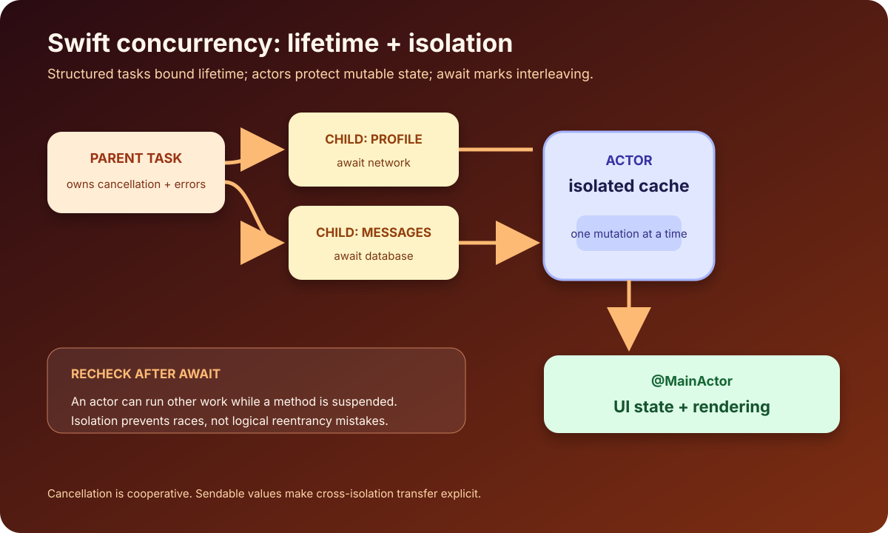

Swift concurrency is easier to reason about when four ideas remain separate:

- `async` marks a function that may suspend.
- `await` marks a possible suspension point.
- a `Task` gives asynchronous work a lifetime and priority context.
- an `actor` isolates mutable state.

None of these means “start a new thread.” The runtime schedules jobs on executors, and an asynchronous function can resume on an executor appropriate to its isolation.



## Suspension is not blocking

```swift
func loadProfile(id: UUID) async throws -> Profile {
    let (data, response) = try await URLSession.shared.data(
        from: profileURL(id)
    )
    try validate(response)
    return try JSONDecoder().decode(Profile.self, from: data)
}
```

At `await`, `loadProfile` may suspend while the networking operation continues. The underlying thread can execute other work. Later, the function resumes and either receives a value or throws.

Three important consequences:

1. Local state must remain valid across suspension.
2. Other code may change shared state before this function resumes.
3. Cancellation or errors must be part of the function's contract.

`await` identifies where interleaving can occur; it does not guarantee that a suspension actually happens every time.

## Prefer structured concurrency

When child work belongs to the current operation, keep it in the task hierarchy:

```swift
func loadDashboard() async throws -> Dashboard {
    async let profile = profileService.currentProfile()
    async let messages = messageService.unreadMessages()

    return try await Dashboard(
        profile: profile,
        messages: messages
    )
}
```

The two child tasks can make progress concurrently. Their lifetime remains bounded by `loadDashboard`; errors and cancellation propagate through the structure.

For a dynamic number of children, use a task group:

```swift
func loadThumbnails(_ urls: [URL]) async throws -> [URL: Data] {
    try await withThrowingTaskGroup(
        of: (URL, Data).self,
        returning: [URL: Data].self
    ) { group in
        for url in urls {
            group.addTask {
                (url, try await download(url))
            }
        }

        var result: [URL: Data] = [:]
        for try await (url, data) in group {
            result[url] = data
        }
        return result
    }
}
```

Bound concurrency for very large inputs; launching thousands of network operations at once can overwhelm the client or server.

## Unstructured and detached tasks

`Task { ... }` starts an unstructured task that inherits useful context such as priority and actor isolation. It is appropriate for bridging a synchronous UI event into asynchronous work when you keep the handle or the task is deliberately tied to an owner.

```swift
@MainActor
final class ProfileViewModel: ObservableObject {
    @Published private(set) var state: State = .idle
    private var loadingTask: Task<Void, Never>?

    func load() {
        loadingTask?.cancel()
        loadingTask = Task {
            state = .loading
            do {
                state = .loaded(try await service.loadCurrent())
            } catch is CancellationError {
                // A replacement request owns the UI now.
            } catch {
                state = .failed(error.localizedDescription)
            }
        }
    }

    deinit {
        loadingTask?.cancel()
    }
}
```

`Task.detached` discards actor context and other inherited structure. Use it rarely, when the work genuinely should not inherit that context. It is not a general “background thread” button.

## Actors protect mutable state

An actor serializes access to its isolated state:

```swift
actor ImageCache {
    private var images: [URL: Data] = [:]

    func value(for url: URL) -> Data? {
        images[url]
    }

    func insert(_ data: Data, for url: URL) {
        images[url] = data
    }
}
```

Code outside the actor uses `await` to cross the isolation boundary:

```swift
let cache = ImageCache()

if let data = await cache.value(for: url) {
    return data
}
```

Actors prevent unsynchronized access; they do not make a multi-step operation automatically atomic across an `await`.

### Actor reentrancy

This loader can download the same URL twice:

```swift
actor Loader {
    private var cache: [URL: Data] = [:]

    func data(for url: URL) async throws -> Data {
        if let cached = cache[url] { return cached }

        let downloaded = try await download(url) // actor may run other work
        cache[url] = downloaded
        return downloaded
    }
}
```

While `download` is suspended, another call can enter the actor, observe the same miss, and start another download. If deduplication matters, cache the in-flight task:

```swift
actor ImageLoader {
    private var values: [URL: Data] = [:]
    private var inFlight: [URL: Task<Data, Error>] = [:]

    func data(for url: URL) async throws -> Data {
        if let value = values[url] { return value }
        if let task = inFlight[url] { return try await task.value }

        let task = Task { try await Self.download(url) }
        inFlight[url] = task

        do {
            let value = try await task.value
            values[url] = value
            inFlight[url] = nil
            return value
        } catch {
            inFlight[url] = nil
            throw error
        }
    }

    private nonisolated static func download(_ url: URL) async throws -> Data {
        let (data, _) = try await URLSession.shared.data(from: url)
        return data
    }
}
```

The exact cancellation policy needs a product decision: should one cancelled caller cancel the shared download for everyone? Often it should not.

## `MainActor` is UI isolation

Annotate UI-facing state with `@MainActor`:

```swift
@MainActor
final class SearchViewModel: ObservableObject {
    @Published private(set) var results: [Result] = []

    func search(_ query: String) async {
        results = (try? await service.search(query)) ?? []
    }
}
```

This expresses an isolation guarantee, not merely a dispatch convention. Do not wrap every line in `MainActor.run`; place the owning type or the methods that mutate UI state on the main actor.

## Sendable and Swift 6 checks

`Sendable` describes values that can safely cross concurrency isolation boundaries. Value types whose stored properties are themselves sendable often fit naturally. Mutable reference types require careful isolation or synchronization.

Swift 6 language mode makes data-race safety checks stronger. Migration is usually clearer when done boundary by boundary:

1. Enable warnings/checks for a module.
2. Identify mutable state crossing isolation.
3. Isolate UI state with `@MainActor`.
4. Move shared mutable state into actors or synchronized owners.
5. Make transferred value models `Sendable` where true.
6. Treat `@unchecked Sendable` as a documented safety proof, not a way to silence the compiler.

## Cancellation is cooperative

Cancelling a task sets cancellation state; your code and called APIs must observe it:

```swift
func transform(_ records: [Record]) async throws -> [Output] {
    var output: [Output] = []
    for record in records {
        try Task.checkCancellation()
        output.append(expensiveTransform(record))
    }
    return output
}
```

Handle `CancellationError` separately from an ordinary user-visible failure. A cancelled search replaced by a newer query is not necessarily an error banner.

## Review checklist

- Does child work have a clear owner and lifetime?
- Can cancellation propagate to expensive operations?
- Is mutable shared state actor-isolated or otherwise synchronized?
- Have invariants been rechecked after every `await`?
- Is UI state isolated to `MainActor`?
- Are values crossing isolation boundaries genuinely `Sendable`?
- Is unstructured work retained and cancelled by its owner?
- Is `Task.detached` used only with a specific reason?
- Are concurrency limits explicit for fan-out work?

Swift concurrency gives you vocabulary for lifetimes, suspension, and isolation. Use that vocabulary to make ownership visible; the compiler can then help detect designs that would otherwise become timing-dependent bugs.

## Sources

- [Concurrency — The Swift Programming Language](https://docs.swift.org/swift-book/documentation/the-swift-programming-language/concurrency/)
- [Swift 6 concurrency migration guide](https://www.swift.org/migration/documentation/swift-6-concurrency-migration-guide/migrationstrategy/)
- [Announcing Swift 6 — Swift.org](https://www.swift.org/blog/announcing-swift-6/)
- [Get started with Swift concurrency — Apple Developer](https://developer.apple.com/news/?id=o140tv24)
