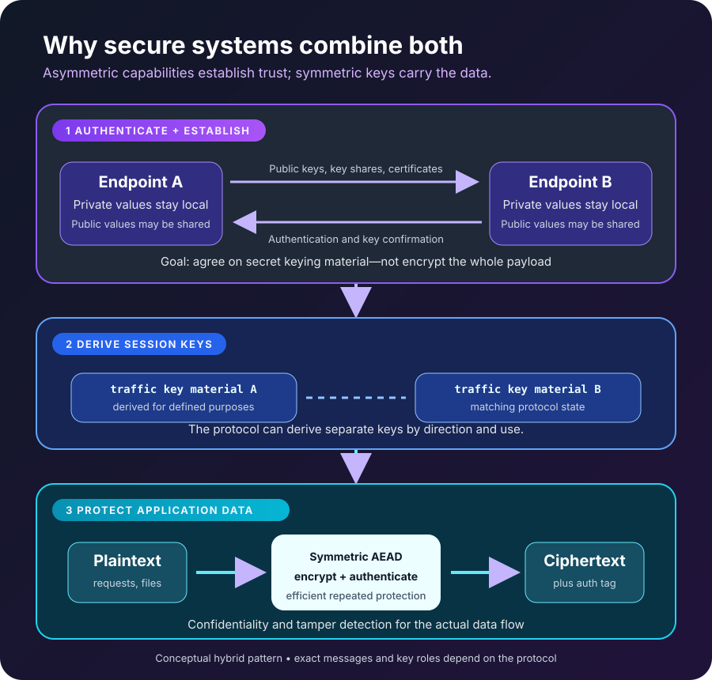

A team encrypts its nightly backup with one secret key. The protection works—until a second system needs to restore the data.

Should the team copy the secret key to that system? Send it over the network? Give every service its own copy? And if one copy leaks, how many backups and systems must be treated as exposed?

This is the problem hidden inside most explanations of encryption. Turning plaintext into ciphertext is only half the design. The other half is deciding **who holds which keys, how those keys arrive safely, and what a key is allowed to do**.

**Symmetric encryption uses shared secret key material for encryption and decryption. Asymmetric cryptography uses a mathematically related public and private key pair, allowing the public key to be distributed while the private key remains secret.**

Neither replaces the other. Symmetric encryption is the practical workhorse for protecting data. Asymmetric cryptography helps establish keys, prove identity, and create digital signatures. Modern secure systems usually combine them.

## The real difference is who must share a secret

Imagine Alice needs to send Bob a confidential file.

With **symmetric encryption**, Alice and Bob need access to the same secret key. Alice encrypts the file with it, and Bob decrypts the result with the corresponding shared secret. Anyone who obtains that key may be able to read the protected data, so the key needs a secure path before the file does.

With **asymmetric encryption**, Bob can publish a public key and keep the paired private key secret. Alice can use the public key in an approved encryption scheme, while only the private-key holder can perform the corresponding decryption operation.

That sounds as though asymmetric encryption solves everything. It does not. Public-key operations are generally more computationally expensive, public-key schemes have strict message and encoding limits, and publishing a key does not prove who owns it. Systems still need authenticated protocols, certificates or another trust mechanism, and careful private-key protection.

The useful comparison is not “old encryption versus better encryption.” It is **shared-secret efficiency versus public/private-key capabilities**.

| Question | Symmetric encryption | Asymmetric cryptography |
| --- | --- | --- |
| Key model | Shared secret key material | Related public and private keys |
| Main strength | Efficient protection of data at rest or in transit | Key establishment, encryption for a key holder, and digital signatures |
| Main distribution challenge | The secret must reach every authorized party securely | The public key must be bound reliably to the right identity |
| Typical examples | AES-GCM, ChaCha20-Poly1305 | RSA-OAEP, Diffie-Hellman variants, ECDSA, EdDSA |
| Common role | Encrypt the actual file, database field, backup, or network session | Establish session keys or authenticate a party and its messages |

The examples in the last row do not all perform the same operation. In particular, key agreement and digital signatures are asymmetric cryptographic functions, but they are not themselves asymmetric encryption.

## Symmetric encryption carries the data

The [NIST Advanced Encryption Standard](https://csrc.nist.gov/pubs/fips/197/final) defines AES-128, AES-192, and AES-256. Each AES variant transforms 128-bit blocks; the number in its name is the key length, not the block size or a direct measure of how many bytes an application can encrypt.

An application should not normally apply a raw block cipher to data by itself. It needs a secure construction that defines how blocks, nonces, padding where applicable, and integrity protection work together. [NIST SP 800-38D](https://csrc.nist.gov/pubs/sp/800/38/d/final), for example, specifies GCM, an authenticated-encryption mode for an approved symmetric block cipher.

Authenticated encryption matters because confidentiality is not enough. An attacker who cannot read ciphertext may still try to modify, replay, truncate, or rearrange it. A suitable authenticated-encryption scheme can detect unauthorized modification, provided the application follows its rules—especially its nonce requirements—and handles failures safely.

Symmetric encryption fits the heavy part of the job:

- encrypting a disk, backup, or object in storage;
- protecting database fields that an authorized application must recover;
- carrying application traffic after a secure session has been established; and
- wrapping other key material under a key-encryption key.

Its hard problem is not throughput. It is secret-key custody. Every authorized encryptor or decryptor needs controlled access to key material or to a service that performs the operation. Copies, backups, logs, memory, permissions, rotation, revocation, and recovery all become part of the security boundary.

This is why “we use AES-256” is not a complete security design. The algorithm name says little about where the key lives, whether nonces can repeat, who can request decryption, or what happens after compromise.

## Asymmetric cryptography separates capabilities

A public/private key pair creates an important asymmetry: one value can be shared widely without revealing the private value under the assumptions of the scheme.

That separation enables several distinct jobs.

**Public-key encryption** lets a sender use a recipient's public key in a defined encryption scheme so the private-key holder can decrypt. [RFC 8017](https://www.rfc-editor.org/rfc/rfc8017.html), for example, defines RSA encryption schemes including RSAES-OAEP. The padding and encoding scheme is not optional decoration; “textbook RSA” is not a safe application protocol.

**Key establishment** lets parties produce shared secret keying material. This may happen through key transport or key agreement. [NIST SP 800-56B Revision 2](https://csrc.nist.gov/pubs/sp/800/56/b/r2/final) specifies RSA-based pair-wise key-establishment schemes, including methods for key confirmation. Other protocols use finite-field or elliptic-curve Diffie-Hellman instead.

**Digital signatures** work in a different direction. A signer uses a private key to generate a signature, and a verifier uses the public key to check it. [NIST FIPS 186-5](https://csrc.nist.gov/pubs/fips/186-5/final) standardizes digital-signature algorithms for detecting unauthorized changes and authenticating the signatory.

This is why the phrase “encrypt with the private key” is a misleading explanation of signing. Encryption aims to keep content confidential; signing aims to make authenticity and integrity verifiable. Some RSA primitives look mathematically related, but secure encryption and signature schemes have different encodings, purposes, and validation rules.

Asymmetric cryptography also moves rather than eliminates trust. If Alice downloads a public key from an attacker while believing it belongs to Bob, the mathematics can work perfectly and still protect the wrong relationship. Certificates, trusted directories, fingerprints, pinned keys, or another authenticated channel bind a public key to an identity.

## Why real systems combine both

Consider sending a 2 GB encrypted archive to several recipients. Encrypting the full archive separately with each recipient's public-key scheme would be awkward and unnecessary.

A hybrid design instead works conceptually like this:

1. Generate a fresh random data-encryption key with a cryptographically secure random source.
2. Encrypt the archive once using an authenticated symmetric scheme.
3. Protect a small copy of the data-encryption key for each recipient using an appropriate public-key or key-establishment mechanism.
4. Store or transmit the encrypted archive, protected keys, nonces, algorithm identifiers, and required metadata in a defined format.

The large payload receives symmetric protection; asymmetric cryptography solves the smaller key-distribution problem. Removing a recipient may stop future sharing, although it cannot make that recipient forget a key or plaintext already obtained.

TLS 1.3 demonstrates the same division of labor in a network protocol. [RFC 8446](https://www.rfc-editor.org/rfc/rfc8446.html) describes a handshake that negotiates parameters, authenticates peers where required, and establishes shared secret keying material. The resulting traffic keys protect application data with authenticated symmetric encryption. The protocol does not repeatedly run every application byte through public-key encryption.

The diagram above shows that broad pattern, not a packet-by-packet TLS transcript. Real protocols derive separate keys for particular directions and purposes, and some TLS 1.3 sessions can use pre-shared keys. The central idea remains: expensive trust and key-establishment work prepares efficient session protection.

## Which type should you use?

If the question is about protecting a large amount of data that authorized software must read later, symmetric authenticated encryption is usually the relevant primitive.

If the problem is delivering secret keying material to a party you have not already shared a secret with, an approved asymmetric key-establishment scheme may be part of the answer.

If the requirement is to prove that a message, software package, or certificate was authorized by a private-key holder, look at digital signatures—not “asymmetric encryption” as a vague category.

If you are designing a secure transport, file format, or messaging system, the likely answer is a reviewed hybrid protocol rather than choosing one family. Cryptography is unusually sensitive to small composition errors, so use maintained libraries and established protocols instead of designing a custom combination from primitives.

## Common mistakes that break the model

The first mistake is treating a public key as automatically trustworthy. Public means distributable, not authenticated.

The second is treating a shared key like an ordinary configuration value. Committing it to a repository, placing it in an image, or copying it across many hosts makes rotation and incident response much harder.

The third is comparing key sizes across families. A 256-bit AES key and a 256-bit elliptic-curve key do not represent the same construction or security calculation. Key length only makes sense with the algorithm, parameters, intended lifetime, and current guidance.

The fourth is encrypting without integrity protection. Ciphertext that hides content but permits undetected modification may fail the application's actual threat model.

The fifth is reusing one key for every purpose. Encryption, message authentication, signatures, key wrapping, and derivation have different rules. [NIST SP 800-57 Part 1 Revision 5](https://csrc.nist.gov/pubs/sp/800/57/pt1/r5/final) emphasizes that key type, usage, protection, lifecycle, and compromise handling are part of key management—not cleanup tasks after an algorithm is selected.

## The key-management question comes first

Before choosing an algorithm, draw the key path.

Who creates the key? Which identities can use it? Can they retrieve the raw bytes, or only ask a managed key service to perform an operation? How is access logged? How is the key rotated? Which old ciphertext must remain readable? What is revoked after a device, service, employee account, or private key is compromised?

Those questions often reveal the architecture more clearly than a list of cipher names.

Symmetric encryption answers, “How can parties that share secret key material protect data efficiently?” Asymmetric cryptography answers a different set of questions: “How can public and private capabilities be separated, shared keys be established, or signatures be verified?”

The strongest systems do not force one tool to perform the other's job. They use asymmetric mechanisms to create or authenticate a secure relationship, symmetric authenticated encryption to carry the data, and disciplined key management to keep both trustworthy.

## Continue learning

- [Encryption vs Hashing vs Encoding](/posts/encryption-vs-hashing-vs-encoding/)
- [The CIA Triad: Confidentiality, Integrity, and Availability](/posts/cia-triad-explained/)
- [Authentication vs Authorization](/posts/authentication-vs-authorization/)
- [MFA vs Passwordless Authentication vs Passkeys](/posts/mfa-vs-passwordless-vs-passkeys/)

## Sources

- [NIST FIPS 197: Advanced Encryption Standard](https://csrc.nist.gov/pubs/fips/197/final)
- [NIST SP 800-38D: Galois/Counter Mode and GMAC](https://csrc.nist.gov/pubs/sp/800/38/d/final)
- [NIST SP 800-56B Revision 2: RSA Key Establishment](https://csrc.nist.gov/pubs/sp/800/56/b/r2/final)
- [NIST FIPS 186-5: Digital Signature Standard](https://csrc.nist.gov/pubs/fips/186-5/final)
- [NIST SP 800-57 Part 1 Revision 5: Key Management](https://csrc.nist.gov/pubs/sp/800/57/pt1/r5/final)
- [RFC 8017: PKCS #1, RSA Cryptography Specifications Version 2.2](https://www.rfc-editor.org/rfc/rfc8017.html)
- [RFC 8446: The Transport Layer Security Protocol Version 1.3](https://www.rfc-editor.org/rfc/rfc8446.html)
