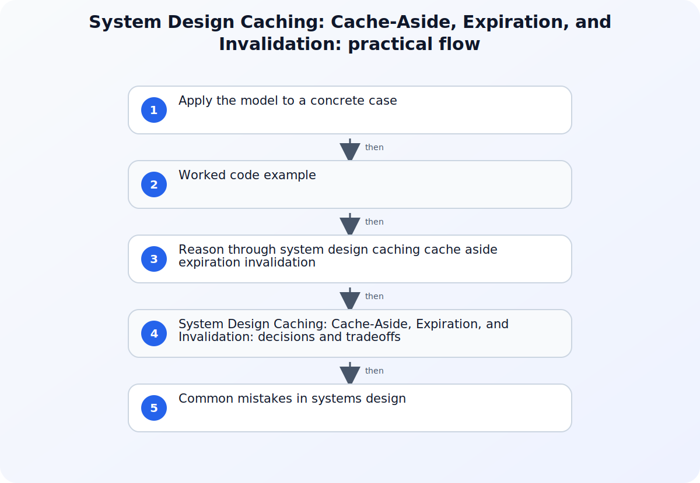

A cache is a second representation of data placed closer to a reader or cheaper execution path. It can reduce latency and origin load, but it also introduces another state boundary that can be empty, stale, unavailable, or inconsistent with the source of truth. Good cache design therefore starts with workload and correctness requirements, not with a product selection or a target hit ratio.



## A working model for System Design Caching: Cache-Aside, Expiration, and Invalidation

Describe the read-to-write ratio, acceptable staleness, object size, access distribution, peak concurrency, origin cost, and recovery expectation after a cache loss. Identify the authoritative store and the keys or tenant boundaries that must not be mixed. Choose measurements for hit rate, miss latency, eviction, origin load, stale responses, and cache errors so the design can be tested under realistic conditions.

## Apply the model to a concrete case

Imagine a profile service whose database is authoritative and whose reads greatly outnumber edits. The cache key includes tenant and profile identifiers plus a schema version. On a miss, one refill operation loads the profile while concurrent requests wait briefly or follow a bounded fallback, preventing a popular account from producing many identical database reads. Successful edits commit to the database and publish invalidation for the old key; a short, jittered TTL limits the damage if that event is lost. The service measures hit and miss latency separately and protects the database with timeouts and admission control during a full cache loss. Sensitive authorization decisions are not reused beyond the scope encoded in the key.

## Worked code example

### Make cache-aside branches explicit

```python
def get_profile(tenant_id: str, profile_id: str) -> dict:
    key = f"profile:v2:{tenant_id}:{profile_id}"
    cached = cache.get(key)
    if cached is not None:
        metrics.increment("profile_cache_hit")
        return cached

    metrics.increment("profile_cache_miss")
    profile = database.load_profile(tenant_id, profile_id)
    cache.set(key, profile, ttl_seconds=jittered_ttl())
    return profile
```

The example makes hit, miss, authoritative read, key scope, and refill behavior visible. Production code still needs bounded timeouts, concurrent-miss control, cache-error handling, and an invalidation path for writes.

## Source boundaries for systems design

### Caching guidance

Use Caching guidance for this boundary of the topic: Use Microsoft's caching guidance for cache-aside flow, local versus distributed choices, concurrency, and operational considerations.
### Cloudflare cache concepts

Use Cloudflare cache concepts for this boundary of the topic: Use Cloudflare's cache concepts to distinguish cache eligibility, freshness, cache keys, and behavior across cache layers.
### Redis client-side caching

Use Redis client-side caching for this boundary of the topic: Use Redis client-side caching documentation for tracking modes, local copies, and invalidation-message behavior.

## Reason through system design caching cache aside expiration invalidation

### 1. Define cache-aside behavior for hits and misses

In cache-aside, the application checks the cache, loads a missing value from the authoritative store, and writes the result back for later readers. Define how concurrent misses for the same key are controlled so a cold or expired entry does not create an origin spike. Decide whether missing records are briefly cached, how serialization errors are handled, and whether a cache failure is bypassed or returned to the caller. Each branch needs an observable outcome.
### 2. Choose freshness semantics, not just a TTL

Expiration limits how long an entry can remain without refresh, but one duration rarely captures the whole consistency contract. Connect the TTL to how often the underlying value changes and how much stale data the consumer can tolerate. Add jitter when synchronized expiry would produce a burst, and decide whether selected workloads may serve stale data during origin trouble. When writes require prompt visibility, pair expiration with explicit invalidation or versioned keys.
### 3. Plan invalidation and cache failure as normal paths

Invalidation must name the event that makes an entry obsolete, the keys affected, and what happens when the invalidation message is delayed or lost. Client-side caches add another copy near application code, so tracking and invalidation responsibilities need to be understood before enabling them. Test a complete cache flush, partial network loss, an unavailable origin, and a hot key. The system should degrade according to an explicit policy instead of depending on a permanently warm cache.

## System Design Caching: Cache-Aside, Expiration, and Invalidation: decisions and tradeoffs

| Situation or decision | Tradeoff or common failure mode | Validation question |
| --- | --- | --- |
| Origin traffic spikes when popular entries expire | Many callers refill the same key simultaneously | Measure concurrent misses and evaluate request coalescing, locking, or expiry jitter |
| Users read an old value after a successful write | TTL is the only freshness mechanism or an invalidation was missed | Trace the write event to every affected key and measure invalidation delay |
| A cache outage becomes a total service outage | Failure behavior and origin capacity were not designed together | Load-test bypass, timeouts, admission control, and origin protection with the cache unavailable |

## Common mistakes in systems design

A high hit rate can hide poor cache design when misses are extremely slow, hot keys overload one partition, or stale values violate a business rule. Treating TTL as complete invalidation leaves a freshness window that may be unacceptable after writes. Clearing the entire cache for one changed entity creates avoidable cold-start load, while never versioning serialized values can make old entries unreadable after deployment. Another failure is assuming cache availability while sizing the origin; a cache outage then becomes a self-amplifying database incident. Review keys for tenant and authorization scope, measure distributions rather than averages, and exercise cold, stale, invalidation-loss, and bypass paths under load.

## Practical implementation checklist

1. Name the authoritative store and the maximum stale interval for each cached data class.
2. Define cache-key fields, tenant isolation, serialization versioning, and object-size limits.
3. Protect the origin from concurrent cold misses and synchronized expiration bursts.
4. Measure hit rate together with miss latency, origin load, eviction, and stale-response behavior.
5. Exercise invalidation loss, full cache loss, hot keys, and cache bypass before production rollout.

## Related implementation context

[Proving Application Resilience on Azure: A Practical Guide to Chaos Studio](/posts/azure-chaos-studio-application-resilience-guide/) and [Postgres with pgvector vs. Specialized Vector Databases: The Real Cost and Performance Tradeoffs](/posts/postgres-pgvector-vs-specialized-vector-databases/)

## Version and verification boundary

The design principles are product-neutral, while cache directives, tracking modes, and platform defaults are version-sensitive; verify the cited Azure, Cloudflare, and Redis documentation for the deployed versions.

## Summary

Design caching around an authoritative store, an explicit staleness budget, and tested failure behavior. Cache-aside, expiration, and invalidation must work together, and hit rate only has meaning beside miss latency, origin load, eviction, and stale-response measurements.

## Sources

- [Caching guidance](https://learn.microsoft.com/en-us/azure/architecture/best-practices/caching)
- [Cloudflare cache concepts](https://developers.cloudflare.com/cache/concepts)
- [Redis client-side caching](https://redis.io/docs/latest/develop/clients/client-side-caching)
