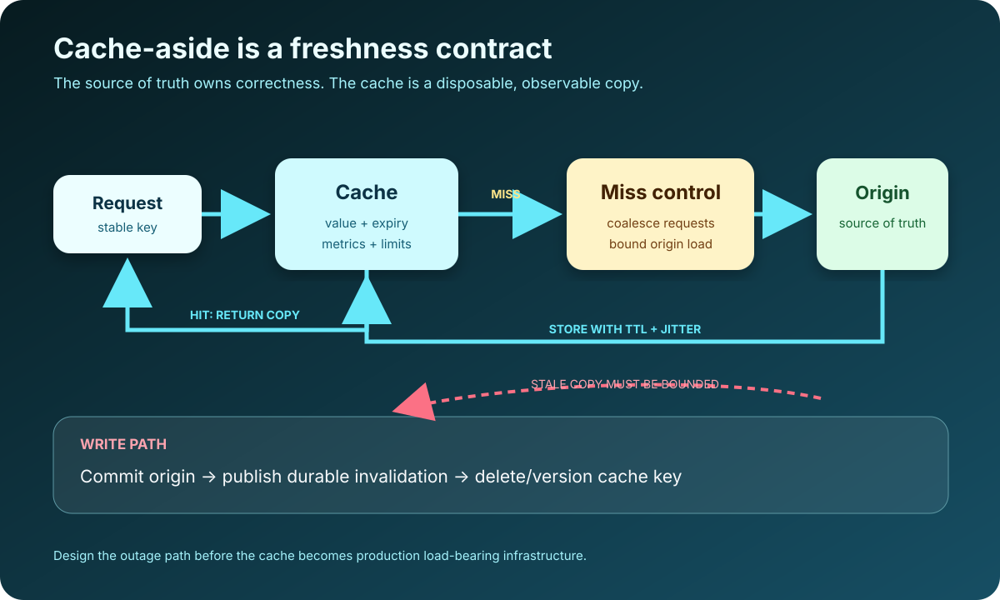

A cache is a copy. Every useful cache design must therefore answer a harder question than “What TTL should we use?”:

> **How wrong may this copy be, for how long, and what happens when the cache or origin fails?**

Cache-aside is popular because the application controls those answers. It is also easy to implement incompletely: a fast happy path can hide stale data, stampedes, unsafe keys, and an origin that collapses the moment Redis is unavailable.



## Cache-aside in six steps

For a read:

1. Build a stable cache key.
2. Read the cache.
3. On a hit, deserialize and return the value.
4. On a miss, read the source of truth.
5. Store the result with an expiration policy.
6. Return the authoritative value.

The database remains the source of truth. The cache is disposable acceleration.

```python
from dataclasses import asdict
import json
import random

BASE_TTL_SECONDS = 300

def get_product(product_id: int) -> Product | None:
    key = f"product:v3:{product_id}"

    try:
        cached = redis.get(key)
        if cached is not None:
            metrics.increment("product_cache_hit")
            return Product(**json.loads(cached))
    except RedisError:
        metrics.increment("product_cache_error")
        # Degrade to the source of truth.

    metrics.increment("product_cache_miss")
    product = database.find_product(product_id)

    if product is not None:
        # Jitter prevents many entries from expiring in the same second.
        ttl = BASE_TTL_SECONDS + random.randint(-30, 30)
        try:
            redis.set(key, json.dumps(asdict(product)), ex=ttl)
        except RedisError:
            metrics.increment("product_cache_write_error")

    return product
```

This version deliberately treats cache failure as a miss. That is appropriate only if the origin can absorb the fallback traffic. If it cannot, add rate limiting, request coalescing, circuit breaking, or serve bounded-stale data.

## Freshness is a product rule

Choose a policy from the consequence of stale data:

| Data | Typical tolerance | Safer strategy |
| --- | --- | --- |
| Product description | Minutes | TTL plus invalidation on edit |
| Inventory estimate | Seconds | Short TTL, event invalidation, authoritative check at purchase |
| Account permission | Very low | Avoid permissive caching; fail closed where required |
| Public article | Minutes or hours | Long TTL with purge on publication |
| Expensive aggregate | Depends on report | Versioned snapshot with visible “as of” time |

A TTL is a maximum residence time, not a guarantee that data is fresh during that interval. If a product changes one second after being cached with a five-minute TTL, readers may see the old value for almost five minutes.

Ask these questions before choosing a number:

- Is stale data merely cosmetic, or can it cause financial or security harm?
- Is the value read far more often than it is written?
- Can a write publish a reliable invalidation event?
- Can clients tolerate a slightly older value during an outage?
- How expensive is the origin request?

## Invalidation strategies

### Delete after a successful write

```python
def update_product(product_id: int, patch: ProductPatch) -> Product:
    updated = database.update_product(product_id, patch)
    redis.delete(f"product:v3:{product_id}")
    return updated
```

This is simple, but a process crash between the database commit and cache deletion leaves stale data. A transactional outbox can close that reliability gap: commit the data change and an invalidation event in one database transaction, then publish the event asynchronously.

### Update the cache after the database

Updating the cache can reduce the next miss, but concurrent writers may apply cache updates out of order. Include a version or timestamp and reject older updates, or prefer deletion when races are difficult to control.

### Version the key

Changing `product:v2:42` to `product:v3:42` makes old data unreachable immediately without scanning for every old key. Versioning works well after schema or serialization changes. Old entries still consume space until expiration, so keep TTLs.

### Use event-driven invalidation

Events can purge local and distributed caches quickly, but delivery must be observable and retryable. Redis keyspace notifications are fire-and-forget Pub/Sub messages; disconnected consumers miss events. Do not mistake notification availability for durable delivery.

## Prevent a cache stampede

When a popular key expires, hundreds of requests may miss together and query the origin simultaneously.

Common controls:

- **TTL jitter:** spread expirations across a time window.
- **Request coalescing:** one request refreshes the key; others await its result.
- **Distributed lock:** one instance refreshes, with a short lock timeout and a safe failure path.
- **Refresh ahead:** renew hot keys before they expire.
- **Stale-while-revalidate:** return bounded-stale content while one worker refreshes it.

The lock must not become a new single point of failure. Use a timeout, release it safely, and decide whether waiting callers should use stale data, retry, or reach the origin.

## Negative caching

Caching “not found” can protect a database from repeated requests for missing IDs:

```python
MISSING = b"__missing__"

value = redis.get(key)
if value == MISSING:
    return None

product = database.find_product(product_id)
redis.set(key, MISSING if product is None else encode(product), ex=30)
```

Use a shorter TTL for negative results. Otherwise a newly created resource may appear missing until the negative entry expires. Never let an attacker generate unbounded unique negative-cache keys.

## Keys are part of the data model

A good key includes every input that can change the result:

```text
price:v2:{tenant_id}:{currency}:{product_id}
```

Omitting `tenant_id`, locale, authorization scope, or feature version can return one caller's data to another. Hash large query objects into a canonical representation, but retain enough structure to operate and debug the cache.

Do not place credentials, raw personal data, or secrets in keys. Keys often appear in metrics and logs.

## Failure modes to design before launch

### Cache unavailable

If every request falls through, the origin sees a sudden load spike. Use a bulkhead or limiter so “Redis is down” does not become “everything is down.”

### Origin unavailable

Decide whether bounded-stale data is acceptable. If yes, retain it separately from normal expiration or use a cache that supports stale serving. If no, surface a controlled error rather than returning unbounded-stale state.

### Hot key

One key can overwhelm one shard or network path even with a high hit rate. Consider local caching, request coalescing, replicas, or partitioning the value.

### Oversized values

Large payloads increase serialization time, memory pressure, and network latency. Cache the smallest reusable representation and measure transfer size.

### Eviction

An entry can disappear before its TTL because of memory policy. Correctness must never depend on the entry remaining present.

## Measure whether the cache helps

Hit rate alone is not enough. A 99% hit rate can hide one uncached query that dominates latency.

Track:

- hit, miss, and error rates by operation;
- latency for cache hits and origin fallbacks;
- origin request volume caused by misses;
- eviction and memory pressure;
- hot keys and value-size distribution;
- stale-data incidents and invalidation delay;
- stampede lock contention;
- cost per request before and after caching.

Compare end-to-end latency percentiles, not just Redis latency. Serialization and network hops may make a cache slower than an in-process computation.

## Do not confuse application and HTTP caches

Application cache-aside controls access to data your service owns. HTTP caching has standardized directives such as `Cache-Control`, validators such as `ETag`, and shared-cache rules defined by HTTP semantics. A response may pass through a browser cache, CDN, reverse proxy, application cache, and database page cache. Document which layer owns freshness and invalidation at each boundary.

## Design review checklist

- What is the source of truth?
- What staleness is acceptable for each value?
- Does the key include tenant, locale, authorization, and representation inputs?
- How are writes invalidated, and what happens if delivery fails?
- What prevents simultaneous misses from stampeding the origin?
- Can the origin survive a total cache outage?
- May bounded-stale data be served during an origin outage?
- Are negative entries, hot keys, and oversized values bounded?
- Are secrets excluded from keys and values?
- Do metrics prove lower user-visible latency and origin load?

Caching works when it makes the system faster without making correctness mysterious. Treat freshness, invalidation, and failure behavior as API contracts; then choose the storage technology and TTL.

## Sources

- [Cache-Aside pattern — Microsoft Azure Architecture Center](https://learn.microsoft.com/en-us/azure/architecture/patterns/cache-aside)
- [Caching guidance — Microsoft Azure Architecture Center](https://learn.microsoft.com/en-us/azure/architecture/best-practices/caching)
- [HTTP Caching — RFC 9111](https://www.rfc-editor.org/rfc/rfc9111.html)
- [Redis client-side caching — Redis documentation](https://redis.io/docs/latest/develop/clients/client-side-caching/)
- [Redis keyspace notifications — Redis documentation](https://redis.io/docs/latest/develop/pubsub/keyspace-notifications/)
