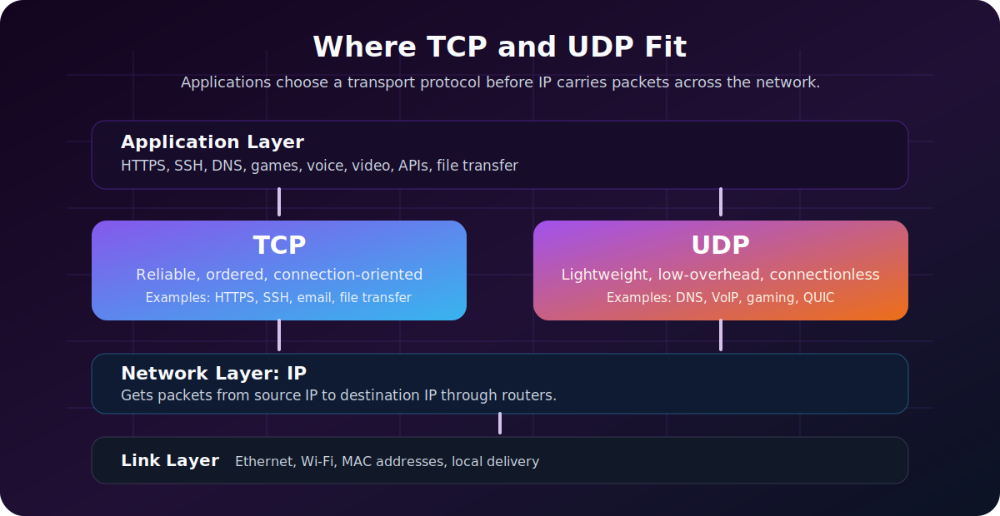
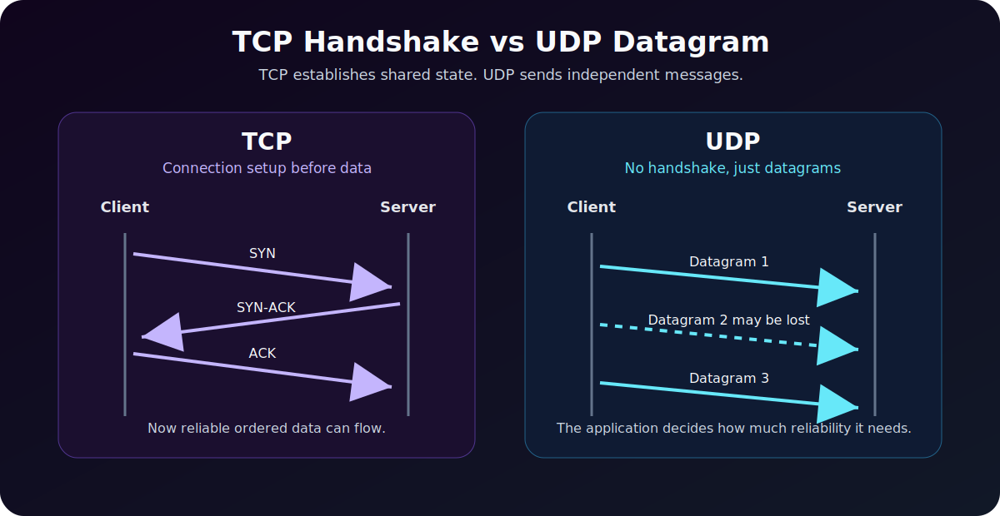

TCP and UDP are two of the most important protocols in networking. They both live at the **transport layer**, and they both help applications communicate across networks. But they make very different tradeoffs.

The short version:

- **TCP** is reliable, ordered, connection-oriented communication.
- **UDP** is lightweight, fast, connectionless communication.

If IP is responsible for getting packets from one machine to another, TCP and UDP are responsible for how applications on those machines exchange data.

If you are still building the lower-level foundation, read [Network Communication Basics](/posts/network-communication-basics/) first, then [Internet Protocol (IP) Explained](/posts/internet-protocol-ip-basics/). TCP and UDP sit on top of that IP foundation.



---

## The Transport Layer in Plain English

When your laptop talks to a server, there are several layers involved:

```text
Application data
      |
      v
Transport layer: TCP or UDP, source port, destination port
      |
      v
Network layer: source IP, destination IP
      |
      v
Link layer: source MAC, destination MAC on the local segment
```

The IP address gets traffic to the right host. The **port number** gets traffic to the right application on that host.

Examples:

| Application | Typical Protocol | Typical Port |
|---|---:|---:|
| HTTPS web traffic | TCP, or UDP with QUIC/HTTP/3 | 443 |
| DNS lookup | UDP, sometimes TCP | 53 |
| SSH | TCP | 22 |
| Email submission | TCP | 587 |
| Online games | Often UDP | Varies |
| Video calls | Often UDP | Varies |

The protocol choice affects reliability, latency, performance, firewall rules, and how troubleshooting works.

---

## What Is TCP?

**TCP** stands for **Transmission Control Protocol**. It is designed for situations where correctness matters more than raw speed.

TCP provides:

- **Connection setup** before data transfer.
- **Reliable delivery** using acknowledgments.
- **Retransmission** when data is lost.
- **Ordered delivery** so data arrives in the correct sequence.
- **Flow control** so a fast sender does not overwhelm a slow receiver.
- **Congestion control** so traffic backs off when the network is overloaded.

TCP is what you want when missing, duplicated, or out-of-order data would break the application.

Common TCP use cases:

| Use Case | Why TCP Fits |
|---|---|
| Web pages over HTTP/1.1 and HTTP/2 | Pages, scripts, and responses must arrive correctly |
| SSH | Commands and terminal output must be accurate |
| File transfers | A corrupted or incomplete file is not acceptable |
| Email | Message delivery needs correctness |
| Database connections | Queries and results must stay consistent |
| API calls | Clients expect complete, ordered responses |

---

## TCP Three-Way Handshake

Before TCP sends application data, it establishes a connection:



The classic TCP handshake:

```text
Client -> Server: SYN
Server -> Client: SYN-ACK
Client -> Server: ACK
```

After that, application data can flow.

This handshake adds a small delay, but it gives both sides a shared connection state. That state is what lets TCP track sequence numbers, acknowledgments, retransmissions, and connection teardown.

---

## What Is UDP?

**UDP** stands for **User Datagram Protocol**. It is designed for simple, low-overhead communication.

UDP does not provide:

- Connection setup.
- Delivery guarantees.
- Built-in retransmission.
- Built-in ordering.
- Built-in congestion control.

That sounds bad until you understand the use case. Sometimes late data is useless data.

In a live video call, if one packet is lost, you usually do not want the application to stop and wait for the missing packet. By the time it arrives, that moment in the conversation has already passed. It is better to keep going.

Common UDP use cases:

| Use Case | Why UDP Fits |
|---|---|
| DNS lookups | Small request, small response, low overhead |
| Voice and video calls | Low latency matters more than perfect delivery |
| Online gaming | Current position/state matters more than old packets |
| Streaming telemetry | Losing a sample may be acceptable |
| DHCP | Broadcast-based local network discovery |
| QUIC and HTTP/3 | Modern reliability and encryption built above UDP |

UDP is not "bad TCP." It is a different tool.

---

## TCP vs UDP Comparison Table

| Feature | TCP | UDP |
|---|---|---|
| Connection setup | Yes | No |
| Reliability | Built in | Not built in |
| Ordering | Built in | Not built in |
| Retransmission | Built in | Application must handle it if needed |
| Header size | Larger | Smaller |
| Latency | Usually higher | Usually lower |
| Best for | Correctness and ordered data | Speed, simplicity, real-time traffic |
| Examples | HTTPS, SSH, email, APIs | DNS, VoIP, gaming, DHCP, QUIC |

The practical rule:

```text
Need complete, ordered, reliable data? Use TCP.
Need low latency and can tolerate some loss? Use UDP.
Need UDP speed plus modern reliability? Look at QUIC.
```

---

## Example 1: Loading a Website

When you visit a traditional HTTPS website, your browser usually uses TCP:

```text
Browser -> TCP connection -> TLS encryption -> HTTP request -> Server response
```

TCP makes sure HTML, CSS, JavaScript, and API responses arrive correctly. A missing chunk of JavaScript could break the page.

Important modern nuance: **HTTP/3 uses QUIC, and QUIC runs over UDP**. QUIC implements reliability, encryption, stream handling, and congestion control above UDP. So modern web traffic can use UDP without behaving like simple "fire and forget" UDP.

This is why you may see UDP/443 in firewall logs for web traffic. It is often HTTP/3/QUIC.

---

## Example 2: DNS Lookup

DNS commonly uses UDP port 53:

```text
Client -> UDP/53 -> DNS server
DNS server -> UDP/53 -> Client
```

Why UDP? Most DNS queries are tiny. A connection handshake would add unnecessary delay.

But DNS can also use TCP. TCP is used when:

- The response is too large for a simple UDP response.
- Zone transfers are performed between DNS servers.
- Reliability is more important than speed.
- DNS over TLS is used.

So "DNS is UDP" is a useful beginner rule, but the accurate statement is: **DNS commonly uses UDP, and also uses TCP in specific cases.**

---

## Example 3: Video Calls and Voice Calls

Real-time communication often prefers UDP because latency matters more than perfect delivery.

Imagine a video call:

```text
Frame 1 arrives
Frame 2 partially arrives
Frame 3 arrives
Frame 4 arrives
```

If part of Frame 2 is lost, the application may conceal the loss, reduce quality, or skip ahead. Waiting for a retransmission could freeze the call.

That is the central UDP tradeoff: it gives the application control. The application can decide whether to ignore, repair, retransmit, or replace missing data.

---

## Example 4: File Transfer

For file transfer, TCP is usually the right answer.

If a 500 MB file arrives with missing pieces, it is not "mostly fine." It is corrupt. TCP's reliability and ordering are exactly what file transfer needs.

Examples that typically rely on TCP:

- SFTP over SSH.
- HTTPS downloads.
- SMB file shares.
- Database backups over a network.

The transfer may be slower than a raw UDP stream, but correctness matters more.

---

## Example 5: Online Gaming

Many online games use UDP because the game state changes constantly.

If a player's position update from 300 milliseconds ago is lost, retransmitting it may be pointless because a newer position update has already replaced it.

Games often build their own reliability rules on top of UDP:

- Critical events may be acknowledged.
- Frequent position updates may be sent without retransmission.
- The client may interpolate movement between updates.
- The server may correct invalid client state.

This is a good example of UDP's philosophy: the application decides what reliability means.

---

## Security Considerations

TCP and UDP also behave differently from a security and monitoring perspective.

| Area | TCP | UDP |
|---|---|---|
| Port scanning | Easier to infer open/closed states | Harder because no response may mean filtered or ignored |
| DDoS risk | SYN floods target connection state | Amplification attacks often abuse UDP services |
| Firewall behavior | Stateful inspection is common | Policies can be trickier because there is no connection state |
| Logging | Connection start/end can be tracked | Datagram activity may be more sparse |
| Common abuse | SYN flood, brute force on exposed services | DNS, NTP, SSDP, memcached amplification |

UDP services exposed to the internet deserve special attention. Because UDP is connectionless, some protocols can be abused for reflection and amplification attacks if misconfigured.

Examples:

- Open DNS resolvers.
- Misconfigured NTP servers.
- Exposed SSDP/UPnP services.
- Legacy UDP services that respond to spoofed source addresses.

For defenders, this connects directly to [SIEM vs XDR vs SOAR](/posts/siem-vs-xdr-vs-soar/): network telemetry, firewall logs, DNS logs, and endpoint activity all help explain whether traffic is normal, suspicious, or part of an incident.

---

## Troubleshooting TCP and UDP

One common mistake: **ping is not TCP or UDP**. Ping uses ICMP. It can tell you whether a host responds to ICMP, but it does not prove that a TCP or UDP service works.

Useful troubleshooting commands:

| Goal | Windows PowerShell | Linux/macOS |
|---|---|---|
| Test TCP port | `Test-NetConnection example.com -Port 443` | `nc -vz example.com 443` |
| Check DNS lookup | `Resolve-DnsName example.com` | `dig example.com` |
| List active connections | `netstat -ano` | `ss -tulpn` |
| Trace route | `tracert example.com` | `traceroute example.com` |
| Test HTTP response | `curl https://example.com` | `curl https://example.com` |

For UDP, testing is harder because a lack of response does not always mean the port is closed. The service may be silent, filtered, or designed not to reply to your test packet.

---

## Which One Should You Use?

If you are designing an application, start with the application's tolerance for loss and delay.

| Requirement | Better Default |
|---|---|
| Exact data must arrive | TCP |
| Data must arrive in order | TCP |
| User can tolerate slight delay | TCP |
| Real-time interaction matters most | UDP |
| Old packets become useless quickly | UDP |
| You need modern web transport with low-latency stream handling | QUIC over UDP |
| You do not want to design reliability yourself | TCP |

For most business applications, APIs, dashboards, login systems, admin panels, and file transfers, TCP is the sensible default.

For games, voice, video, streaming telemetry, and custom real-time systems, UDP may be a better fit.

---

## Common Misconceptions

**"UDP is unreliable, so it is bad."**  
UDP has no built-in reliability. That does not make it bad. It means reliability is optional and application-defined.

**"TCP is always slower."**  
TCP has more overhead, but it is heavily optimized and extremely fast in real-world networks. Do not avoid TCP unless the application has a real latency or transport reason.

**"DNS only uses UDP."**  
DNS commonly uses UDP, but TCP is also part of DNS behavior.

**"HTTP always uses TCP."**  
HTTP/1.1 and HTTP/2 typically use TCP. HTTP/3 uses QUIC over UDP.

**"If ping works, the service works."**  
Ping only tests ICMP reachability. A web server can ignore ping while HTTPS works, or respond to ping while TCP/443 is blocked.

---

## Quick Summary

| Question | Answer |
|---|---|
| Which is more reliable? | TCP |
| Which is lower overhead? | UDP |
| Which preserves order? | TCP |
| Which is better for file transfer? | TCP |
| Which is better for live voice/video? | UDP |
| Which protocol does DNS usually use? | UDP, with TCP in some cases |
| Which protocol does HTTP/3 use underneath? | UDP through QUIC |

TCP and UDP are not competitors where one wins forever. They are different answers to different networking problems.

Use TCP when the application needs correctness. Use UDP when the application needs speed, real-time behavior, or custom reliability. And when you see UDP carrying modern web traffic, remember that protocols like QUIC can build sophisticated behavior on top of a very small transport foundation.

**Read next:** [Internet Protocol (IP) Explained](/posts/internet-protocol-ip-basics/) and [Understanding HTTP Status Codes](/posts/http-status-codes/) to connect transport behavior with real application behavior.
