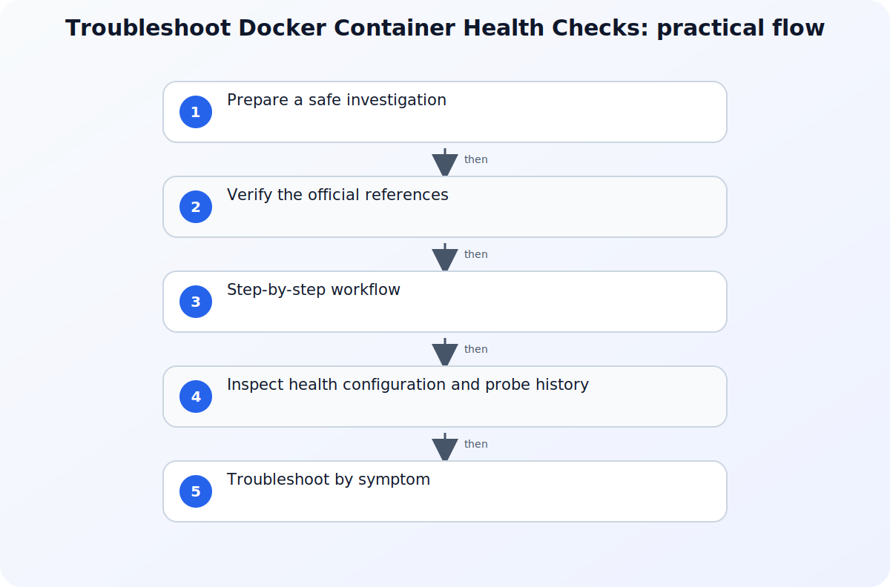

## Direct answer

An unhealthy Docker container can still have a running main process. Diagnosis should therefore keep process state, health-check configuration, individual probe results, and application readiness separate. Inspect those facts before restarting the container or weakening the check, because a restart can erase the timing pattern without correcting the command, dependency, or startup budget. Start with evidence already available to the operator and use the referenced documentation to verify the behavior of the component in scope.

## Prepare a safe investigation

Record the container name or ID, image reference, deployment time, expected endpoint or command, current container status, and the first unhealthy timestamp. Use read-only Docker commands against the correct daemon context and preserve the initial inspect output before rebuilding the image, recreating the container, or disabling its health check. Before changing policy, access, networking, or application settings, capture a small reproducible record of the failure. Include the affected identity, workload, tenant or environment, time zone, correlation identifier when available, and the action that produced the result. Mask secrets and personal data in any ticket or shared export. A narrow record is safer to review and lets another administrator test the same hypothesis without repeating a disruptive change.

## Verify the official references

### Dockerfile HEALTHCHECK reference

Use Dockerfile HEALTHCHECK reference to verify this specific part of the investigation: Use the Dockerfile HEALTHCHECK reference for instruction forms, timing options, exit status, and stored output behavior. Match the field names, permissions, and interface labels for Dockerfile HEALTHCHECK reference before changing the affected service.
### docker inspect

Use docker inspect to verify this specific part of the investigation: Use the docker inspect reference for supported low-level object inspection and formatted output. Match the field names, permissions, and interface labels for docker inspect before changing the affected service.
### docker container ls health filter

Use docker container ls health filter to verify this specific part of the investigation: Use the docker container ls reference for documented health filtering. Match the field names, permissions, and interface labels for docker container ls health filter before changing the affected service.

## Step-by-step workflow

For each step, record the timestamp, affected actor or workload, exact result, and evidence scope before moving on. This keeps the investigation reproducible without repeating the same warning after every action.

### 1. Confirm the configured HEALTHCHECK

Inspect the image and container configuration to identify the exact health command, interval, timeout, retries, and start period. Distinguish an inherited image check from an override so the remediation is applied to the configuration that actually created the container.
### 2. Read the health history

Use docker inspect to capture the current health status and recent probe records, including timestamps, exit codes, and bounded output. Compare the probe time with application logs and dependency availability instead of assuming that every nonzero exit is an application crash.
### 3. Find the affected set without changing it

Filter the container list by health state to determine whether the problem is isolated to one instance or shared by containers from the same image or environment. Keep health state separate from running or exited state when deciding the next evidence check.

## Inspect health configuration and probe history

The following commands read the effective health-check definition, recent probe records, and the set of unhealthy containers. They do not restart or recreate the workload:

```bash
CONTAINER_NAME='example-app'

docker inspect --type container "$CONTAINER_NAME" --format '{{json .Config.Healthcheck}}'
docker inspect --type container "$CONTAINER_NAME" --format '{{json .State.Health}}'
docker container ls --filter health=unhealthy --format 'table {{.ID}}\t{{.Image}}\t{{.Names}}\t{{.Status}}'
```

Read the command and timing settings from `Config.Healthcheck`, then correlate each `State.Health.Log` timestamp, exit code, and bounded output value with application and dependency logs. The filtered list shows scope; it does not explain why the probes failed.


## Troubleshoot by symptom

Use the observed result to choose the next check instead of changing several controls at once. The following table is a decision aid, not a list of automatic fixes. Confirm the product-specific behavior in the cited documentation before applying a remediation.

| Symptom | Likely boundary | Next safe check |
| --- | --- | --- |
| Container remains in starting state | Start period, slow dependency, or probe execution boundary | Compare probe timestamps and command duration with the application startup timeline. |
| Container is running but unhealthy | Probe command, endpoint, dependency, permission, or timeout failure | Inspect recent probe exit codes and output, then correlate the same timestamp with application logs. |
| Every replica becomes unhealthy together | Shared image, configuration, or external dependency | Compare image identity and probe output across replicas before recreating them. |

## Common mistakes to avoid

Do not treat an isolated success as proof that the underlying configuration is correct. Different users, applications, devices, networks, and token states can follow different paths. Do not remove a security control merely to make one test pass; first identify the exact condition that produced the failure and verify whether a narrower, approved adjustment exists. Avoid copying commands, policy values, or portal labels from old runbooks without checking the current official reference.

Keep the investigation read-only until the evidence identifies a change boundary. If a temporary exception is approved, define who authorized it, when it expires, how it will be monitored, and how the original state will be restored. A reversible experiment is useful; an undocumented workaround creates a second incident to diagnose later.

## Practical checklist

1. Record container, image, daemon context, deployment time, and first unhealthy timestamp.
2. Inspect the effective health-check command and timing options.
3. Capture recent health records with exit codes and bounded output.
4. Correlate probe time with application and dependency evidence.
5. Change one reviewed boundary, recreate only when required, and verify the original health condition.

## Preserve the result and follow up

After the immediate issue is understood, record the conclusion in language that separates facts, inferences, and remaining unknowns. Attach only the necessary evidence and link the relevant official reference rather than pasting a long, unversioned screenshot. If the same pattern returns, compare the new record with the earlier timestamp, scope, and configuration state before making another change. This turns a one-off troubleshooting session into a dependable operating procedure.

For related background, see [Common Kubernetes Probe Misconfigurations and Fixes](/posts/kubernetes-probe-misconfigurations-fixes/) and [Operating AI/ML Workloads on Kubernetes: A Headlamp Plugin for Kubeflow](/posts/operating-ai-ml-workloads-kubernetes/). These internal articles provide context, but the cited official documents remain the source of truth for the configuration or diagnostic details in this workflow.

## Version and verification notes

This article is based on the official sources listed for this topic and was checked at publication time. Cloud services, identity behavior, product labels, and administrative interfaces can change. Recheck the cited documentation before automating a command, relying on a default, or applying the same procedure to a different tenant, subscription, cluster, or operating-system release.

## Summary

Start with a small evidence record, use the documented diagnostic path for the affected service, and make one reversible change only after the evidence supports it. That approach protects availability and security while producing a clear handoff for the next operator.

## Sources

- [Dockerfile HEALTHCHECK reference](https://docs.docker.com/reference/dockerfile)
- [docker inspect](https://docs.docker.com/reference/cli/docker/inspect)
- [docker container ls health filter](https://docs.docker.com/reference/cli/docker/container/ls)
