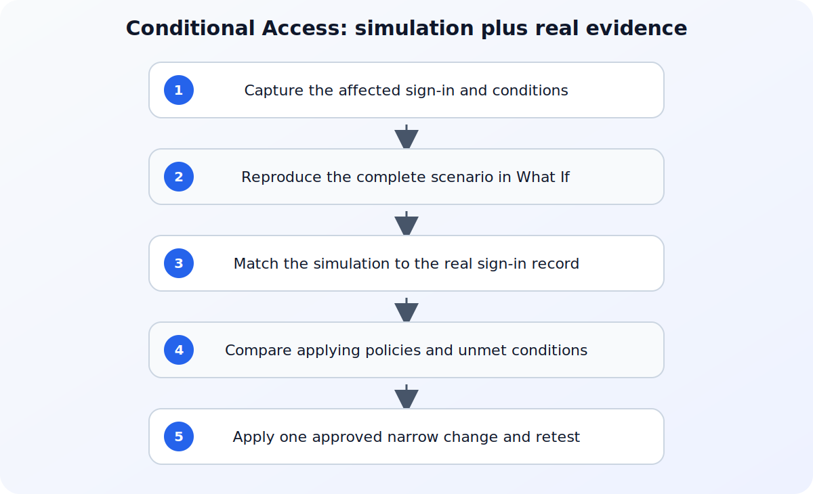

## Direct answer

Conditional Access troubleshooting requires both a modeled policy evaluation and evidence from the real sign-in. The What If tool explains how enabled and report-only policies evaluate the supplied identity, resource, and conditions, while the sign-in record shows the application, resource, client, device, location, risk, and policy result that actually occurred. Neither should be treated as a universal policy test on its own. Start with evidence already available to the operator and use the referenced documentation to verify the behavior of the component in scope.

## Prepare a safe investigation

Capture the affected identity, target application and resource, sign-in time, request or correlation identifier, client app, device platform, location context, and user-facing error. Use an appropriately scoped read-only role where possible, preserve the original policy state, and do not exclude a broad group or disable a policy merely to confirm that access can succeed. Before changing policy, access, networking, or application settings, capture a small reproducible record of the failure. Include the affected identity, workload, tenant or environment, time zone, correlation identifier when available, and the action that produced the result. Mask secrets and personal data in any ticket or shared export. A narrow record is safer to review and lets another administrator test the same hypothesis without repeating a disruptive change.

## Verify the official references

### Conditional Access What If tool

Use Conditional Access What If tool to verify this specific part of the investigation: Use the What If reference for required inputs, evaluation results, and documented limitations such as service dependencies. Match the field names, permissions, and interface labels for Conditional Access What If tool before changing the affected service.
### Troubleshoot sign-in problems with Conditional Access

Use Troubleshoot sign-in problems with Conditional Access to verify this specific part of the investigation: Use Microsoft's Conditional Access troubleshooting reference for sign-in-event correlation and policy details. Match the field names, permissions, and interface labels for Troubleshoot sign-in problems with Conditional Access before changing the affected service.
### Use Microsoft Entra sign-in diagnostics

Use Use Microsoft Entra sign-in diagnostics to verify this specific part of the investigation: Use the sign-in diagnostics reference for the supported diagnostic workflow and its scope. Match the field names, permissions, and interface labels for Use Microsoft Entra sign-in diagnostics before changing the affected service.

## Step-by-step workflow

For each step, record the timestamp, affected actor or workload, exact result, and evidence scope before moving on. This keeps the investigation reproducible without repeating the same warning after every action.

### 1. Reproduce the intended conditions in What If

Supply the identity, exact target resource, device platform, client app, and every condition that matters to the suspected policy. Review both applying and nonapplying policies and retain the first unmet condition reported for a policy that does not apply.
### 2. Match the simulation to the real sign-in

Find the sign-in record for the reported attempt and compare its resource, client, device, location, risk, and Conditional Access details with the values used in the simulation. A simulation with missing or different conditions does not explain the recorded event.
### 3. Use diagnostics before narrowing a policy

Open the sign-in diagnostic for the matching event and record the recommendation and relevant authentication or policy context. If a change is justified, adjust only the identified assignment or condition through the approved process and retest the same scenario.

## Troubleshoot by symptom

Use the observed result to choose the next check instead of changing several controls at once. The following table is a decision aid, not a list of automatic fixes. Confirm the product-specific behavior in the cited documentation before applying a remediation.

| Symptom | Likely boundary | Next safe check |
| --- | --- | --- |
| What If says a policy does not apply but the sign-in was blocked | Simulation inputs differ from the recorded resource or conditions | Compare every supplied What If parameter with the matching sign-in fields. |
| A policy applies unexpectedly | Broad assignment, resource dependency, audience, or condition match | Read the applying-policy details and the actual resource or audience in the sign-in record. |
| One user or device behaves differently | Identity, group, device, client, risk, or location-specific condition | Run a complete simulation for each scenario and compare the corresponding sign-in evidence. |

## Common mistakes to avoid

Do not treat an isolated success as proof that the underlying configuration is correct. Different users, applications, devices, networks, and token states can follow different paths. Do not remove a security control merely to make one test pass; first identify the exact condition that produced the failure and verify whether a narrower, approved adjustment exists. Avoid copying commands, policy values, or portal labels from old runbooks without checking the current official reference.

Keep the investigation read-only until the evidence identifies a change boundary. If a temporary exception is approved, define who authorized it, when it expires, how it will be monitored, and how the original state will be restored. A reversible experiment is useful; an undocumented workaround creates a second incident to diagnose later.

## Practical checklist

1. Capture the exact identity, application, resource, client, device, location, and sign-in time.
2. Run What If with all conditions required by the policies in scope.
3. Compare applying and nonapplying results with the matching sign-in record.
4. Review Sign-in Diagnostics before changing an assignment or control.
5. Apply one approved narrow change, retest the same scenario, and remove any temporary exception.

## Preserve the result and follow up

After the immediate issue is understood, record the conclusion in language that separates facts, inferences, and remaining unknowns. Attach only the necessary evidence and link the relevant official reference rather than pasting a long, unversioned screenshot. If the same pattern returns, compare the new record with the earlier timestamp, scope, and configuration state before making another change. This turns a one-off troubleshooting session into a dependable operating procedure.

For related background, see [Troubleshoot Microsoft Entra Sign-in Errors with Sign-in Diagnostics](/posts/troubleshoot-microsoft-entra-sign-in-errors/) and [Microsoft Entra ID Explained: Users, Groups, Apps, Roles, and Conditional Access](/posts/microsoft-entra-id-explained-users-groups-apps-roles-conditional-access/). These internal articles provide context, but the cited official documents remain the source of truth for the configuration or diagnostic details in this workflow.

## Version and verification notes

This article is based on the official sources listed for this topic and was checked at publication time. Cloud services, identity behavior, product labels, and administrative interfaces can change. Recheck the cited documentation before automating a command, relying on a default, or applying the same procedure to a different tenant, subscription, cluster, or operating-system release.

## Summary

Start with a small evidence record, use the documented diagnostic path for the affected service, and make one reversible change only after the evidence supports it. That approach protects availability and security while producing a clear handoff for the next operator.

## Sources

- [Conditional Access What If tool](https://learn.microsoft.com/en-us/entra/identity/conditional-access/what-if-tool)
- [Troubleshoot sign-in problems with Conditional Access](https://learn.microsoft.com/en-us/entra/identity/conditional-access/troubleshoot-conditional-access)
- [Use Microsoft Entra sign-in diagnostics](https://learn.microsoft.com/en-us/entra/identity/monitoring-health/howto-use-sign-in-diagnostics)
