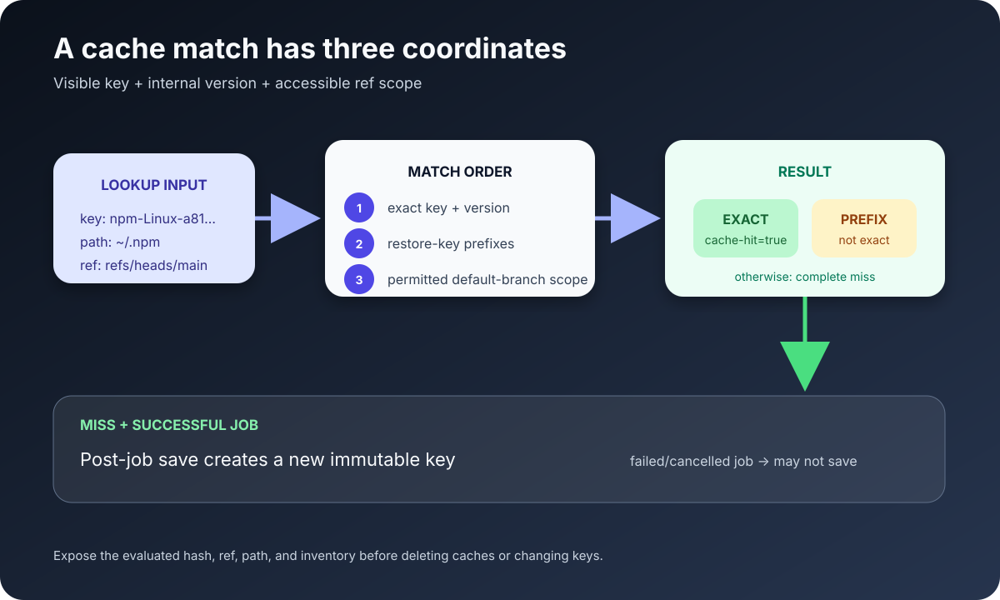

A GitHub Actions cache “miss” is not one condition. It can mean:

- no entry has the requested key;
- a prefix restore succeeded, but the exact-key output is not `true`;
- the key exists in an inaccessible branch scope;
- the key text matches, but the cache **version** differs;
- the previous job never saved the cache;
- the cache was evicted.

The reliable way to diagnose it is to expose the evaluated key, scope, version inputs, and save path—then compare them with the repository's cache inventory.



## Understand the lookup before changing YAML

For `actions/cache`, GitHub searches using the key and an internal cache version. At a high level:

1. Look for an exact key and version in the current branch scope.
2. Look for prefix matches.
3. Try each `restore-keys` prefix in order.
4. If needed, repeat the permitted search against the default branch.
5. On a miss, save a new cache after a successful job.

The cache version incorporates metadata about the cached paths and compression tool. The same visible key can therefore miss when those inputs are incompatible.

Caches are also scope-restricted. A workflow can generally restore entries from its current branch and default branch, plus the base branch for pull-request runs. It cannot freely read sibling or child branch caches. A cache created by a `pull_request` run belongs to the pull request merge ref and is not a general cache for `main`.

## Start with an observable workflow

Prefer the package manager's setup action when it supports your ecosystem:

```yaml
- uses: actions/checkout@v6

- uses: actions/setup-node@v6
  with:
    node-version: 24
    cache: npm
    cache-dependency-path: package-lock.json

- run: npm ci
```

For custom paths, make every key component visible:

```yaml
- name: Compute cache inputs
  id: cache-inputs
  shell: bash
  run: |
    echo "lock_hash=${{ hashFiles('**/package-lock.json') }}"
    echo "runner_os=${{ runner.os }}"
    echo "ref=${{ github.ref }}"
    echo "base_ref=${{ github.base_ref }}"

- name: Restore npm download cache
  id: npm-cache
  uses: actions/cache@v4
  with:
    path: ~/.npm
    key: npm-${{ runner.os }}-${{ hashFiles('**/package-lock.json') }}
    restore-keys: |
      npm-${{ runner.os }}-

- name: Explain cache result
  shell: bash
  run: |
    echo "exact_hit=${{ steps.npm-cache.outputs.cache-hit }}"
    echo "primary_key=npm-${{ runner.os }}-${{ hashFiles('**/package-lock.json') }}"
```

Do not print secrets or dump the entire context. Print only the values needed to reproduce the lookup.

## Exact hit, prefix restore, or complete miss?

The `cache-hit` output is `true` only for an exact key match. A restored prefix is useful, but it is not an exact hit:

```yaml
- if: steps.npm-cache.outputs.cache-hit != 'true'
  run: npm ci
```

This condition runs for both a partial restore and a complete miss, which is usually correct for dependency installation: restored package downloads accelerate `npm ci`, while the lockfile still determines the installed tree.

Do not skip a deterministic install merely because a broad prefix restored old dependencies.

## Inspect the actual cache inventory

With GitHub CLI:

```bash
gh cache list \
  --repo OWNER/REPOSITORY \
  --limit 100 \
  --json id,key,ref,sizeInBytes,createdAt,lastAccessedAt
```

Filter by key:

```bash
gh cache list \
  --repo OWNER/REPOSITORY \
  --key "npm-Linux-" \
  --limit 100
```

Compare:

- fully evaluated key;
- `ref` scope;
- creation and last-access time;
- size;
- expected operating system and architecture markers.

The Actions UI and REST API can also list caches. Inventory is stronger evidence than “another workflow used the same YAML.”

## The seven common causes

### 1. `hashFiles()` evaluated to an empty string

A wrong path or different checkout directory can produce:

```text
npm-Linux-
```

That key is valid but much broader than intended. Confirm checkout happened before key evaluation and that the lockfile exists with the same case:

```yaml
- shell: bash
  run: |
    pwd
    find . -name package-lock.json -print
    echo "hash=${{ hashFiles('**/package-lock.json') }}"
```

### 2. The cached path is wrong

For npm, cache the package-manager download cache (`~/.npm`) rather than `node_modules` unless you have a measured reason to cache the installed tree. Verify the path after the install:

```bash
npm config get cache
du -sh ~/.npm || true
```

An empty or nonexistent path creates little value and may produce a save warning.

### 3. The job did not reach the post-job save

`actions/cache` restores during its step and saves in a post-job phase after a successful job. If tests fail, a runner is cancelled, or the process is terminated, the new cache may never be written. Inspect the end of the job log for the cache save.

For advanced workflows, `actions/cache/restore` and `actions/cache/save` make save placement explicit, but you must preserve security and correctness yourself.

### 4. Branch or pull-request scope differs

Print:

```yaml
- run: |
    echo "event=${{ github.event_name }}"
    echo "ref=${{ github.ref }}"
    echo "base_ref=${{ github.base_ref }}"
```

A pull request cache often belongs to `refs/pull/.../merge`. A later `push` to `main` should not be expected to restore that PR-scoped entry.

### 5. Version inputs changed

Changing `path`, compression compatibility, or operating system can change cache compatibility even when `key` looks identical. Include platform details in cross-platform keys, and use `enableCrossOsArchive` only after reviewing its prerequisites and tradeoffs.

### 6. The key changes too often—or not often enough

A commit SHA guarantees misses on every commit:

```yaml
key: build-${{ github.sha }}
```

A static key never saves new content because caches are immutable:

```yaml
key: build-v1
```

Keys should change when the cached content becomes incompatible. Dependency lock hashes, toolchain versions, OS, architecture, and a manual schema version are common inputs.

### 7. Eviction and cache thrashing

GitHub applies repository storage and retention policies. Large, highly unique caches can evict one another. Inspect total sizes and last-access times; remove low-value caches or reduce key cardinality before increasing storage.

## Design restore keys deliberately

```yaml
key: gradle-${{ runner.os }}-jdk21-${{ hashFiles('**/*.gradle*', '**/gradle-wrapper.properties') }}
restore-keys: |
  gradle-${{ runner.os }}-jdk21-
  gradle-${{ runner.os }}-
```

Each line broadens compatibility. Ask what stale content it may restore. The install/build step must validate or replace restored entries.

Avoid a prefix so broad that unrelated toolchain or platform artifacts become inputs to privileged build steps.

## Cache security is part of correctness

GitHub warns that people able to open pull requests may be able to read caches available to the base branch. Never cache:

- tokens, credentials, signing material, or `.env` secrets;
- authenticated configuration files;
- private user data;
- untrusted executable output that a privileged workflow later runs without validation.

Low-trust triggers also have restricted cache-write behavior to reduce cache poisoning. Do not work around those boundaries simply to remove a warning.

Pin third-party actions to trusted revisions according to your supply-chain policy, minimize token permissions, and treat restored executable artifacts as inputs requiring provenance.

## A five-minute triage sequence

1. Print the exact evaluated primary key and lockfile hash.
2. Print event, ref, base ref, OS, and architecture.
3. Confirm the cached path exists and contains the expected data.
4. Classify `cache-hit` as exact, partial, or absent.
5. List repository caches and compare key plus ref.
6. Inspect the end of the producer job for a successful save.
7. Check recent path/action/runner changes that affect cache version.
8. Check size, eviction, and overly unique keys.

Change one variable at a time. Deleting every cache may temporarily hide a bad key and removes the evidence needed to diagnose it.

## Sources

- [Dependency caching reference — GitHub Docs](https://docs.github.com/en/actions/reference/workflows-and-actions/dependency-caching)
- [Managing caches — GitHub Docs](https://docs.github.com/en/actions/how-tos/manage-workflow-runs/manage-caches)
- [REST API endpoints for GitHub Actions cache — GitHub Docs](https://docs.github.com/en/rest/actions/cache)
- [actions/cache — official GitHub repository](https://github.com/actions/cache)
- [GitHub CLI `gh cache` manual](https://cli.github.com/manual/gh_cache)
