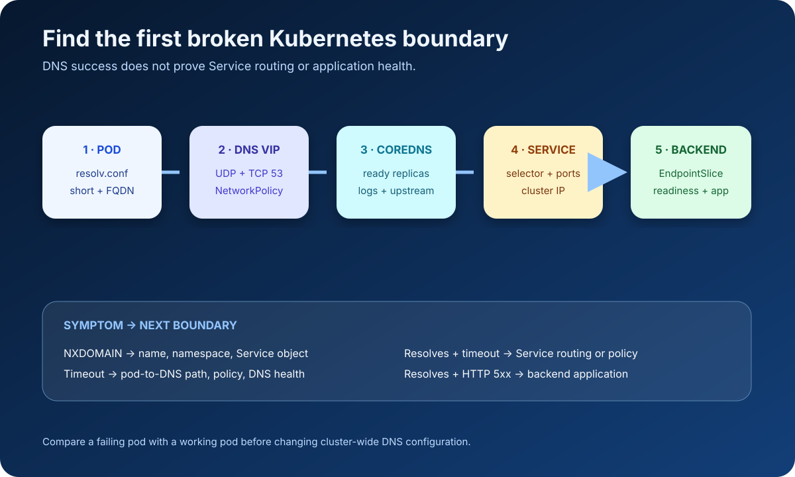

“The pod cannot reach `orders`” describes at least four different failures:

1. The pod generated a different DNS query than expected.
2. Cluster DNS did not answer correctly.
3. DNS resolved, but the Service virtual IP was unreachable.
4. The Service was reachable, but no healthy backend served the request.

Changing CoreDNS before locating the failing layer usually adds noise. Start inside the affected pod or namespace and move outward one boundary at a time.



## Capture the symptom precisely

Record:

- namespace, pod, container, node, and cluster;
- exact hostname and port;
- error text (`NXDOMAIN`, timeout, connection refused, TLS error);
- when it started and whether every pod is affected;
- whether the fully qualified name works;
- recent Deployment, Service, NetworkPolicy, or DNS changes.

Use a disposable diagnostic pod only when the application image lacks tools:

```bash
kubectl run dns-debug \
  --rm -it \
  --restart=Never \
  --image=registry.k8s.io/e2e-test-images/dnsutils:1.3 \
  --namespace=shop \
  -- /bin/sh
```

For a production incident, capture output before deleting the pod.

## Step 1: inspect the pod's resolver view

```bash
kubectl exec -n shop deploy/web -- cat /etc/resolv.conf
```

A typical pod using `dnsPolicy: ClusterFirst` has:

```text
search shop.svc.cluster.local svc.cluster.local cluster.local
nameserver 10.96.0.10
options ndots:5
```

Do not assume these exact values; the cluster domain and DNS Service IP are configurable.

Check the workload:

```bash
kubectl get pod -n shop web-abc123 \
  -o jsonpath='{.spec.dnsPolicy}{"\n"}{.spec.dnsConfig}{"\n"}'
```

Important cases:

- `ClusterFirst` is the normal cluster-DNS policy for pods.
- `Default` inherits the node's resolver behavior.
- `None` requires explicit `dnsConfig`.
- Pods using `hostNetwork: true` commonly need `ClusterFirstWithHostNet` for cluster DNS behavior.

Compare a failing pod with a working pod in the same namespace. Differences are stronger evidence than a generic “correct” sample.

## Step 2: test short and fully qualified names

For Service `orders` in namespace `shop`:

```bash
nslookup orders
nslookup orders.shop
nslookup orders.shop.svc.cluster.local
```

Kubernetes creates DNS names relative to namespaces. A pod in `shop` can usually resolve `orders`; a pod in `payments` should use `orders.shop` or the full service name.

If the FQDN works but the short name fails, investigate the search list, `ndots`, namespace expectation, and pod DNS policy. If all forms time out, focus on reaching the DNS Service. If they return `NXDOMAIN`, verify the name and object.

For applications that make many external lookups, `ndots:5` can cause several search-suffixed queries before an absolute lookup. A trailing dot such as `api.example.com.` explicitly marks an absolute DNS name. Change resolver options only after measuring the application and understanding cluster-wide consequences.

## Step 3: verify the Kubernetes object

```bash
kubectl get service orders -n shop -o wide
kubectl get service orders -n shop -o yaml
```

Check:

- exact name and namespace;
- `clusterIP` (or `None` for a headless Service);
- ports and target ports;
- selectors;
- Service type.

Service DNS behavior differs by type:

- A normal Service name resolves to its cluster IP.
- A headless Service (`clusterIP: None`) resolves to addresses associated with selected endpoints.
- ExternalName uses a DNS CNAME and has application-protocol caveats because the requested hostname may differ from the target hostname.

Test A/AAAA records separately from SRV records when service discovery depends on named ports.

## Step 4: check the DNS control plane

Clusters commonly label CoreDNS pods `k8s-app=kube-dns`, even when the implementation is CoreDNS:

```bash
kubectl get pods -n kube-system -l k8s-app=kube-dns -o wide
kubectl get service -n kube-system kube-dns -o wide
kubectl get endpointslice -n kube-system \
  -l kubernetes.io/service-name=kube-dns
```

Look for ready replicas, restarts, pending pods, missing endpoints, or the DNS Service IP differing from the pod's `nameserver`.

Inspect logs without immediately editing configuration:

```bash
kubectl logs -n kube-system \
  -l k8s-app=kube-dns \
  --prefix \
  --tail=200
```

If the query never appears, traffic may not reach DNS. If CoreDNS reports upstream failures, compare internal Service lookups with external names and inspect its configured forwarders:

```bash
kubectl get configmap -n kube-system coredns -o yaml
```

Redact sensitive internal zones before sharing the output.

## Step 5: test network reachability to DNS

A timeout is different from `NXDOMAIN`. Determine whether UDP and TCP port 53 can reach the DNS Service from the affected pod.

Check policies:

```bash
kubectl get networkpolicy -A
kubectl describe networkpolicy -n shop
```

In a default-deny egress namespace, allow:

- UDP 53 to the cluster DNS endpoints or Service path;
- TCP 53 for larger responses, retries, and operations that require it.

The exact policy selectors depend on the CNI and cluster DNS placement. Do not copy a broad allow rule without confirming it selects the intended destination.

Node-specific failures suggest CNI routing, kube-proxy/service implementation, node resolver, or node firewall differences. Compare failing and working pods scheduled on different nodes.

## Step 6: separate DNS from Service routing

Once the name resolves, capture the address:

```bash
getent hosts orders.shop.svc.cluster.local
```

Then inspect Service backends:

```bash
kubectl get endpointslice -n shop \
  -l kubernetes.io/service-name=orders \
  -o wide

kubectl get pods -n shop \
  -l app=orders \
  -o wide
```

An empty EndpointSlice usually points to mismatched selectors, unready pods, or manually managed endpoints. That is not a DNS-record failure.

Test the application protocol:

```bash
curl -sv --connect-timeout 3 \
  http://orders.shop.svc.cluster.local:8080/health
```

Interpret the layers:

| Symptom | Likely boundary |
| --- | --- |
| `NXDOMAIN` | Name/namespace/object or DNS record generation |
| DNS timeout | Pod-to-DNS networking or unhealthy DNS |
| Resolves, connection timeout | Service routing, policy, node, or backend path |
| Resolves, connection refused | Port/target process mismatch |
| HTTP 5xx | Application/backend behavior |
| TLS hostname failure | Certificate/SNI/hostname contract |

## A compact evidence script

Run commands individually when permissions vary:

```bash
NAMESPACE=shop
SERVICE=orders

kubectl get service "$SERVICE" -n "$NAMESPACE" -o wide
kubectl get endpointslice -n "$NAMESPACE" \
  -l "kubernetes.io/service-name=$SERVICE" -o wide
kubectl get pods -n kube-system -l k8s-app=kube-dns -o wide
kubectl get service -n kube-system kube-dns -o wide
```

Inside the affected pod:

```bash
cat /etc/resolv.conf
nslookup orders
nslookup orders.shop.svc.cluster.local
```

Preserve command output with timestamps and the pod UID. Pods are replaceable; the evidence disappears quickly.

## Avoid these incident shortcuts

- Restarting CoreDNS before determining whether queries reach it.
- Editing `/etc/resolv.conf` inside a running pod; it is generated and not a durable fix.
- Treating a successful lookup as proof the application port works.
- Testing only from a laptop, which uses different DNS and networking paths.
- Installing tools into an immutable production container.
- Ignoring TCP 53 because ordinary queries usually use UDP.
- Broadly disabling NetworkPolicy instead of proving the required flow.

The fastest safe path is a ladder: pod resolver → expected record → DNS Service and CoreDNS → network path → Service → EndpointSlice → backend. Stop at the first boundary where a failing and working case differ.

## Sources

- [Debugging DNS Resolution — Kubernetes documentation](https://kubernetes.io/docs/tasks/administer-cluster/dns-debugging-resolution/)
- [DNS for Services and Pods — Kubernetes documentation](https://kubernetes.io/docs/concepts/services-networking/dns-pod-service/)
- [Debug Services — Kubernetes documentation](https://kubernetes.io/docs/tasks/debug/debug-application/debug-service/)
- [Customizing DNS Service — Kubernetes documentation](https://kubernetes.io/docs/tasks/administer-cluster/dns-custom-nameservers/)
- [Network Policies — Kubernetes documentation](https://kubernetes.io/docs/concepts/services-networking/network-policies/)
