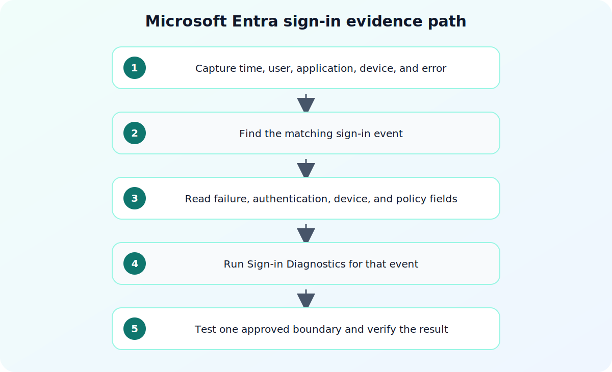

## Direct answer

Microsoft Entra sign-in troubleshooting should begin with the affected sign-in record and its diagnostic details. This isolates whether the failure is associated with the account, application, device, network, authentication method, or an access policy before an administrator changes Conditional Access or user settings. This recovery article is intentionally conservative: it starts with evidence already available to the operator, separates observation from remediation, and uses the referenced documentation to confirm the exact behavior of the service in scope. It does not assume that a familiar error message has one universal cause.



## Prepare a safe investigation

Ask the affected user for the approximate time, application, device, network location, and the exact error shown. Confirm the administrator is authorized to view the relevant tenant data and use an appropriately scoped account. Preserve the original sign-in details before testing with another user or another device. Before changing policy, access, networking, or application settings, capture a small reproducible record of the failure. Include the affected identity, workload, tenant or environment, time zone, correlation identifier when available, and the action that produced the result. Mask secrets and personal data in any ticket or shared export. A narrow record is safer to review and lets another administrator test the same hypothesis without repeating a disruptive change.

## Verify the official references

### What are Microsoft Entra sign-in logs?

Use this official reference to verify the part of the investigation it covers. Use the sign-in-log overview to confirm which records and fields are relevant. Treat the document as the authority for product-specific fields, permissions, and user-interface labels; do not fill a gap with a guess from a similar service or an older screenshot.
### Use sign-in diagnostics

Use this official reference to verify the part of the investigation it covers. Use Sign-in Diagnostics for the supported diagnostic workflow and interpretation. Treat the document as the authority for product-specific fields, permissions, and user-interface labels; do not fill a gap with a guess from a similar service or an older screenshot.
### Sign-in log activity details

Use this official reference to verify the part of the investigation it covers. Use the activity-detail reference to check the exact fields reported for the sign-in. Treat the document as the authority for product-specific fields, permissions, and user-interface labels; do not fill a gap with a guess from a similar service or an older screenshot.

## Step-by-step workflow

### 1. Find the matching sign-in

Filter the sign-in records by the user, application, and the smallest time window that contains the failure. Confirm that the record matches the reported attempt rather than a background token refresh or a different application. Keep this step bounded to the current incident or change request. Record the timestamp, the actor or workload, the exact result, and the scope of the evidence before moving to the next step. That record makes a later escalation reproducible and prevents a broad configuration change from hiding the original signal.
### 2. Read the diagnostic result before editing policy

Open the diagnostic information for the selected record and note the result, failure code, and any policy or authentication context shown. Keep the record identifier with the ticket so the same event can be reviewed after a controlled test. Keep this step bounded to the current incident or change request. Record the timestamp, the actor or workload, the exact result, and the scope of the evidence before moving to the next step. That record makes a later escalation reproducible and prevents a broad configuration change from hiding the original signal.
### 3. Validate the affected condition with a narrow test

Test only the suspected boundary, such as the application assignment, authentication method, device state, or named network condition. Use a non-production test account when policy allows, and do not disable a broad protection merely to prove that a sign-in can succeed. Keep this step bounded to the current incident or change request. Record the timestamp, the actor or workload, the exact result, and the scope of the evidence before moving to the next step. That record makes a later escalation reproducible and prevents a broad configuration change from hiding the original signal.

## Troubleshoot by symptom

Use the observed result to choose the next check instead of changing several controls at once. The following table is a decision aid, not a list of automatic fixes. Confirm the product-specific behavior in the cited documentation before applying a remediation.

| Symptom | Likely boundary | Next safe check |
| --- | --- | --- |
| One user cannot access one application | User, application, or assignment-specific condition | Compare the selected sign-in record with a successful user in the same application. |
| Sign-in fails only from one device or network | Device posture, client, or network condition | Confirm the recorded client and location context before changing policy. |
| A policy-related error appears | A requirement was not satisfied | Review the sign-in diagnostic details and make one approved, narrow test. |

## Common mistakes to avoid

Do not treat an isolated success as proof that the underlying configuration is correct. Different users, applications, devices, networks, and token states can follow different paths. Do not remove a security control merely to make one test pass; first identify the exact condition that produced the failure and verify whether a narrower, approved adjustment exists. Avoid copying commands, policy values, or portal labels from old runbooks without checking the current official reference.

Keep the investigation read-only until the evidence identifies a change boundary. If a temporary exception is approved, define who authorized it, when it expires, how it will be monitored, and how the original state will be restored. A reversible experiment is useful; an undocumented workaround creates a second incident to diagnose later.

## Practical checklist

1. Capture the exact time, user, application, device, and user-facing error.
2. Locate the matching sign-in record and preserve its identifier.
3. Review diagnostic and activity details before changing an authentication or access policy.
4. Test one suspected condition with an approved, reversible change.
5. Record the result and remove any temporary exception at its agreed expiry time.

## Preserve the result and follow up

After the immediate issue is understood, record the conclusion in language that separates facts, inferences, and remaining unknowns. Attach only the necessary evidence and link the relevant official reference rather than pasting a long, unversioned screenshot. If the same pattern returns, compare the new record with the earlier timestamp, scope, and configuration state before making another change. This turns a one-off troubleshooting session into a dependable operating procedure.

For related background, see [Microsoft Entra ID Explained: Users, Groups, Apps, Roles, and Conditional Access](/posts/microsoft-entra-id-explained-users-groups-apps-roles-conditional-access/) and [MFA vs Passwordless vs Passkeys: What Is the Difference?](/posts/mfa-vs-passwordless-vs-passkeys/). These internal articles provide context, but the cited official documents remain the source of truth for the configuration or diagnostic details in this workflow.

## Version and verification notes

This article is based on the official sources listed for this topic and was checked at publication time. Cloud services, identity behavior, product labels, and administrative interfaces can change. Recheck the cited documentation before automating a command, relying on a default, or applying the same procedure to a different tenant, subscription, cluster, or operating-system release.

## Summary

Start with a small evidence record, use the documented diagnostic path for the affected service, and make one reversible change only after the evidence supports it. That approach protects availability and security while producing a clear handoff for the next operator.

## Build a bounded sign-in evidence record

Use a structured PowerShell object to keep the lookup boundary explicit before opening Sign-in Diagnostics. This example is local and read-only:

```powershell
$Evidence = [ordered]@{
    UserPrincipalName = 'user@contoso.test'
    Application       = 'Example application'
    ObservedAtUtc     = '2026-07-20T12:00:00Z'
    CorrelationId     = '00000000-0000-0000-0000-000000000000'
    ErrorCode         = 'replace-with-observed-code'
    DeviceId          = 'redacted'
}

$Evidence | ConvertTo-Json -Depth 3
```

Populate the fields from the user's error and the matching log entry. Do not invent a correlation identifier or broaden the time window merely to make a record match.

## Sources

- [What are Microsoft Entra sign-in logs?](https://learn.microsoft.com/en-us/entra/identity/monitoring-health/concept-sign-ins)
- [Use sign-in diagnostics](https://learn.microsoft.com/en-us/entra/identity/monitoring-health/howto-use-sign-in-diagnostics)
- [Sign-in log activity details](https://learn.microsoft.com/en-us/entra/identity/monitoring-health/concept-sign-in-log-activity-details)
