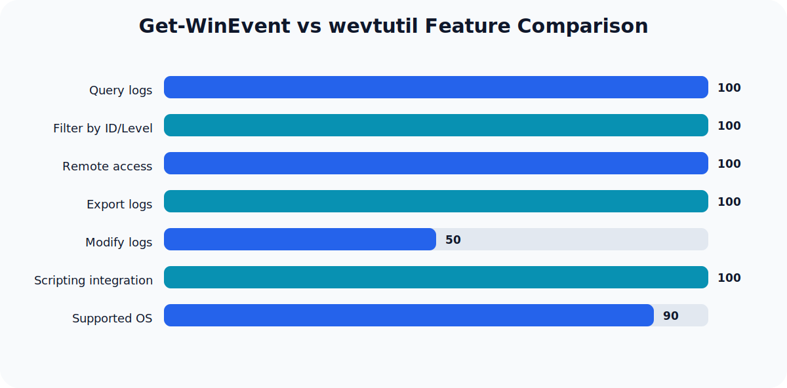

## Why Troubleshoot Windows Event Logs with PowerShell?

When Windows systems encounter issues—such as service failures, application crashes, or security incidents—the Event Logs are your primary source for diagnosis and forensic investigation. System administrators, help desk engineers, and IT troubleshooters require fast, reliable, and scriptable methods to analyze these logs. PowerShell’s Get-WinEvent cmdlet and the native wevtutil command-line tool provide robust, read-only access to Windows Event Logs, enabling efficient troubleshooting without risking accidental modification.

## Direct Answer: Efficient, Safe Log Queries

To address most troubleshooting needs, you should:

- Identify relevant logs and providers
- Filter events by time, ID, or severity
- Export or review events for diagnosis

Both Get-WinEvent and wevtutil allow you to accomplish these tasks safely. Avoid commands that clear or delete logs unless you fully understand the risks and have a documented need.

## Overview of Windows Event Logs

Windows organizes events into several log channels:

- **Application**: Application-level events
- **System**: OS and hardware events
- **Security**: Audit and authentication events
- **Setup**: OS installation and upgrade events
- **Custom logs**: Created by applications or services

Each log contains structured events with fields such as Event ID, Level (Error, Warning, Information), Provider, and Timestamp. Understanding which log and event ID to target is crucial for effective troubleshooting.

## Get-WinEvent: Modern PowerShell Log Querying

### Basic Usage

```powershell
# List all available logs
Get-WinEvent -ListLog *

# Retrieve latest 50 events from System log
Get-WinEvent -LogName System -MaxEvents 50
```

### Filtering with FilterHashtable

Filtering directly within Get-WinEvent is far more efficient than piping to Where-Object, especially for large logs. For example, to find errors from the Application log in the last day:

```powershell
$filter = @{ LogName = 'Application'; Level = 2; StartTime = (Get-Date).AddDays(-1) }
Get-WinEvent -FilterHashtable $filter
```

- **LogName**: Specifies the log
- **Level**: 2 = Error, 3 = Warning, 4 = Information
- **StartTime/EndTime**: Date range

#### Performance Note

Using FilterHashtable improves query speed and reduces memory usage, as filtering occurs before objects are sent down the pipeline ([see claim_evidence]).

### Advanced Filtering: Event ID and Provider

To retrieve specific events, such as unexpected shutdowns (Event ID 6008):

```powershell
$filter = @{ LogName = 'System'; Id = 6008 }
Get-WinEvent -FilterHashtable $filter | Format-Table TimeCreated, Id, Message
```

### Remote Log Querying

Get-WinEvent supports querying logs on remote systems:

```powershell
Get-WinEvent -ComputerName 'server01' -LogName 'Security' -MaxEvents 10
```

To use credentials:

```powershell
$cred = Get-Credential
Get-WinEvent -ComputerName 'server01' -LogName 'Security' -Credential $cred -MaxEvents 10
```

## wevtutil: Native Command-Line Log Access

wevtutil is available on Windows Server 2016+, Windows 10+, and Azure Local 2311.2 and later. It is ideal for scripting and automation, especially when PowerShell is unavailable or restricted.

### List Logs

```cmd
wevtutil enum-logs
```

### Query Events

```cmd
wevtutil qe System /c:10 /f:text
```

- **qe**: Query events
- **System**: Log name
- **/c:10**: Count (number of events)
- **/f:text**: Output format

### Export Logs Safely

```cmd
wevtutil epl Application C:\Logs\Application.evtx
```

This exports the Application log without modifying it. Avoid using the clear-log command unless you intend to erase history and have documented the action.

## Comparison Table: Get-WinEvent vs wevtutil

| Feature                  | Get-WinEvent (PowerShell)         | wevtutil (cmd)                |
|-------------------------|------------------------------------|-------------------------------|
| Query logs              | Yes                                | Yes                           |
| Filter by ID/Level      | Yes (FilterHashtable)              | Yes (query syntax)            |
| Remote access           | Yes                                | No                            |
| Export logs             | Yes (with Export-CSV, etc.)        | Yes (epl command)             |
| Modify logs             | No (read-only by default)          | Yes (clear-log, risky)        |
| Scripting integration   | Excellent (objects, pipelines)     | Good (text output)            |
| Supported OS            | Windows Server 2008+               | Windows Server 2016+, Win10+  |

## Common Troubleshooting Scenarios

### Scenario 1: Diagnosing Service Failures

Suppose a Windows service fails to start. To investigate:

```powershell
$filter = @{ LogName = 'System'; ProviderName = 'Service Control Manager'; Level = 2 }
Get-WinEvent -FilterHashtable $filter | Format-Table TimeCreated, Id, Message
```

Look for Event IDs such as 7000 (service failed to start) or 7031 (service terminated unexpectedly). The Message field provides details about the service name and the cause.

### Scenario 2: Investigating Security Events

To check for failed logon attempts:

```powershell
$filter = @{ LogName = 'Security'; Id = 4625; StartTime = (Get-Date).AddDays(-1) }
Get-WinEvent -FilterHashtable $filter | Format-Table TimeCreated, Message
```

Event ID 4625 indicates failed logons. Analyze the Message field for usernames, source addresses, and failure reasons. This is critical for detecting brute-force attacks or unauthorized access attempts.

### Scenario 3: Unexpected Shutdowns

To find when the system shut down unexpectedly:

```powershell
$filter = @{ LogName = 'System'; Id = 6008 }
Get-WinEvent -FilterHashtable $filter | Select-Object TimeCreated, Message
```

Review the TimeCreated and Message fields to determine the shutdown time and possible causes.

### Scenario 4: Application Crash Analysis

If an application crashes, filter by its provider name and error level:

```powershell
$filter = @{ LogName = 'Application'; ProviderName = 'Application Error'; Level = 2 }
Get-WinEvent -FilterHashtable $filter | Format-Table TimeCreated, Id, Message
```

This will highlight critical errors and provide insight into crash details.

### Scenario 5: Log Export for Offline Analysis

Export filtered results for further analysis:

```powershell
$filter = @{ LogName = 'System'; Level = 3; StartTime = (Get-Date).AddDays(-7) }
Get-WinEvent -FilterHashtable $filter | Export-Csv -Path C:\Logs\SystemWarnings.csv -NoTypeInformation
```

This creates a CSV file of warnings from the System log for the past week, enabling offline review and reporting.

## Expected Outputs and Interpretation

Get-WinEvent returns rich PowerShell objects with properties such as:

- **TimeCreated**: When the event occurred
- **Id**: Event ID
- **LevelDisplayName**: Severity
- **ProviderName**: Source
- **Message**: Human-readable description

Use `Format-Table`, `Select-Object`, or `Export-Csv` to customize and analyze output. For large logs, exporting to CSV or EVTX is recommended for performance and compatibility.

## Security and Safety Considerations

- **Read-only queries**: All examples here are safe and do not modify logs.
- **Avoid clear/delete commands**: Clearing logs erases evidence and can violate compliance requirements. Only use `wevtutil cl <LogName>` if you intend to wipe logs and have documented the action.
- **Least privilege**: Querying logs may require administrative rights, especially for Security logs.
- **Remote queries**: Use secure credentials and restrict access to sensitive logs.

## Common Mistakes and How to Avoid Them

- **Using Where-Object for filtering**: This is inefficient for large logs. Prefer FilterHashtable for performance ([see claim_evidence]).
- **Misidentifying log names**: Use `Get-WinEvent -ListLog *` or `wevtutil enum-logs` to confirm log names.
- **Exporting logs without specifying format**: Always use `.evtx` for compatibility.
- **Overlooking time zones**: Event timestamps are in local system time.
- **Running clear-log commands accidentally**: Double-check scripts to avoid destructive actions.

## Troubleshooting Checklist

- [ ] Identify the relevant log and provider
- [ ] Use FilterHashtable or structured queries for efficient filtering
- [ ] Review Event IDs and severity
- [ ] Export results for deeper analysis
- [ ] Avoid commands that modify logs unless required
- [ ] Document findings and actions

## Further Learning

For security event analysis and incident response, see [SIEM vs XDR vs SOAR: What They Do and When to Use Each](/posts/siem-vs-xdr-vs-soar/) and [Zero Trust Explained With Real-World Examples](/posts/zero-trust-explained-real-world-examples/).

## Conclusion

PowerShell's Get-WinEvent and the native wevtutil tool are essential for safe, efficient Windows Event Log troubleshooting. By mastering structured queries, filtering, and exporting techniques, you can diagnose issues quickly, maintain compliance, and avoid common pitfalls. Always use read-only commands unless you have a documented need to clear logs, and prefer FilterHashtable for performance. With these skills, you'll streamline your troubleshooting workflow and improve system reliability.

## Related guidance

- [DNS Explained: How Your Browser Finds a Website](/posts/dns-explained-how-your-browser-finds-a-website/) — supporting reference.

## Visual Summary



## Sources

- [Get-WinEvent (Microsoft.PowerShell.Diagnostics)](https://learn.microsoft.com/en-us/powershell/module/microsoft.powershell.diagnostics/get-winevent?view=powershell-7.5)
- [Creating Get-WinEvent queries with FilterHashtable](https://learn.microsoft.com/en-us/powershell/scripting/samples/creating-get-winevent-queries-with-filterhashtable?view=powershell-7.5)
- [wevtutil](https://learn.microsoft.com/en-us/windows-server/administration/windows-commands/wevtutil)
