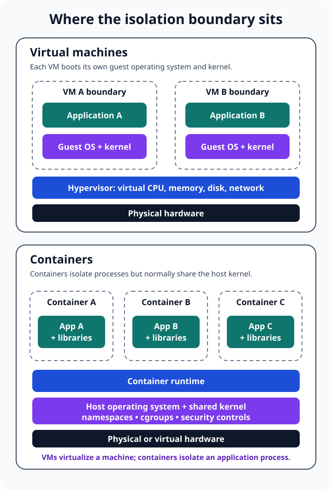

A team has a small web service that works perfectly on one developer's laptop. Now it needs to run in testing, production, and perhaps a second cloud region.

One engineer says, "Put it in a virtual machine." Another says, "That is too heavy; use a container." Both suggestions sound like ways to place software inside a box. The important question is what kind of box each one creates.

**A virtual machine emulates a computer and runs a complete guest operating system, including its own kernel. A container isolates an application process and its user-space dependencies while normally sharing the host operating system's kernel.**

That one boundary explains most of the practical differences: startup time, image size, operating-system compatibility, isolation, patching, density, and the kinds of workloads each technology handles well.



## The difference is below the application

From inside either environment, an application can see processors, memory, storage, and a network interface. That similarity is useful, but it can hide what happens underneath.

In full virtualization, a **hypervisor** presents virtual hardware to each VM. The guest operating system boots against that hardware as though it were running on a physical computer. NIST describes the hypervisor as the layer that controls access to physical CPU, memory, storage, and networking while isolating guest operating systems from one another.

A container begins at a different layer. It is an isolated process environment with a filesystem, configuration, and restricted view of system resources. On Linux, runtimes use kernel mechanisms such as namespaces, control groups, capabilities, and security modules. The [OCI Runtime Specification](https://specs.opencontainers.org/runtime-spec/) standardizes the container configuration, execution environment, and lifecycle; the [Linux cgroup v2 documentation](https://docs.kernel.org/admin-guide/cgroup-v2.html) explains how processes can be organized and resources distributed.

The container may include an entire user-space filesystem with libraries and command-line tools, but it does not normally bring a second Linux kernel. System calls still cross into the host kernel.

This is why a Linux container image is not a tiny Linux VM. It contains the files the application needs, not a separately booted operating system.

## A virtual machine creates a computer-shaped boundary

Suppose the service depends on a particular operating system, needs a custom kernel module, or must run beside an untrusted workload with a stronger separation boundary.

A VM is a natural fit because its unit of isolation is the machine. It can have virtual processors, a fixed memory allocation, virtual disks, firmware settings, and its own kernel. A Linux host may run a Windows guest when the hypervisor and hardware support it, and the two systems can follow different patch schedules.

That independence has a cost. Every VM carries and operates a guest OS. It must boot, consume memory, store system files, receive operating-system updates, expose logs, and be monitored like a computer. Templates and automation can make this efficient, but they do not remove the guest operating system from the responsibility model.

The VM boundary is also not magic. NIST's [Guide to Security for Full Virtualization Technologies](https://csrc.nist.gov/pubs/sp/800/125/final) warns that virtualization adds components that must be secured: the hypervisor, host, guest OS, applications, storage, and virtual network. A vulnerable or poorly configured guest is still vulnerable merely because it is virtual.

VMs are especially useful when you need:

- different operating-system kernels on the same physical host;
- a machine-like environment for older or tightly coupled software;
- strong tenant or workload separation through a hypervisor boundary;
- kernel-level control, device virtualization, or full OS administration;
- infrastructure that existing backup, recovery, and compliance processes already understand.

## A container creates an application-shaped boundary

Return to the web service. It needs a runtime, a few libraries, application files, and configuration. It does not need to pretend it owns a whole computer.

A container image packages those user-space pieces into a repeatable artifact. The OCI image model defines an ordered set of filesystem changes plus execution settings. A runtime turns that image into a container process. Because it does not boot another general-purpose OS, the container can usually start with less overhead and can be packed more densely than an equivalent fleet of full VMs.

This model is valuable in delivery pipelines. Development, testing, and production can run the same immutable image digest, while environment-specific configuration and secrets are supplied separately. When an image changes, a deployment can replace containers rather than modifying long-lived servers in place.

Portable does not mean universal, however. The host still matters. A Linux container expects a compatible Linux kernel and CPU architecture; a Windows container has its own host compatibility rules. Docker's [container overview](https://docs.docker.com/get-started/docker-concepts/the-basics/what-is-a-container/) correctly emphasizes the shared kernel, which is precisely why an image cannot silently supply any kernel it wants.

Containers are especially useful when you need:

- consistent application packaging across delivery environments;
- fast creation and replacement of stateless service instances;
- many independently deployed services on shared infrastructure;
- image-based CI/CD and declarative deployment workflows;
- efficient batch jobs, build workers, APIs, and microservices.

## The practical comparison

The useful question is not which technology is modern. It is which boundary matches the workload.

| Concern | Virtual machine | Container |
|---|---|---|
| Virtualized layer | Hardware | Operating-system process environment |
| Operating system | Complete guest OS with its own kernel | User-space files; normally shares the host kernel |
| Isolation boundary | Hypervisor and guest boundary | Kernel-enforced process and resource isolation |
| OS flexibility | Can run a different supported guest OS | Must be compatible with the host kernel family and architecture |
| Startup and density | Usually more overhead because a guest OS boots and runs | Usually less overhead because no separate general-purpose kernel boots |
| Deployment unit | VM image plus machine configuration | Container image plus runtime configuration |
| Patching | Host, hypervisor, and each guest OS | Host kernel/runtime plus rebuilt application images and dependencies |
| Typical fit | Mixed OSs, legacy systems, stronger isolation, full machine control | Repeatable app delivery, elastic services, jobs, CI/CD |

These are architectural tendencies, not benchmark results. A stripped-down VM can start quickly. A bloated container image can be slow to pull. A container with excessive privileges can create serious host risk. Real outcomes depend on the runtime, image, storage, network, security controls, and workload.

## Security is a boundary decision, not a slogan

It is tempting to reduce the comparison to "VMs are secure; containers are not." That is too crude to guide a real design.

VMs generally provide a stronger default separation because each guest has its own kernel and the hypervisor mediates access to hardware. Containers share more of the host's operating-system boundary. If an attacker escapes a container through a kernel or runtime vulnerability, the shared host becomes relevant to every workload on it.

That does not make containers unsuitable for production. It changes the controls you need. NIST's [Application Container Security Guide](https://csrc.nist.gov/pubs/sp/800/190/final) treats images, registries, orchestrators, runtimes, and hosts as distinct risk areas. Practical defenses include minimal images, vulnerability scanning, signed or otherwise verified artifacts, non-root processes, restricted capabilities, read-only filesystems where possible, resource limits, network policy, secrets management, and prompt host-kernel and runtime patching.

Trust boundaries should drive placement. Workloads from different customers, workloads that execute untrusted code, or systems with demanding regulatory isolation may justify separate VMs, sandboxed runtimes, or dedicated hosts. Two services owned by the same team and deployed from controlled images may reasonably share a container host with defense in depth.

The strongest design often layers the technologies instead of forcing a choice between them.

## Containers frequently run inside virtual machines

Many cloud deployments follow this shape:

```text
physical host
  -> hypervisor
    -> virtual machine
      -> container runtime
        -> application containers
```

The VM gives the cloud provider or platform team a machine-level tenancy and lifecycle boundary. Containers inside it give application teams repeatable packaging and faster workload replacement. Microsoft similarly describes [containers and VMs as complementary technologies](https://learn.microsoft.com/en-us/virtualization/windowscontainers/about/containers-vs-vm), noting that containers commonly use VMs as hosts.

Kubernetes does not replace either layer. It schedules and manages containerized workloads across nodes; those nodes are often VMs. Likewise, moving an application into a VM does not automatically make it a container, and placing a container on a VM does not give every container its own guest kernel.

The layers solve different ownership problems.

## Choose by asking what must be independent

Start with requirements rather than the format your platform happens to make easiest.

Ask these questions:

1. **Does the workload require a different kernel or operating system?** Choose a VM when the answer is yes.
2. **How strong must separation be between workloads?** Treat hostile multi-tenancy as a security-architecture problem, not merely a deployment preference.
3. **Is the unit of change an entire machine or an application?** Containers make application images first-class; VMs preserve a computer-like administrative boundary.
4. **Where should state live?** Neither a disposable container nor a replaceable VM should hold irreplaceable data without deliberate persistent storage and recovery.
5. **Who patches each layer?** Write down ownership for firmware, hypervisor, host kernel, runtime, guest OS, base image, libraries, and application.
6. **What does the existing platform operate reliably?** A familiar, automated VM estate can be safer than a poorly understood container platform, and the reverse is also true.

For a small stateless API with a standard runtime, a container is often the simpler application unit. For a legacy business system that expects a complete Windows server, a VM is usually the honest boundary. For a SaaS platform serving multiple customers, containers on hardened VMs may combine operational speed with an additional infrastructure boundary.

## Common mistakes that erase the benefits

The first mistake is treating a container as a small server. Teams install debugging tools into a running container, store important files in its writable layer, and patch it manually. The next deployment replaces those changes. The better model is to rebuild the image, externalize durable data, and make replacement routine.

The second mistake is treating every VM as permanent. Long-lived guests drift when teams make undocumented changes. VM templates, configuration management, automated patching, and tested restoration still matter.

The third mistake is assuming packaging equals isolation. An image defines what should run; runtime policy defines what it may access. A privileged container with the host filesystem mounted is not meaningfully confined just because it started from an image.

The fourth mistake is comparing only memory and startup speed. Operational skills, licensing, recovery, observability, storage, network policy, and incident response can outweigh raw density.

## The takeaway

Virtual machines and containers both let multiple workloads share infrastructure, but they draw the line in different places.

A VM is a virtual computer: it brings a guest OS and kernel, which costs more resources but provides operating-system independence and a stronger machine boundary. A container is an isolated application process: it packages user-space dependencies and normally shares the host kernel, which makes replacement and density attractive but places more trust in that shared kernel and runtime configuration.

Do not choose containers because they sound newer or VMs because they feel safer. Choose the smallest boundary that honestly satisfies compatibility, isolation, ownership, and operational requirements. Often, that means using both.

For related foundations, see [What Is Cloud Computing?](/posts/what-is-cloud-computing/), [IaaS vs PaaS vs SaaS](/posts/iaas-vs-paas-vs-saas/), [Public Cloud vs Private Cloud vs Hybrid Cloud](/posts/public-cloud-vs-private-cloud-vs-hybrid-cloud/), and [What Is Software Architecture?](/posts/software-architecture-beginners-guide/).

## Sources

- [NIST SP 800-125: Guide to Security for Full Virtualization Technologies](https://csrc.nist.gov/pubs/sp/800/125/final)
- [NIST SP 800-190: Application Container Security Guide](https://csrc.nist.gov/pubs/sp/800/190/final)
- [Open Container Initiative Runtime Specification](https://specs.opencontainers.org/runtime-spec/)
- [Linux kernel documentation: Control Group v2](https://docs.kernel.org/admin-guide/cgroup-v2.html)
- [Microsoft Learn: Containers vs. virtual machines](https://learn.microsoft.com/en-us/virtualization/windowscontainers/about/containers-vs-vm)
- [Docker Docs: What is a container?](https://docs.docker.com/get-started/docker-concepts/the-basics/what-is-a-container/)
