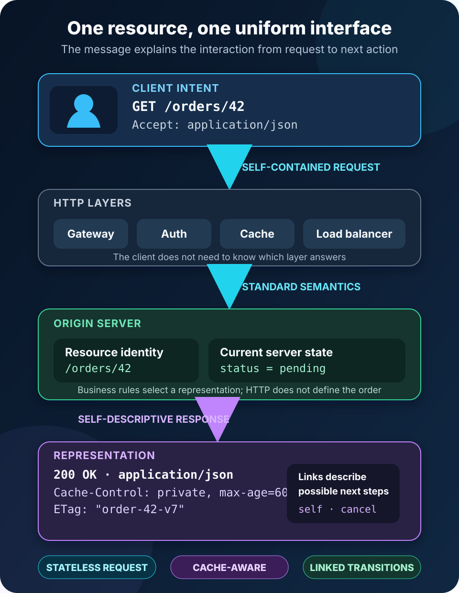

A mobile app shows an order. The customer taps **Cancel**, a request crosses the internet, and a moment later the screen says the order is cancelled.

That small interaction hides several decisions. How does the app identify the order? How does it express “cancel”? Does the server remember earlier requests? Can a cache reuse the response? What tells the app which action is possible next?

People often compress all of those decisions into one sentence: “The app calls a REST API.” Then REST gets reduced to JSON over HTTP, or to a naming convention for URLs.

REST is more useful—and more demanding—than that. It is an **architectural style for networked systems**. A REST API exposes resources through a uniform interface, exchanges representations of those resources, keeps requests self-contained, and allows intermediaries such as caches and gateways to participate without rewriting the application contract.

The shortest practical answer is this: **a REST API lets a client act on identified resources using standard message semantics rather than application-specific remote commands**.



## A REST API is organized around resources

Imagine an order with the identifier `42`. The server may store it across several database tables and calculate part of its status from a workflow engine. The client does not need to know that implementation.

Instead, the API identifies the conceptual resource with a URI:

```text
https://api.example.com/orders/42
```

[RFC 3986](https://www.rfc-editor.org/rfc/rfc3986.html) defines a URI as an identifier for a resource. The resource is the thing being talked about; the URI is its identifier. Neither is the JSON document itself.

When a client sends `GET /orders/42`, the server returns a **representation** of the current order state. JSON is common, but REST does not require it. The same resource could have JSON, XML, HTML, or another representation selected through HTTP content negotiation.

That distinction prevents a lot of muddled API design:

- **Resource:** the order as a domain concept.
- **URI:** `/orders/42`, the stable identifier used in this API.
- **Representation:** the bytes sent at a particular moment, along with metadata such as `Content-Type`.

The representation can change while the resource keeps the same identity. An order moves from `pending` to `shipped`; it does not need a new URI merely because its state changed.

## One interaction carries its own meaning

A simplified request might look like this:

```http
GET /orders/42 HTTP/1.1
Host: api.example.com
Accept: application/json
Authorization: Bearer <token>
```

And the response might be:

```http
HTTP/1.1 200 OK
Content-Type: application/json
Cache-Control: private, max-age=60
ETag: "order-42-v7"

{
  "id": 42,
  "status": "pending",
  "total": 39.90,
  "links": [
    { "rel": "self", "href": "/orders/42" },
    { "rel": "cancel", "href": "/orders/42/cancellation" }
  ]
}
```

This is an illustrative message, not a universal REST schema. Its value is that the interaction is readable from the message itself. The method says what kind of operation is requested. The URI identifies the target. Headers describe representation preferences, authorization, freshness, and validation. The status code reports the outcome. The body carries resource state and possible next transitions.

The server can handle that request without relying on a hidden conversational sequence stored for this client. That is what **stateless communication** means in REST. It does not mean the application has no state. Orders, accounts, permissions, and workflows plainly have state. It means each request includes the context the server needs to understand it.

Authentication illustrates the difference. A bearer token may identify a caller on every request. The server can still store user accounts and revoke credentials. What it avoids is an implicit conversation such as “this is step three, so look up what this client said in steps one and two.”

## The uniform interface is the central constraint

Roy Fielding’s original [REST dissertation chapter](https://ics.uci.edu/~fielding/pubs/dissertation/rest_arch_style.htm) calls the uniform interface the feature that distinguishes REST from other network-based styles. Instead of inventing `fetchOrder`, `replaceOrder`, and `removeOrder` as unrelated network operations, a client applies shared semantics to different resources.

With HTTP, those semantics usually come from methods, status codes, headers, and media types. The method matters more than the verb hidden inside a path.

| Method | Intended meaning in HTTP | Safe? | Idempotent? |
| --- | --- | --- | --- |
| `GET` | Transfer a current representation | Yes | Yes |
| `POST` | Perform resource-specific processing on the request content | No | No, not by definition |
| `PUT` | Replace the target resource’s current representation | No | Yes |
| `DELETE` | Remove the association between the target URI and its current functionality | No | Yes |

“Safe” means the client did not ask for a state change. Logging a `GET` does not make the method unsafe. “Idempotent” means repeating the same request has the same intended effect as sending it once. It does not promise an identical response or identical server logs.

Those properties are operational tools, not vocabulary trivia. A client can usually retry an idempotent `PUT` after losing the connection before the response arrives. Blindly retrying a payment-creating `POST` could create a second charge unless the API adds an explicit idempotency mechanism. [RFC 9110](https://www.rfc-editor.org/rfc/rfc9110.html) defines these method semantics so clients, proxies, servers, and monitoring tools can share the same expectations.

## REST is a set of constraints, not an endpoint checklist

Resources and HTTP methods are the visible part of a REST API. The architectural style is held together by several constraints:

**Client-server separation** lets user-interface concerns and data-management concerns evolve independently. A web app, mobile app, or automation client can use the same resource interface without sharing the server’s internal code.

**Stateless requests** make each interaction understandable on its own. That improves visibility and makes it easier to route requests across server instances, though repeating authentication and context can add overhead.

**Cacheability** allows a response to say whether and for how long it may be reused. [RFC 9111](https://www.rfc-editor.org/rfc/rfc9111.html) describes HTTP cache behavior, including freshness and validation. Headers such as `Cache-Control`, `ETag`, and `Last-Modified` are part of the API’s behavior, not optional performance decoration.

**A uniform interface** decouples clients from implementation details through resource identification, representations, self-descriptive messages, and hypermedia-driven transitions.

**A layered system** means a client does not need to know whether it is connected directly to the origin server or through a gateway, cache, load balancer, or authentication layer. Each component interacts with the layer immediately around it.

**Code on demand** is the optional constraint: a server may extend client behavior by sending executable code. It is important historically to the Web, but it is uncommon in the JSON APIs most developers call REST APIs.

These constraints create tradeoffs. Statelessness can increase request size. A uniform interface may be less efficient than a specialized protocol. Caching introduces invalidation decisions. REST is not “best practices” pasted onto any HTTP endpoint; it is a style chosen because its tradeoffs fit a system.

## Hypermedia is the part most REST APIs leave out

The full uniform-interface constraint includes **hypermedia as the engine of application state**, often shortened to HATEOAS. The idea is familiar from the Web: a browser starts at a page and discovers links and forms instead of hard-coding every possible destination.

An API can do something similar. The order representation above includes a `cancel` link only while cancellation is allowed. A client follows a typed relation rather than reconstructing a route from private knowledge. [RFC 8288](https://www.rfc-editor.org/rfc/rfc8288.html) standardizes a model for links and relation types on the Web.

Many production APIs use resource-shaped URLs, JSON, and HTTP methods but require clients to know every transition in advance. They are commonly called RESTful APIs, even though they do not implement this constraint strongly. That language is established, but precision still helps: an **HTTP API** describes the transport; a **REST API** claims architectural constraints; “REST-like” or “resource-oriented” may be more honest for an API using only part of the style.

This is not a purity contest. The point is to know which benefits a design actually earns. A client cannot discover workflows if the server never describes available transitions.

## What happens when a REST API request arrives?

Return to `GET /orders/42`. A typical path looks like this:

1. The client resolves the host, opens a protected connection, and sends an HTTP request containing a method, target, headers, and sometimes content.
2. Intermediaries may route, authenticate, observe, reject, or satisfy the request from a valid cache. The client contract remains expressed in HTTP messages.
3. The origin server interprets the method against the target resource, applies authorization and domain rules, and selects a representation.
4. The server returns a status code, response metadata, and optional content. A cache uses the metadata to decide whether the response can be stored or reused.
5. The client interprets the response and, when the representation provides links, chooses a next transition from the relations it understands.

HTTP does not make the business decision. It does not know what an order is or whether cancellation should be allowed. It provides the shared semantics around that decision.

Errors should preserve those semantics. A missing order can return `404 Not Found`; invalid input might return `400 Bad Request` or a more specific applicable status. When a status code is not enough, [RFC 9457](https://www.rfc-editor.org/rfc/rfc9457.html) defines a machine-readable “problem details” format for HTTP APIs. Returning `200 OK` with `{ "success": false }` forces generic HTTP software to misunderstand the result.

## Common mistakes make an API harder to use

The most obvious mistake is treating URLs as remote procedure names:

```text
POST /getOrder
POST /deleteOrder
POST /updateOrderStatus
```

That design discards method semantics, weakens cache behavior, and makes generic tooling less useful. Resource-oriented alternatives such as `GET /orders/42` and `DELETE /orders/42` communicate more through the uniform interface.

Another mistake is assuming `PUT` and `PATCH` are synonyms for “update.” HTTP defines `PUT` as replacing the target resource’s representation. `PATCH` has separate semantics for applying a patch document. An API may deliberately support only one, but it should document the actual contract.

Other recurring problems are unstable identifiers, inconsistent error bodies, unsafe work hidden behind `GET`, status codes chosen for convenience, and responses that ignore cache metadata. Each forces clients to learn private exceptions instead of reusable web semantics.

Versioning cannot repair a vague contract either. Whether an API versions through a path, media type, header, or compatibility policy, the durable goal is the same: preserve the meaning clients rely on while allowing representations and implementation details to evolve.

## When REST is a good fit

REST fits especially well when a system exposes recognizable resources to many independent clients, benefits from standard HTTP infrastructure, and can express interactions as self-contained request-response exchanges. Public web APIs, internal business APIs, and mobile backends often match that shape.

It is not the only sensible style. A streaming feed has different interaction needs. A tightly controlled service-to-service call may benefit from a schema-first RPC protocol. Graph-shaped data can make a query language attractive. Event-driven workflows need messages that represent facts over time rather than synchronous resource operations.

The right question is not “Is REST modern?” It is “Do REST’s constraints create the interoperability, scalability, and evolvability this system needs?”

## The takeaway

A REST API is not simply an HTTP server that returns JSON. It is an interface built around **resources, representations, self-contained messages, standard semantics, cacheability, layers, and discoverable transitions**.

Start with the resource, give it a stable identifier, use HTTP methods and status codes according to their defined meaning, make requests self-contained, describe caching deliberately, and expose links when clients should discover what can happen next.

The shape of the URL is the easy part. The real design lives in the promises every message makes.

## Continue learning

- [Understanding HTTP Status Codes](/posts/http-status-codes/)
- [REST and GraphQL Pagination Strategies](/posts/rest-graphql-pagination-offset-cursor-link-strategies/)
- [Authentication vs Authorization](/posts/authentication-vs-authorization/)
- [What Is Software Architecture?](/posts/software-architecture-beginners-guide/)

## Sources

- [Roy Fielding: Representational State Transfer (REST)](https://ics.uci.edu/~fielding/pubs/dissertation/rest_arch_style.htm)
- [RFC 3986: Uniform Resource Identifier (URI)—Generic Syntax](https://www.rfc-editor.org/rfc/rfc3986.html)
- [RFC 8288: Web Linking](https://www.rfc-editor.org/rfc/rfc8288.html)
- [RFC 9110: HTTP Semantics](https://www.rfc-editor.org/rfc/rfc9110.html)
- [RFC 9111: HTTP Caching](https://www.rfc-editor.org/rfc/rfc9111.html)
- [RFC 9457: Problem Details for HTTP APIs](https://www.rfc-editor.org/rfc/rfc9457.html)
