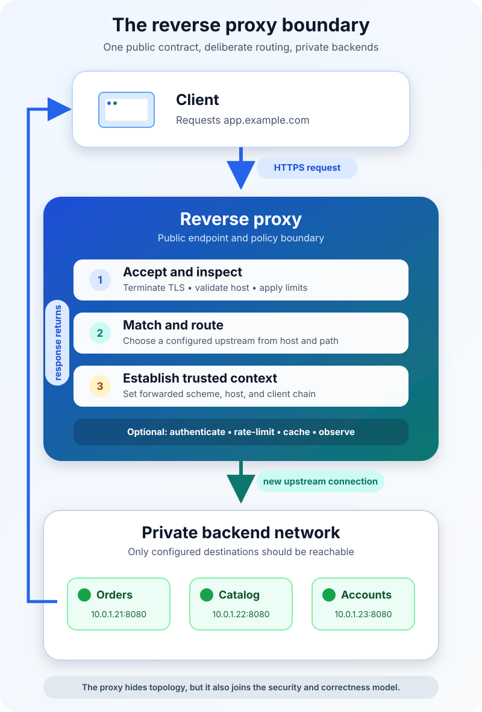

Your application works perfectly on port 8080. Then you try to put it on the public internet.

Suddenly, the application needs a trusted TLS certificate. It should answer for `app.example.com`, not an internal hostname. Static files ought to be cached, `/api/` must reach one service, and `/admin/` must never be exposed by accident. When the backend restarts, users should receive a controlled error rather than a hanging connection.

You could teach every application process to solve every one of those problems. A reverse proxy gives the system another option: put one deliberate boundary in front of the applications.

**A reverse proxy is a server-side intermediary that accepts requests as if it were the origin server, chooses an appropriate backend, forwards the request, and returns the backend's response to the client.** The client connects to the proxy's public address; the backend can remain private and change independently.

That sounds like an extra hop. In practice, it is often the hop that turns a collection of processes into one coherent web service.



## The proxy becomes the server the client can see

Suppose a browser requests:

```text
https://shop.example.com/api/orders/42
```

DNS points `shop.example.com` to the reverse proxy. The browser establishes a connection with that proxy and sends an ordinary HTTP request. It does not need proxy-specific configuration and may not know that another server exists behind the public endpoint.

The proxy then performs a sequence of decisions:

1. It matches the hostname, path, method, and other request properties against configured rules.
2. It may terminate TLS, apply an access policy, limit request size, or serve a cached response.
3. It selects a configured backend, such as `orders:8080`, and opens or reuses an upstream connection.
4. It forwards the request, usually with adjusted headers that describe the original client-facing request.
5. It receives the backend response, may transform selected headers or buffer the body, and sends the result to the browser.

[RFC 9110](https://www.rfc-editor.org/rfc/rfc9110.html#section-3.7) calls this kind of intermediary a *gateway*, also known as a reverse proxy. On its client-facing connection it behaves like an origin server. On the other side, it becomes a client of one or more inbound servers.

That two-connection model matters. The proxy is not simply passing bytes through unchanged. It participates in HTTP, and its behavior can alter security, performance, routing, and what the application believes about the request.

## What a reverse proxy is useful for

The most visible benefit is hiding backend topology. Users can keep calling one stable hostname while application instances move between machines, ports, or containers. The public URL becomes a contract; the implementation behind it can evolve.

That boundary also creates a natural place for shared concerns:

| Concern | What the reverse proxy can do | What it cannot decide alone |
| --- | --- | --- |
| TLS | Present the public certificate and encrypt the client connection | Whether upstream traffic must also use TLS |
| Routing | Map hosts or paths to known backends | Whether the backend's business action is allowed |
| Load distribution | Select among multiple healthy instances | Whether the application is actually correct |
| Caching | Reuse eligible HTTP responses | Whether user-specific data is safe to share |
| Protection | Limit sizes, rates, methods, or source networks | Replace application authentication and authorization |
| Observability | Record edge latency, status, and upstream timing | Explain internal application work without app telemetry |

A reverse proxy may perform all of these jobs or only one. Its defining feature is not TLS termination, caching, or load balancing. It is the direction of the relationship: clients address the proxy as the service, and the proxy knows which backends can satisfy the request.

This is also why a reverse proxy and a [load balancer](/posts/what-is-load-balancing/) overlap without being synonyms. A reverse proxy can forward every request to one backend. A proxy-based load balancer is a reverse proxy that also selects among a pool of backends. Some load balancers instead operate below HTTP and preserve more of the original connection.

## A small configuration reveals the important decisions

Here is a conceptual NGINX example for one application. It is intentionally small; production values should follow the application's traffic, failure, and trust requirements.

```nginx
server {
    listen 443 ssl;
    server_name app.example.com;

    location /api/ {
        proxy_pass http://app_backend;

        proxy_set_header Host $host;
        proxy_set_header X-Forwarded-Proto $scheme;
        proxy_set_header X-Forwarded-For $proxy_add_x_forwarded_for;

        proxy_connect_timeout 3s;
        proxy_read_timeout 30s;
    }
}

upstream app_backend {
    server 10.0.1.21:8080;
    server 10.0.1.22:8080;
}
```

The `server_name` and `location` blocks define which public requests this rule owns. `proxy_pass` identifies the upstream group. The forwarding headers preserve selected facts about the client-facing request, while the timeouts put limits on upstream connection and response waits.

Even this example leaves open important questions. Where are the certificate and private key configured? Are the backends reachable only from the proxy network? Do they support connection reuse? What counts as healthy? Should `/api/reports` stream immediately rather than be buffered? Which responses are safe to cache? A working proxy rule is the beginning of the design, not the end.

NGINX's [official reverse-proxy guide](https://docs.nginx.com/nginx/admin-guide/web-server/reverse-proxy/) documents another subtle point: proxying can change headers, URI paths, and response buffering. Apache HTTP Server's [reverse-proxy guide](https://httpd.apache.org/docs/2.4/howto/reverse_proxy.html) also shows why response rewriting can be necessary. If a backend sends a redirect to its private hostname, the proxy may need to translate that `Location` header back into the public URL.

## Forwarded headers cross a trust boundary

Once TLS ends at the proxy, the backend may see an ordinary HTTP connection from the proxy's IP address. Yet the application still needs to know that the original URL used HTTPS, which hostname the user requested, and sometimes which client address began the chain.

[RFC 7239](https://www.rfc-editor.org/rfc/rfc7239.html) standardizes the `Forwarded` header with parameters such as `for`, `host`, `proto`, and `by`. Many deployments also use the older `X-Forwarded-For`, `X-Forwarded-Host`, and `X-Forwarded-Proto` conventions.

The dangerous mistake is treating every received forwarding header as truth. A client can send its own `X-Forwarded-For` value unless the edge removes or replaces untrusted input. The application must trust forwarding metadata only from known proxy hops and according to an explicit chain length or trusted network list.

Otherwise, forged values can corrupt logs, bypass IP-based controls, create incorrect secure redirects, or influence generated links. The proxy should establish the trusted context; the backend should know exactly which proxy is allowed to establish it.

The same principle applies to `Host`. Routing by host is useful, but accepting arbitrary hostnames can affect redirects, password-reset links, cache keys, and tenant selection. Define the hostnames the proxy serves, reject unexpected ones, and pass the intended value deliberately.

## TLS termination does not end the encryption decision

Terminating TLS at the reverse proxy centralizes certificates and removes that work from application processes. It does not automatically make the proxy-to-backend connection safe.

If the upstream network is shared, crosses an untrusted boundary, or carries sensitive data, use TLS upstream as well and verify the backend identity. The browser's padlock describes the connection it made to the public endpoint. It says nothing about an unencrypted hop hidden behind that endpoint.

The proxy also becomes a concentrated security target. Keep its software patched, expose only required listeners, restrict administrative interfaces, protect configuration and keys, and limit which upstream destinations it can reach. Backends should normally accept traffic only from the intended proxy tier rather than remaining independently public.

## Caching can remove work—or share the wrong response

A reverse proxy can act as a shared cache. When a response is reusable, the proxy may answer a later request without contacting the backend, cutting latency and origin load.

But shared caching needs protocol-aware rules. [RFC 9111](https://www.rfc-editor.org/rfc/rfc9111.html) defines how directives such as `private`, `no-store`, `s-maxage`, validators, and freshness affect shared caches. A response that contains one user's account details must not become another user's cache hit because the cache key ignored identity or the origin omitted the right controls.

Start with explicit caching for clearly public, read-only content. Verify the cache key, honor origin semantics, and test authenticated paths for accidental reuse. The wider system should have one documented answer to who owns freshness and invalidation; otherwise browser, CDN, proxy, application, and database caches can disagree in ways that are difficult to diagnose. The deeper [cache-aside and invalidation guide](/posts/system-design-caching-cache-aside-expiration-invalidation/) explains that ownership problem.

## Common failures begin at the boundary

When a reverse proxy returns `502 Bad Gateway`, it usually means the proxy could not obtain a valid response from the configured upstream. A `504 Gateway Timeout` generally means the upstream did not respond within the gateway's allowed time. Those status codes identify where the visible failure surfaced, not necessarily its root cause.

Useful troubleshooting follows the request across both connections:

- Confirm the public hostname and route matched the intended rule.
- Check whether the proxy can resolve and connect to the selected backend.
- Compare connect, read, write, and total request timeouts with real application behavior.
- Correlate a request identifier across proxy and application logs.
- Inspect upstream status and timing separately from the client-facing status.
- Verify body-size limits, header-size limits, protocol upgrades, and buffering for streaming or long-lived responses.
- Test redirects, cookies, generated links, and secure-session behavior through the proxy—not only by calling the backend directly.

Do not fix every timeout by making it longer. A longer wait can turn a fast failure into resource exhaustion while the real problem remains a saturated dependency or stuck application. Bound the wait, make retries deliberate, and remember that automatically retrying a non-idempotent request can repeat a side effect.

## Reverse proxy or API gateway?

The boundary is about responsibility, not branding.

A reverse proxy primarily receives traffic and forwards it to configured backends, often adding TLS, routing, caching, and basic controls. An API gateway usually adds API-focused policy such as consumer identity, quotas, request validation, protocol transformation, analytics, or developer-facing lifecycle management. Many products can operate as either, and one deployment can gradually acquire gateway features.

Choose the smallest boundary that solves the real problem. A simple website may need hostname routing and TLS. A public multi-tenant API may need a stricter gateway policy. In both cases, application-level authorization still belongs close to the resource and action being protected. The proxy can verify a credential, but the application knows whether this user may cancel this particular order.

## The takeaway

A reverse proxy gives clients one stable public service while routing requests to private, changeable backends. It can centralize TLS, traffic policy, caching, load distribution, and edge observability—but those conveniences make it part of the application's correctness and security model.

Treat it as a contract and a trust boundary. Define which requests it accepts, which context it forwards, which backends it may reach, what it caches, how long it waits, and what evidence it records. Then test the complete path from client to proxy to backend and back again.

The extra hop is easy to draw. The real value is the clear boundary it creates.

## Continue learning

- [What Is Load Balancing and How Does It Work?](/posts/what-is-load-balancing/)
- [What Is a REST API and How Does It Work?](/posts/what-is-a-rest-api/)
- [System Design Caching: Cache-Aside, Expiration, and Invalidation](/posts/system-design-caching-cache-aside-expiration-invalidation/)
- [HTTP Status Codes Explained](/posts/http-status-codes/)

## Sources

- [RFC 9110: HTTP Semantics — Intermediaries](https://www.rfc-editor.org/rfc/rfc9110.html#section-3.7)
- [RFC 7239: Forwarded HTTP Extension](https://www.rfc-editor.org/rfc/rfc7239.html)
- [RFC 9111: HTTP Caching](https://www.rfc-editor.org/rfc/rfc9111.html)
- [NGINX Documentation: Reverse Proxy](https://docs.nginx.com/nginx/admin-guide/web-server/reverse-proxy/)
- [Apache HTTP Server: Reverse Proxy Guide](https://httpd.apache.org/docs/2.4/howto/reverse_proxy.html)
