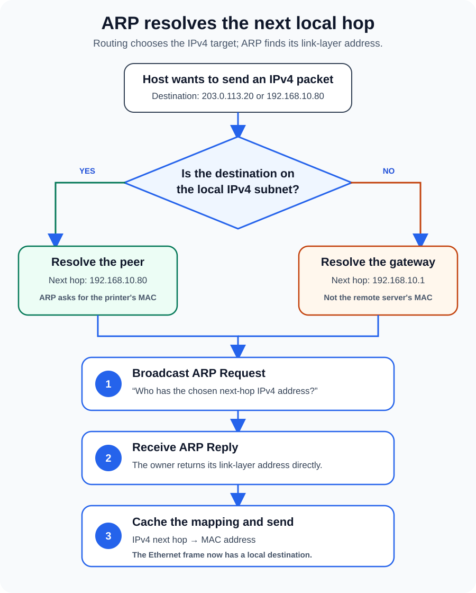

You enter a server's IPv4 address, press Enter, and expect the network to send a packet.

But an Ethernet frame cannot leave your laptop with only that IP address. The network interface also needs a link-layer destination—a MAC address—for the next device on the local network. If the operating system does not already know that address, the packet has nowhere to go yet.

That small gap is what the Address Resolution Protocol fills.

**ARP maps an IPv4 address to a link-layer address, usually a 48-bit Ethernet MAC address, on the local network.** It lets a host ask, “Who is using this IPv4 address?” and remember the answer long enough to send frames efficiently.

The phrase *on the local network* is the key. ARP does not find a remote website's MAC address, cross a router, or replace DNS. It resolves the address of the next local hop.



## ARP solves the last local delivery problem

IP and Ethernet identify destinations at different scopes.

An IPv4 address helps the operating system decide whether a destination is on a directly connected subnet or must be reached through a router. A MAC address tells Ethernet which interface should receive a frame on the current link.

The two values are not interchangeable. A host can keep the same IPv4 address while its network interface changes, and a MAC address does not describe where a device lives across the internet. Before local Ethernet delivery, the sender needs a temporary mapping between them.

[RFC 826](https://www.rfc-editor.org/rfc/rfc826.html), the original ARP specification, describes this as translating a protocol address into a hardware address. Although ARP was designed to be more general, its everyday use is resolving IPv4 addresses on technologies such as Ethernet.

The host does not begin by broadcasting every IP packet. It first asks its routing logic a more important question: **which IPv4 address is the next hop?** Only then does ARP resolve that next-hop address.

## The next hop may not be the final destination

Suppose a laptop has `192.168.10.25/24` and a default gateway at `192.168.10.1`.

If it sends data to a printer at `192.168.10.80`, the subnet calculation says the printer is local. The next hop is the printer itself, so the laptop resolves `192.168.10.80` to the printer's MAC address.

If the laptop sends data to `203.0.113.20`, that destination is outside `192.168.10.0/24`. The laptop does **not** ARP for `203.0.113.20`. It chooses the default gateway as the next hop and resolves `192.168.10.1` to the router interface's MAC address.

The Ethernet frame is addressed to the router, while the IP packet inside still names the remote server as its destination. At each routed hop, the link-layer wrapper can change; the end-to-end IP destination remains the remote host.

This distinction explains why searching a local ARP table for a public website usually finds nothing. The useful entry is the gateway.

## How an ARP request becomes a usable mapping

Assume the printer is local and the laptop has no cached entry for it.

1. **The laptop selects the next-hop IPv4 address.** Its subnet and route information point to `192.168.10.80` directly.
2. **It broadcasts an ARP Request.** The Ethernet destination is `ff:ff:ff:ff:ff:ff`, so devices in that local broadcast domain can receive the question: “Who has `192.168.10.80`?”
3. **The owner replies.** The printer returns an ARP Reply containing its link-layer address. In the ordinary exchange described by RFC 826, the reply is sent directly to the requester.
4. **The laptop records the mapping.** Its ARP or neighbor cache now associates the printer's IPv4 address with the learned MAC address.
5. **Normal data delivery continues.** The laptop can put the IPv4 packet inside an Ethernet frame addressed to that MAC.

The request includes the sender's own IPv4 and hardware addresses. That is useful because the receiving host can learn how to reply while processing the question. ARP is a small exchange, but it gives both sides information they may reuse.

## The ARP cache prevents a broadcast before every frame

Repeating the request for every packet would create needless broadcast traffic and delay. Hosts therefore maintain a cache—often presented as a *neighbor table*—of recently learned mappings.

These entries are not permanent truth. Interfaces move, virtual machines migrate, failover addresses change owners, and devices disconnect. [RFC 1122](https://www.rfc-editor.org/rfc/rfc1122.html) requires hosts to flush out-of-date ARP entries and discusses mechanisms for validating cached mappings. Exact state names and timers are implementation details, so two operating systems may expose the cache differently.

A neighbor entry can be reachable, stale, incomplete, failed, permanent, or something similar depending on the platform. “Stale” does not necessarily mean “broken”; it can mean the mapping has not been confirmed recently and will be checked when traffic needs it. “Incomplete” or “failed” is more interesting because the host tried to resolve a neighbor but did not receive a usable answer.

That makes the cache a diagnostic clue, not a configuration database to clear on instinct.

## ARP stays inside the broadcast domain

Routers do not forward ordinary ARP broadcasts from one subnet to another. The request is meaningful only on the link where the next-hop device is expected to exist.

A VLAN usually defines one such Layer 2 broadcast domain. Two hosts can sit on the same physical switch and still fail to see each other's ARP traffic if their ports belong to different VLANs. Conversely, switches can extend one VLAN across several links, allowing the broadcast to reach devices that are not plugged into the same physical switch.

This scope gives ARP a useful troubleshooting boundary. If a sender cannot resolve an on-link destination, investigate the local path first: interface state, subnet mask, VLAN membership, wireless client isolation, switch ports, duplicate addresses, and the destination host itself. A public DNS resolver or an internet route cannot repair a missing local ARP reply.

For more context on those boundaries, [LAN vs WAN vs VLAN](/posts/lan-vs-wan-vs-vlan/) explains broadcast domains, while [Router vs Switch vs Modem](/posts/router-vs-switch-vs-modem/) follows the devices that carry local and routed traffic.

## ARP is not DNS, routing, or a switch MAC table

Several nearby mechanisms are easy to blend together:

| Mechanism | Question it answers | Typical scope |
| --- | --- | --- |
| DNS | Which IP address belongs to this name? | Local or global name-resolution system |
| Routing table | Which interface and next hop should carry this IP packet? | The current host or router |
| ARP / neighbor cache | Which link-layer address belongs to this next-hop IPv4 address? | The local link or VLAN |
| Switch MAC table | Which switch port leads toward this MAC address? | The switch's Layer 2 forwarding domain |

The sequence matters. DNS may turn a name into an IP address. Routing selects a local next hop. ARP resolves that next hop to a MAC address. A switch then uses its own MAC table to forward the frame toward the right port.

The switch does not consult the sender's ARP cache, and the sender does not need to know the switch port. Each component solves one part of delivery.

## Announcements and duplicate-address detection use ARP too

ARP can do more than answer a pending delivery question. A host may announce a mapping so peers can update old cache entries after an address moves. ARP is also used to check whether an IPv4 address is already active before a host begins using it.

[RFC 5227](https://www.rfc-editor.org/rfc/rfc5227.html) specifies IPv4 Address Conflict Detection. An ARP Probe asks about a candidate address while using an all-zero sender IPv4 address, which avoids teaching other hosts a mapping that may prove invalid. The RFC also defines ARP Announcements and continuing conflict detection.

The phrase **gratuitous ARP** is used loosely across tools and vendor documents. When precision matters, describe the packet's purpose—probe, announcement, cache update, or failover—rather than assuming every unsolicited ARP packet behaves identically.

## ARP trusts what the local network tells it

Classic ARP has no built-in authentication. A malicious or misconfigured device can send a false mapping and persuade hosts to associate another device's IPv4 address—often the gateway—with the wrong MAC address. The result may be interception, traffic disruption, or an unstable network where mappings keep changing.

This is commonly called **ARP spoofing** or **ARP poisoning**. It is one reason a local network should not automatically be treated as trustworthy.

Useful defenses depend on the environment. Managed switches may support controls such as Dynamic ARP Inspection. [Cisco's current guidance](https://www.cisco.com/c/en/us/td/docs/switches/lan/c9000/sec-crypto/fhs-sisf/fhs-and-sisf-configuration-guide/dynamic-arp-inspection.html) describes validating ARP packets against trusted IP-to-MAC bindings, including the DHCP snooping binding database. Network segmentation reduces the set of devices sharing a broadcast domain. Encrypted application protocols such as HTTPS protect data in transit even when the local path is hostile. Static neighbor entries can help a few fixed systems, but they are difficult to maintain at scale and do not cure a compromised Layer 2 network.

## How to troubleshoot ARP without guessing

Start by deciding what the host *should* resolve. Is the destination in the local subnet, or should the neighbor entry belong to the default gateway? A wrong subnet mask can make a host ARP for an address that should have been routed.

Then inspect the neighbor table. These commands read current state; they do not repair it:

```powershell
Get-NetNeighbor -AddressFamily IPv4 |
  Sort-Object InterfaceIndex, IPAddress
```

```bash
ip neigh show
```

Microsoft documents the fields and filters exposed by [`Get-NetNeighbor`](https://learn.microsoft.com/en-us/powershell/module/nettcpip/get-netneighbor), and the iproute2 [`ip-neighbour` manual](https://man7.org/linux/man-pages/man8/ip-neighbour.8.html) explains Linux neighbor states and operations.

Use the result to narrow the failure:

- **No entry until traffic is attempted:** confirm the route, interface, and destination you are testing.
- **Incomplete or failed resolution:** check VLAN membership, link state, wireless isolation, host availability, and whether the address is actually on-link.
- **The same IPv4 address appears with changing MAC addresses:** investigate a duplicate address, failover event, or possible spoofing.
- **A mapping remains wrong after a legitimate move:** verify the new owner is announcing itself and inspect cache aging before clearing anything.

Capturing traffic with a filter such as `arp` can show whether Requests leave, which Replies return, and whether multiple devices claim the same address. Clear a cache entry only after recording the evidence; otherwise, a temporarily successful retry can erase the clue without fixing the cause.

## IPv6 uses Neighbor Discovery instead

ARP is normally part of IPv4 networking. IPv6 uses the Neighbor Discovery protocol defined by [RFC 4861](https://www.rfc-editor.org/rfc/rfc4861.html), with ICMPv6 messages for address resolution, router discovery, reachability information, and related functions.

The problem is familiar—turning a next-hop network-layer address into link-layer delivery information—but the protocol is not ARP. Saying “IPv6 ARP” may feel intuitive, yet it hides important Neighbor Discovery behavior and makes packet filters and troubleshooting advice inaccurate.

## The takeaway

ARP is the short local conversation that lets an IPv4 packet acquire an Ethernet destination.

The host first uses its route and subnet information to choose a next hop. If that next hop is not already in the neighbor cache, it broadcasts an ARP Request, learns the owner's MAC address from the Reply, caches the mapping, and sends the frame. For a local peer, ARP resolves the peer. For a remote destination, ARP usually resolves the gateway.

Remember that boundary and many confusing network symptoms become easier to place. DNS finds names, routing chooses paths, ARP resolves the next local IPv4 hop, and switches carry the resulting frame.

## Related reading

- [Network Communication Basics: Ethernet, MAC Addressing, and How Local Networks Work](/posts/network-communication-basics/)
- [Internet Protocol (IP) Explained: Addressing, Subnets, DHCP, and NAT](/posts/internet-protocol-ip-basics/)
- [The OSI Model Explained Layer by Layer](/posts/osi-model-explained/)
- [LAN vs WAN vs VLAN: What Is the Difference?](/posts/lan-vs-wan-vs-vlan/)

## Sources

- [RFC 826: An Ethernet Address Resolution Protocol](https://www.rfc-editor.org/rfc/rfc826.html)
- [RFC 1122: Requirements for Internet Hosts—Communication Layers](https://www.rfc-editor.org/rfc/rfc1122.html)
- [RFC 5227: IPv4 Address Conflict Detection](https://www.rfc-editor.org/rfc/rfc5227.html)
- [RFC 4861: Neighbor Discovery for IP version 6](https://www.rfc-editor.org/rfc/rfc4861.html)
- [Cisco: Dynamic ARP Inspection](https://www.cisco.com/c/en/us/td/docs/switches/lan/c9000/sec-crypto/fhs-sisf/fhs-and-sisf-configuration-guide/dynamic-arp-inspection.html)
- [Microsoft Learn: Get-NetNeighbor](https://learn.microsoft.com/en-us/powershell/module/nettcpip/get-netneighbor)
- [iproute2: ip-neighbour manual page](https://man7.org/linux/man-pages/man8/ip-neighbour.8.html)
