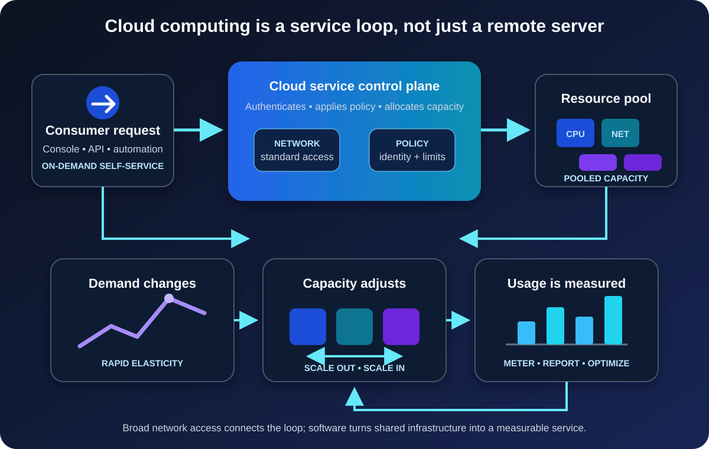

A product launch is three weeks away, and the application needs more capacity.

In a traditional datacenter, that sentence can begin a chain of purchase approvals, delivery estimates, rack space, power, cabling, installation, and configuration. The team must predict how large the launch will be before anyone arrives. Buy too little and the system struggles. Buy too much and expensive hardware waits for work.

Cloud computing changes that conversation. Instead of buying a machine for an uncertain future, a team requests computing capacity as a service, receives it quickly, and releases it when the need passes.

That is the useful beginner's definition: **cloud computing is the on-demand delivery of shared computing resources over a network, with usage that can be measured and capacity that can expand or shrink.**

The cloud is not simply “a server somewhere else.” The location matters, but the operating model matters more.

## What makes a service a cloud service?

The [NIST definition of cloud computing](https://csrc.nist.gov/pubs/sp/800/145/final) remains a strong vendor-neutral baseline. It describes five essential characteristics: on-demand self-service, broad network access, resource pooling, rapid elasticity, and measured service.

Those phrases can sound abstract. Put them into the launch scenario and they become practical:

- **On-demand self-service:** the team can provision capacity through a console, API, or automation without waiting for a provider employee to install it.
- **Broad network access:** the service is available through standard network mechanisms to appropriate clients and systems.
- **Resource pooling:** the provider operates a pool of physical and virtual resources and assigns capacity to consumers as demand changes.
- **Rapid elasticity:** capacity can scale outward and inward, sometimes automatically.
- **Measured service:** resource use can be monitored and reported, which makes usage-based charging and cost analysis possible.

The following picture shows the complete idea. A request does not travel straight to a particular physical server. It goes through a software-controlled service layer that allocates from a resource pool, observes demand, and records consumption.

This abstraction is what makes cloud computing feel different from ordering hardware. Consumers choose a service and required capacity. The provider manages the underlying facilities and exposes control through software.

## Cloud computing is a way to consume IT

Imagine an online store that normally needs four application instances but expects a short holiday spike.

With owned hardware, the company might buy enough servers for the peak and run much of that capacity lightly during ordinary months. In the cloud, it can start with current demand, add instances as traffic rises, and remove them afterward. [AWS describes cloud computing](https://docs.aws.amazon.com/whitepapers/latest/aws-overview/what-is-cloud-computing.html) as on-demand access to IT resources through the internet with pay-as-you-go pricing; [Google Cloud's definition](https://cloud.google.com/learn/what-is-cloud-computing) similarly emphasizes scalable services and avoiding the need to self-manage physical resources.

That does not guarantee a lower bill. It changes the shape of the decision.

Capital spending on owned equipment becomes some mixture of usage-based operating expense, subscriptions, support, data transfer, and longer-term commitments. Capacity can follow demand more closely, but every running resource can generate cost. A forgotten test database or oversized virtual machine is still waste—just waste that appears on a monthly bill instead of in a server room.

Cloud therefore replaces one discipline with another. Teams provision faster, but they also need budgets, ownership labels, monitoring, lifecycle rules, and regular cost review.

## What happens behind the cloud interface?

A cloud provider operates datacenters filled with computing, storage, and networking equipment. Virtualization and other abstraction layers divide and combine those physical resources into services. A control plane accepts requests, checks identity and policy, allocates capacity, and exposes status through APIs and management tools.

The consumer might request a virtual machine with a certain amount of memory, an object-storage bucket, or a managed database. The request names the desired service, not a rack and server serial number.

This is why cloud computing and virtualization are related but not identical. Virtualization can divide one physical machine into multiple virtual machines, including inside a private datacenter. Cloud computing adds the broader service model: self-service access, pooling, elasticity, network availability, and measurement.

The internet is not the cloud either. It is commonly the network used to reach public cloud services. A private cloud may use private connectivity, and many ordinary internet services are not elastic, metered cloud platforms.

## IaaS, PaaS, and SaaS move the management boundary

Cloud services are commonly grouped by how much of the technology stack the provider operates.

| Service model | What you receive | What you still focus on | Familiar example |
| --- | --- | --- | --- |
| Infrastructure as a Service (IaaS) | Virtual compute, storage, and networking | Operating systems, applications, data, access, and configuration | A virtual machine hosting your application |
| Platform as a Service (PaaS) | A managed application or data platform | Code, data, access, application settings, and workload behavior | A managed web-app or database platform |
| Software as a Service (SaaS) | A ready-to-use application | Users, data, access, governance, and service configuration | Web email or an online collaboration suite |

Think of the three models as different management boundaries, not rankings.

IaaS resembles a traditional server environment and offers substantial control, but the consumer still patches and operates more of the stack. PaaS removes much of that platform work so developers can concentrate on the application. SaaS delivers the finished application but usually offers less control over its internals.

Real systems mix them. The store might run a legacy component on IaaS, deploy its new API to PaaS, and use SaaS for customer support. The right question is not “Which model is best?” It is “Which responsibilities need our control, and which can the provider handle more effectively?”

## Public, private, hybrid, and community cloud describe who uses it

Service models describe *what is managed*. Deployment models describe *who the cloud is provisioned for and how environments relate*.

- A **public cloud** is offered for open use and operated on the provider's premises.
- A **private cloud** is provisioned for the exclusive use of one organization. It may exist on or off that organization's premises.
- A **hybrid cloud** connects distinct cloud environments so data or applications can move or work across them.
- A **community cloud**, included in the NIST taxonomy, serves organizations with shared concerns such as mission, policy, or compliance requirements.

“Public” does not mean that every customer's data is public. It describes the provider and consumption model. Access to an individual workload still depends on its identities, permissions, network controls, and configuration.

Likewise, placing automation around an ordinary virtualized datacenter does not automatically make it a private cloud. The cloud characteristics still matter. If every resource request becomes a manual ticket and capacity cannot be pooled or released efficiently, the experience is closer to managed hosting than genuine cloud self-service.

## The provider takes work, not accountability

The easiest cloud mistake is assuming that managed infrastructure means a managed outcome.

Cloud security uses a **shared responsibility model**. The provider secures the facilities, physical equipment, and portions of the software stack included in the selected service. The consumer remains responsible for the parts it controls.

[Microsoft's current shared-responsibility guidance](https://learn.microsoft.com/en-us/azure/security/fundamentals/shared-responsibility) says that customers retain responsibility for their data, accounts, access management, and endpoints across cloud deployment types. [AWS makes the same boundary explicit](https://aws.amazon.com/compliance/shared-responsibility-model/): AWS secures the infrastructure of its cloud, while customer work varies with the chosen service.

For the online store, the provider may protect the physical host beneath a managed database. The store team must still decide who can read customer records, whether backups meet recovery needs, how secrets are handled, which region may hold the data, and what happens when an administrator account is compromised.

Moving from IaaS to PaaS or SaaS generally shifts more operational work to the provider. It never shifts the business's accountability for using the service safely and lawfully.

## Why teams choose cloud—and what they inherit

The strongest cloud benefit is usually not one feature. It is the ability to trade fixed infrastructure and slow provisioning for programmable services.

That can produce several advantages:

- Experiments can begin without a hardware purchase.
- Capacity can respond to changing demand.
- Managed services can remove undifferentiated platform work.
- Regions and managed resilience features can support wider availability goals.
- Infrastructure can be described and reviewed through code and APIs.

But cloud also creates new constraints. A workload depends on provider services and network connectivity. Costs can be difficult to predict when traffic or data movement changes. Managed products have quotas, supported configurations, and lifecycle policies. Architecture choices can make later migration expensive. Resilience still requires deliberate design; deploying an application to one cloud region does not make it immune to failure.

This is the same architectural truth that applies elsewhere: every convenience moves complexity rather than erasing it. A managed database removes hardware and operating-system work, but schema design, query behavior, permissions, backup policy, and recovery testing remain.

## When cloud computing is a good fit

Cloud is especially useful when demand is variable, speed of provisioning matters, a managed service can replace low-value maintenance, or teams need resources in several locations. Development environments, web applications, backup systems, data processing, and short-lived experiments often benefit from those properties.

It is not an automatic answer for every workload. Existing hardware may still have useful life. A system may require specialized equipment, extremely predictable local latency, disconnected operation, or controls that a particular service cannot satisfy. A steady workload can also be economical on owned infrastructure when an organization already has the facilities and expertise to operate it.

A sound evaluation begins with the workload rather than the provider catalog:

1. How quickly does capacity need to change?
2. Which parts of the stack must the team control?
3. What availability, recovery, latency, and data-location requirements apply?
4. Who will own identity, configuration, monitoring, and cost after launch?
5. What is the exit or portability plan for data and critical interfaces?

These questions turn “move to the cloud” from a slogan into an engineering decision.

## Common beginner mistakes

The first mistake is treating cloud as a destination rather than an operating model. Moving an unchanged server into a virtual machine may be a valid migration step, but it does not automatically gain elasticity, resilience, or operational simplicity.

The second is confusing available capacity with infinite capacity. Cloud services have quotas, regional capacity considerations, API limits, and budgets. Designs should handle those boundaries.

The third is assuming pay-as-you-go means pay-less. Usage pricing rewards resources that match demand and are removed when idle. It punishes resources that nobody owns or measures.

The fourth is ignoring failure because the infrastructure is managed. Applications still need appropriate redundancy, backups, recovery objectives, observability, and tested failure behavior.

The fifth is forgetting shared responsibility. A provider cannot repair an overly broad permission, classify business data, or decide who should retain access after changing roles.

## The concise takeaway

Cloud computing lets consumers obtain shared computing capabilities as on-demand, network-accessible, elastic, and measurable services. IaaS, PaaS, and SaaS define how much of the stack the provider manages. Public, private, hybrid, and community cloud describe how cloud environments are provisioned and connected.

The real shift is from owning capacity to requesting a service through software. That can make technology faster to provision and easier to scale, but it also demands clear ownership of cost, data, access, reliability, and architecture.

The cloud removes the need to manage some machinery. It does not remove the need to think.

## Continue learning

- [What Is Software Architecture? A Beginner's Guide](/posts/software-architecture-beginners-guide/)
- [AZ-900 Cheatsheet: The Complete Azure Fundamentals Study Guide](/posts/az-900-cheatsheet/)
- [System Design Caching: Cache-Aside, Expiration, and Invalidation](/posts/system-design-caching-cache-aside-expiration-invalidation/)
- [DNS Explained: How Your Browser Finds a Website](/posts/dns-explained-how-your-browser-finds-a-website/)

## Sources

- [NIST SP 800-145: The NIST Definition of Cloud Computing](https://csrc.nist.gov/pubs/sp/800/145/final)
- [AWS: What Is Cloud Computing?](https://docs.aws.amazon.com/whitepapers/latest/aws-overview/what-is-cloud-computing.html)
- [AWS: Shared Responsibility Model](https://aws.amazon.com/compliance/shared-responsibility-model/)
- [Microsoft Azure: Shared Responsibility in the Cloud](https://learn.microsoft.com/en-us/azure/security/fundamentals/shared-responsibility)
- [Google Cloud: What Is Cloud Computing?](https://cloud.google.com/learn/what-is-cloud-computing)
