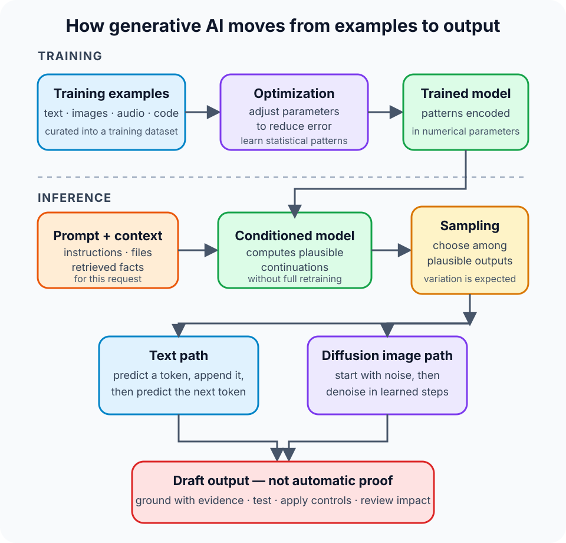

A support chatbot writes a calm, polished answer to a customer's billing question. The grammar is flawless. The explanation sounds certain. One problem remains: the refund policy it cites does not exist.

That moment captures both the appeal and the danger of generative AI. The system can produce useful new material in seconds, yet fluency is not evidence. A convincing response and a verified response are two different things.

**Generative AI is a category of artificial intelligence that learns patterns from data and uses those patterns to create new content, such as text, images, audio, video, or code.** It generates a likely output for the input and context it receives. It does not automatically look up a known correct answer, understand a subject as a person does, or guarantee that its output is true.

That distinction is the mental model worth keeping. Generative AI is a powerful *creator of candidates*. The surrounding system and the people using it must decide which candidates are accurate, safe, and useful.

## Generative AI predicts what could come next

Traditional software follows rules written by developers. A tax calculator applies a formula. A database returns stored rows that match a query. A conventional classifier may estimate whether an email is spam or whether a transaction looks fraudulent.

Generative AI has a different job: produce a new arrangement that resembles the patterns it learned.

For a text model, generation often happens one **token** at a time. A token can be a word, part of a word, punctuation, or another small unit. Given the tokens already present, the model assigns probabilities to possible next tokens, selects one according to a decoding strategy, adds it to the sequence, and repeats. The result can be a sentence, program, summary, or conversation.

The Transformer architecture made this kind of sequence modeling far more effective. The original [Attention Is All You Need paper](https://research.google/pubs/attention-is-all-you-need/) introduced a design built around attention mechanisms, which let the model relate different positions in a sequence without processing every dependency through recurrence. Modern language models add many engineering and training advances, but attention remains a foundational idea.

Image generation can follow another path. A diffusion model learns how to reverse a process that gradually adds noise to data. At generation time, it begins with noise and repeatedly denoises it while conditioning the process on a prompt or other input. The [original denoising diffusion work published at NeurIPS](https://proceedings.neurips.cc/paper/2020/hash/4c5bcfec8584af0d967f1ab10179ca4b-Abstract.html) describes this learned reverse process and its use for image synthesis.

These mechanisms are different, but the broad idea is shared: learn a distribution from examples, then sample a new output under some condition.

## Training and using a model are separate moments

The word *learning* can make it sound as though a chatbot studies every question while you wait. Normally, two distinct phases are involved.

During **training**, a model processes many examples and adjusts numerical parameters to reduce errors on a training objective. A language model may learn to predict missing or next tokens. A diffusion model may learn to estimate and remove noise. Training turns regularities in data into parameter values; it does not build a tidy encyclopedia of source documents.

After pre-training, developers may adapt a base model with additional data or feedback. Instruction tuning can improve its ability to follow requests. Fine-tuning can specialize behavior for a domain or task. Other methods can shape safety, style, or preferences. These steps change the model, but they still do not make every answer reliable.

During **inference**, a person or application supplies a prompt and perhaps additional context. The already-trained model computes an output without retraining its full set of parameters. Sampling settings affect which plausible continuation is chosen, so the same prompt can produce different results.

This is why a generated answer may vary from one attempt to the next. The variation is useful for brainstorming and creative work. It is a defect when a workflow quietly assumes deterministic, source-backed facts.

## A model is not the whole product

People often use *model*, *chatbot*, and *generative AI system* as though they mean the same thing. They do not.

The model is the learned component that generates output. A production application can also include:

- a user interface and conversation history;
- retrieved documents or database records;
- tools that search, calculate, or perform actions;
- filters, access controls, and usage policies;
- monitoring, evaluations, and human approval steps.

Suppose a company builds an assistant for its refund policy. Asking a base model from memory is fragile because the policy can change and may never have appeared in its training data. A better system retrieves the current approved policy, gives the relevant passages to the model, asks for an answer grounded in that material, and preserves citations for review.

Retrieval improves access to current, private, or domain-specific facts. It does not guarantee that the model will use them correctly. Authorization still has to limit which documents a user may retrieve, instructions need protection from hostile content, and important claims still need evaluation.

## Generative AI is broader than large language models

An LLM is a language model with a very large number of learned parameters. It is one important kind of generative model, not a synonym for the entire field.

The [Google Machine Learning glossary](https://developers.google.com/machine-learning/glossary/generative) includes text, image, audio, music, and video systems under generative AI. Models can also be **multimodal**, accepting or producing more than one kind of data. For example, a system might inspect an image and answer a text question, or combine text and audio instructions to create a video draft.

| Term | Useful meaning | Example output |
| --- | --- | --- |
| Generative AI | The broad category of systems that create new content from learned patterns | Text, images, audio, video, or code |
| Large language model | A generative model centered on language tokens | An explanation, translation, or code draft |
| Diffusion model | A generative model that can learn to reverse a noise-adding process | An image synthesized from noise under text guidance |
| Generative AI application | A complete product containing a model plus context, controls, and workflows | A document assistant with retrieval, citations, and review |

That separation prevents a common mistake: judging a complete product only by the underlying model. The same model can behave very differently depending on the data it can access, the instructions it receives, the tools it can call, and the checks applied to its output.

## What is generative AI good at?

Generative AI is most useful when producing a strong first candidate has value and someone or something can evaluate that candidate.

It can summarize a long document, rewrite text for a different audience, translate, draft test cases, propose code, generate interface variations, classify information through structured output, or help explore several approaches to a problem. It can make blank-page work faster and turn unstructured input into a useful starting point.

The fit becomes weaker as the cost of a subtle error rises. A marketing tagline and a medication instruction are both text, but they do not deserve the same review process. Neither do a disposable code sketch and a script with production credentials.

A practical selection question is therefore not merely, “Can the model do this?” Ask instead:

1. Can the output be checked against a source, rule, test, or expert judgment?
2. What happens when the output is plausible but wrong?
3. Does the prompt or retrieved context contain private or regulated data?
4. Who approves an action before it changes money, permissions, records, or infrastructure?
5. Can the system record inputs, model versions, retrieved evidence, and outcomes well enough to investigate a failure?

Generative AI works best inside a process designed for uncertainty, not one that pretends uncertainty has disappeared.

## Fluent output still needs evidence

A language model is optimized to continue patterns, not to serve as a truth database. It can produce a false statement in the same confident style as a correct one. Google calls this behavior a **hallucination**; NIST uses **confabulation** in its risk framework. The label matters less than the operational lesson: presentation quality and factual quality must be measured separately.

The [NIST Generative AI Profile](https://www.nist.gov/publications/artificial-intelligence-risk-management-framework-generative-artificial-intelligence) recommends empirical evaluation, reviewing generated sources and citations, documenting how human knowledge and retrieval contribute, and testing in conditions similar to deployment. It also treats data privacy, information security, harmful bias, intellectual property, and human over-reliance as risks that need active management.

That leads to a simple review pattern:

- **Ground factual work.** Provide authoritative context and require traceable sources.
- **Test executable work.** Run generated code in an isolated environment and review what it can access.
- **Protect inputs.** Do not paste secrets or sensitive data into a service without an approved data-handling agreement and technical controls.
- **Evaluate the real task.** A few impressive demonstrations are not a representative test set.
- **Keep meaningful human control.** High-impact outputs need a reviewer with the authority and expertise to reject them.

Adding “be accurate” to a prompt cannot replace these controls. A prompt influences generation; it does not prove correctness.

## Common misconceptions

**“It searches its training data and pastes the closest answer.”** Generation normally comes from learned parameters rather than a document lookup. Models can still memorize or reproduce material, which is one reason data provenance, privacy, and intellectual-property controls matter.

**“If it sounds original, it must be correct.”** Novelty and truth are separate properties. A model can assemble a new, coherent explanation around a false premise.

**“A bigger model removes the need for verification.”** Capability can improve while errors remain expensive and difficult to notice. The review requirement should follow the impact of failure, not the confidence of the prose.

**“The model understands every action taken by the application.”** A tool-using product combines probabilistic generation with deterministic software, permissions, and external systems. Its safety depends on all those boundaries, not only on the model.

## The takeaway

Generative AI learns patterns from data and samples new content in response to an input. Language models commonly generate token by token; diffusion models can generate by learning to remove noise. Training creates the model, while inference uses that model to produce a particular response.

The most useful way to treat the result is as a candidate, not a verdict. Ground it when facts matter, test it when it can execute, protect the data around it, and match human review to the cost of being wrong.

For the wider taxonomy, read [Artificial Intelligence vs Machine Learning vs Deep Learning](/posts/ai-vs-machine-learning-vs-deep-learning/). To follow the lifecycle behind learned models, continue with [What Is Machine Learning and How Does It Work?](/posts/what-is-machine-learning/). For a comparison of learning signals, see [Supervised vs Unsupervised vs Reinforcement Learning](/posts/supervised-vs-unsupervised-vs-reinforcement-learning/).

## Sources

- [NIST AI 600-1: Artificial Intelligence Risk Management Framework — Generative Artificial Intelligence Profile](https://www.nist.gov/publications/artificial-intelligence-risk-management-framework-generative-artificial-intelligence)
- [Google for Developers: Machine Learning Glossary — Generative AI](https://developers.google.com/machine-learning/glossary/generative)
- [Google Research: Attention Is All You Need](https://research.google/pubs/attention-is-all-you-need/)
- [NeurIPS: Denoising Diffusion Probabilistic Models](https://proceedings.neurips.cc/paper/2020/hash/4c5bcfec8584af0d967f1ab10179ca4b-Abstract.html)
