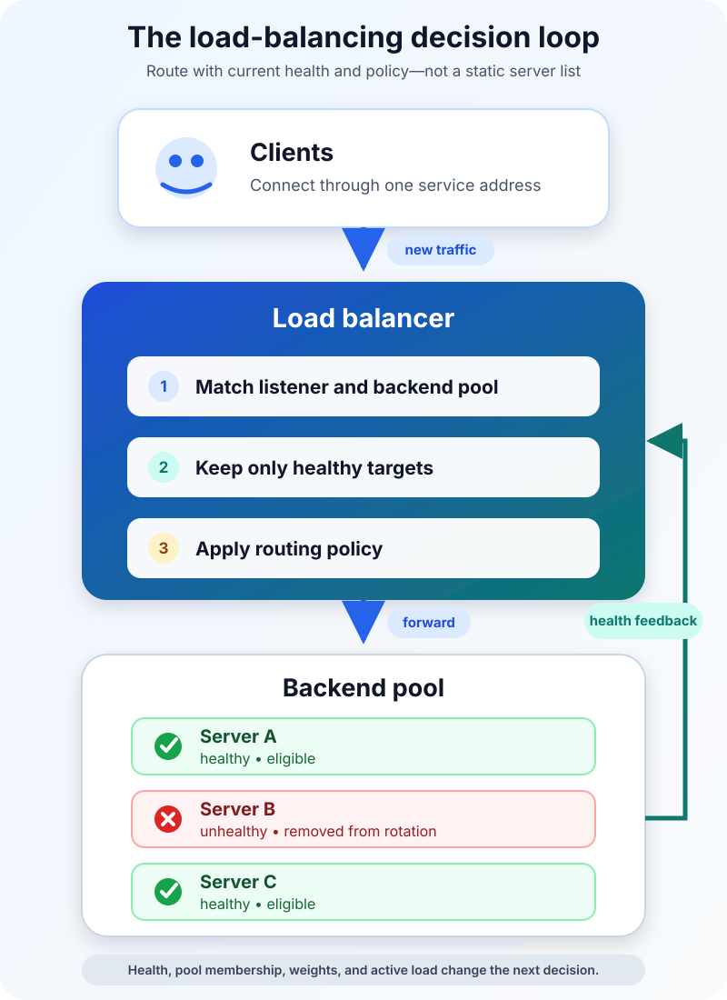

The promotion begins at noon. By 12:03, the store has three application servers running and customers are still seeing timeouts.

Adding servers was supposed to solve the problem. Instead, one server is overwhelmed, another is almost idle, and the third has a broken database connection but continues accepting requests.

The missing piece is not more capacity. It is a way to decide where each new request should go—and when a server should receive no traffic at all.

That is the job of a load balancer. **A load balancer sits between clients and a pool of backends, accepts incoming traffic through one service address, and selects an eligible backend for each request or connection.** It can spread work, remove unhealthy targets from rotation, and give applications room to scale without asking clients to track individual servers.

The word *balance* can be misleading, though. A good load balancer does not always make every server equally busy. It makes a better routing decision using the health, capacity, and behavior of the system it actually has.

## One address hides a changing pool

Imagine that the store exposes `shop.example.com`, while three application instances run behind it.

The client resolves the public name and connects to an address associated with the load-balancing service. A listener accepts traffic on a configured protocol and port. The load balancer identifies the relevant backend pool, excludes targets that are not eligible, applies its routing algorithm, and forwards the traffic to one selected target.

The response returns to the client either through the load balancer or directly from the backend, depending on the design. Proxy-based load balancers terminate one connection and create another toward the backend. Passthrough designs can preserve more of the original packet and allow direct server return.

Meanwhile, health checks keep updating the eligible pool. If the second server fails enough checks, it leaves rotation. When it later passes the recovery threshold, it can receive traffic again.

That feedback loop is the heart of load balancing:

1. discover the possible backends;
2. decide which ones are healthy enough to serve;
3. select one using a routing policy;
4. observe what happens and update the next decision.

AWS describes the same basic flow for Elastic Load Balancing: a load balancer accepts client traffic, chooses a healthy registered target, stops routing to a target detected as unhealthy, and resumes when it becomes healthy again. The product details vary, but the control loop is widely useful.

## Layer 4 and Layer 7 see different information

“Which server should get this traffic?” depends partly on what the load balancer can see.

A Layer 4 load balancer works at the transport level. It commonly makes decisions using connection information such as source and destination IP addresses, ports, and protocol. It can handle traffic without understanding an HTTP path or cookie.

A Layer 7 load balancer understands an application protocol, most commonly HTTP or HTTPS. It can route `/images/` to one pool, `/checkout/` to another, or requests for different hostnames to different services. Because it acts as an application proxy, it can also participate in TLS termination, redirects, and HTTP header handling.

| Question | Layer 4 load balancing | Layer 7 load balancing |
| --- | --- | --- |
| What does it inspect? | Connection and transport information | Application data such as HTTP host, path, headers, or cookies |
| What can it route? | TCP, UDP, and other supported IP traffic | Supported application protocols, usually HTTP and HTTPS |
| Typical strength | Fast, protocol-agnostic connection distribution | Content-aware routing and application controls |
| Typical tradeoff | Cannot route by URL or HTTP metadata | More protocol processing and proxy responsibility |

This is not a contest in which Layer 7 is always more advanced and therefore always better. A database connection, mail service, multiplayer game, and website present different traffic. Choose the layer that exposes the information needed for the routing decision without taking on unnecessary work.

Google Cloud's documentation makes the distinction concrete: its Application Load Balancers operate at Layer 7 for HTTP(S), while Network Load Balancers operate at Layer 4 for TCP, UDP, or other supported IP protocols. It also separates proxy and passthrough network designs, a reminder that “Layer 4” does not describe one universal implementation.

## The algorithm is a policy, not magic

Once the load balancer has an eligible set of backends, it still needs to pick one.

**Round robin** cycles through available servers. It is easy to understand and works well when servers have similar capacity and requests require roughly similar effort. But ten requests are not necessarily ten equal pieces of work. One might return a cached product name while another generates a large report.

**Least connections** sends new work toward the server with fewer active connections. It can fit long-lived or uneven connections better than a simple cycle, although connection count is still only a proxy for real load.

**Weighted routing** gives more work to targets with greater capacity. During a hardware transition, for example, a larger instance might receive three times the share of a smaller one. Weights can also support gradual rollout, but they do not prove that a new version is correct.

**Hash-based routing** uses a stable value—perhaps a source address or another key—to make requests more likely to reach the same target. This can help session persistence or cache locality. It also couples routing to the chosen key, so changes to the pool or client network behavior can produce surprises.

NGINX documents round robin, least-connected, and IP-hash methods for HTTP upstreams, along with weights. AWS Application Load Balancers currently offer round robin, least outstanding requests, and weighted random routing at the target-group level. The names differ because implementations differ. The durable question is: *what signal best represents available capacity for this workload?*

## Health checks decide who deserves traffic

A routing algorithm is useful only after bad choices have been removed.

A basic TCP health check proves that a backend accepts a connection on a port. That is better than no signal, but it does not prove that checkout can reach its database or that inventory data is available. An HTTP check can ask a more meaningful endpoint, such as `/ready`, and require an acceptable response.

The endpoint must tell the truth. If it returns success whenever the process is alive, the store's third server stays in rotation even though every checkout request fails. If the check depends on ten distant services, a minor dependency wobble may remove every application instance at once.

Good health policy balances several tensions:

- **Depth:** test enough to prove the backend can serve its promised work.
- **Cost:** keep checks cheap enough to run continuously.
- **Thresholds:** require repeated failures before removal and repeated successes before recovery, so one noisy result does not cause flapping.
- **Capacity:** ensure the remaining healthy pool can absorb the redirected traffic.

HAProxy distinguishes active checks, which probe a server periodically, from passive checks, which learn from errors in live traffic. Active checks can detect trouble before the next customer arrives. Passive checks can notice failures that a synthetic endpoint misses. Used together, they provide different evidence.

Health checks also define failure semantics. Some systems fail closed when no healthy target remains; others may fail open and try every target in case the health signal itself is wrong. That behavior must be understood before an outage, not discovered during one.

## Sticky sessions solve one problem by creating another

Suppose a user's shopping cart lives only in Server A's memory. If the next request reaches Server B, the cart disappears.

Session persistence, often called a sticky session, can keep that user associated with Server A. It is a practical bridge for an application that expects local session state.

But stickiness reduces the load balancer's freedom. One target can accumulate unusually heavy users. A deployment or failure can still break the association. Autoscaling becomes harder because traffic does not redistribute cleanly when the pool changes.

The stronger long-term design is usually to make application instances replaceable: store session data in a shared service, use a signed token when appropriate, and keep durable state outside one process. Then any healthy target can handle the next request. Stickiness remains an option, not a hidden dependency.

## A load balancer can fail too

Putting one load-balancing process in front of three servers merely moves the single point of failure.

Production designs therefore run redundant load-balancer nodes or use a managed service with a distributed control and data plane. DNS may return multiple load-balancer addresses. Internal tiers may have their own load balancers so service-to-service traffic does not depend on one external entry point.

Redundancy does not eliminate operational mistakes. Several failure patterns remain common:

- a health endpoint says “ready” while a critical dependency is broken;
- retries multiply traffic and make an overloaded pool worse;
- a short timeout rejects legitimate slow work, while a long timeout traps capacity;
- a server is removed immediately during deployment and active requests are cut off;
- TLS termination, client IP forwarding, or headers are configured inconsistently;
- logs show aggregate errors but not the chosen backend, latency, or health transition.

Connection draining helps with planned changes: stop sending new work to a target while giving in-flight requests time to finish. Observability should connect client-facing latency and errors with backend selection, health status, retry counts, and pool saturation. Without those signals, “the load balancer is up” says almost nothing about whether useful traffic is flowing.

## Global load balancing is a larger decision

So far, the backend pool could live in one data center or region. Global server load balancing chooses among sites or regions, often using DNS, anycast routing, proxy infrastructure, or a combination.

The inputs can include regional health, proximity, policy, and capacity. The time scale is different too. DNS answers may be cached until their time to live expires, so changing a record does not instantly move every client. A local load balancer can choose a backend for each new connection; a DNS decision can influence where a client connects for longer.

This distinction keeps two queue-worthy questions separate: the foundational mechanics of load balancing, covered here, and cloud load balancing across managed regions and services, which deserves its own architecture discussion.

## What load balancing does not guarantee

Load balancing can improve distribution and availability, but it does not create healthy capacity from nothing. It does not automatically scale the backend pool unless another system adds and removes targets. It does not fix slow database queries, unsafe shared state, or an application that fails identically on every server.

It is also not, by itself, a complete security or disaster-recovery strategy. TLS termination, web application filtering, rate limits, and denial-of-service protection may be integrated into the same platform, but they are separate responsibilities that need explicit design.

Before shipping, ask whether the chosen layer matches the protocol, whether the algorithm matches the workload, whether health checks reflect real readiness, whether sessions survive target changes, whether removal drains active work, and whether the load-balancing tier is itself redundant and observable.

## The takeaway

Load balancing is a decision loop in front of a changing pool of backends.

It gives clients one service address, filters the pool using health evidence, applies a routing policy, and forwards each request or connection to an eligible target. Layer 4 routing sees transport information; Layer 7 routing can use application details. Algorithms shape distribution, but health checks and failure behavior determine whether the result is resilient.

The practical goal is not perfectly equal server graphs. It is to keep useful work flowing as demand, deployments, and failures change the system underneath.

## Related reading

- [What Is Software Architecture? A Beginner's Guide](/posts/software-architecture-beginners-guide/)
- [Concurrency vs Parallelism: What Is the Difference?](/posts/concurrency-vs-parallelism/)
- [TCP vs UDP Explained With Examples](/posts/tcp-vs-udp-explained-with-examples/)

## Sources

- [AWS: How Elastic Load Balancing works](https://docs.aws.amazon.com/elasticloadbalancing/latest/userguide/how-elastic-load-balancing-works.html)
- [Google Cloud: Cloud Load Balancing overview](https://docs.cloud.google.com/load-balancing/docs/load-balancing-overview)
- [NGINX: Using nginx as an HTTP load balancer](https://nginx.org/en/docs/http/load_balancing.html)
- [HAProxy: Health checks](https://www.haproxy.com/documentation/haproxy-configuration-tutorials/reliability/health-checks/)
