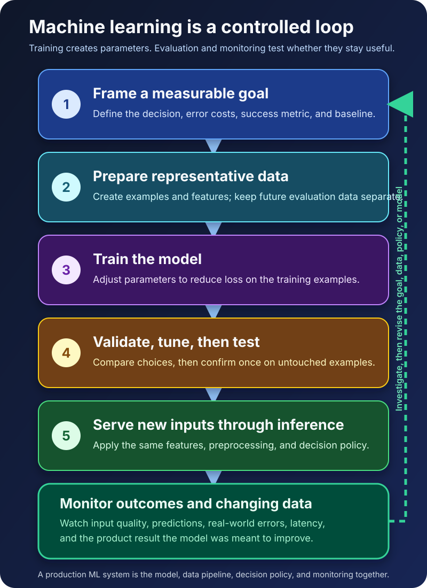

A spam filter reports 99% accuracy. That sounds excellent—until someone notices that only 1% of the messages in its test data were spam.

The model could label every message *not spam*, catch nothing dangerous, and still earn that impressive score.

This is the tension at the heart of machine learning. Training a model is the visible technical step, but useful machine learning depends on everything around it: choosing the right problem, collecting representative examples, measuring the mistakes that matter, and noticing when the real world changes.

The shortest useful definition is this: **machine learning is a way to train software, called a model, to find patterns in data and use those patterns to make predictions or generate outputs for new inputs.**

The software does not receive a hand-written rule for every possible case. It learns adjustable mathematical values—its *parameters*—from examples. That difference is powerful, but it also changes what “correct” means. The question is no longer only whether the code follows its instructions. The question is whether the learned pattern works on data the model has never seen.

## Machine learning moves part of the behavior into data

Imagine building a spam filter without machine learning. You might write rules such as:

- Block messages containing a known malicious domain.
- Increase suspicion when the sender name imitates an executive.
- Quarantine attachments with dangerous file types.

Those rules are explicit. A developer or security analyst decides what the system should notice and how it should respond. This can be the right design when policy is stable and the important conditions are known.

But spam changes constantly. The same intent appears through different wording, domains, formatting, and sender behavior. A rule list can become an endless attempt to describe yesterday’s attacks.

A machine-learning classifier takes another approach. It receives historical messages and their labels—spam or not spam—and adjusts a model so that combinations of signals lead to useful predictions. The result may discover relationships that would be tedious to encode one by one.

That does not remove human decisions. People still decide what counts as spam, which data may be used, how mistakes will be measured, what confidence triggers quarantine, and how users can recover a legitimate message. Machine learning relocates some behavior from hand-written conditions into patterns learned from data; it does not remove engineering or accountability.

## The lifecycle begins before training

Google’s problem-framing guidance starts with a question that is easy to skip: is machine learning actually the right tool?

“Use ML” is not a product goal. “Reduce the number of malicious messages that reach employee inboxes without blocking important business mail” is closer. It names an outcome and exposes two different costs: missed spam and false alarms.

That distinction matters because a model optimizes the target it is given, not the outcome a team vaguely intended. If a video service trains only for clicks, it may learn to recommend irresistible but disappointing titles. If a fraud system optimizes raw accuracy on highly imbalanced data, it may learn that ignoring rare fraud is statistically convenient.

Before selecting an algorithm, define:

- the decision or output the system must produce;
- the information available at the moment of that decision;
- the cost of each kind of error;
- a simple rule-based or existing-system baseline;
- the product outcome that would justify operating an ML system.

If a few reliable rules already solve the problem, a learned model may add expense without adding value. Machine learning earns its place when relevant patterns exist in data, those patterns are difficult to express as durable rules, and the application can do something useful with an imperfect prediction.

## Examples, features, and labels give the problem a shape

Most introductory machine-learning projects can be understood through three pieces.

An **example** is one item the system can learn from or make a prediction about. For the spam filter, one email is an example.

A **feature** is an input signal made available to the model: the age of the sender domain, properties of links, message text, or whether the sender is known to the recipient. Features must exist at prediction time. A signal calculated only after an investigation is completed cannot honestly help a real-time filter.

A **label** is the known answer used for supervised training, such as `spam` or `not spam`. Labels often contain human judgment, inconsistent policy, and historical blind spots. A model can reproduce those problems because it treats the data as evidence of the relationship it should learn.

Representative data matters more than an impressive row count. Ten million old messages from one department may say little about a new campaign targeting another language or region. Duplicated examples can also make evaluation look stronger than it is, especially if nearly identical messages appear in both training and test data.

## Training is an optimization process, not understanding

A model has a structure and adjustable parameters. During training, an algorithm makes predictions on training examples, measures their error with a **loss function**, and adjusts the parameters to reduce that loss.

For a simple classifier, the parameters might be weights that increase or decrease a spam score. Training gradually finds weights that fit the examples better. In many models, an optimization method such as gradient descent estimates which direction will reduce loss and updates the parameters repeatedly.

Two terms are worth separating:

- **Parameters** are learned during training, such as weights in a linear model or neural network.
- **Hyperparameters** are choices made around training, such as model depth, regularization strength, or learning rate.

Lower training loss is not the finish line. A model can memorize peculiarities in its training data and fail on new messages. That failure is **overfitting**: the model fits its practice material more closely than the underlying problem.

The real goal is **generalization**—useful performance on new examples drawn from the conditions the system will face.

## Validation and testing protect the honest answer

To estimate generalization, teams separate data into distinct roles.

The **training set** teaches the parameters. The **validation set** helps compare models, features, thresholds, and hyperparameters during development. The **test set** is held back for a final estimate after those choices have been made.

The exact percentages are not universal. The important properties are separation, sufficient size, and resemblance to the conditions that matter. Time-dependent problems may require a chronological split rather than a random one. Data from the same customer, device, patient, or event may need to stay in one partition so related records cannot leak across the boundary.

Leakage is especially deceptive. Suppose the team normalizes a feature using the average calculated from the entire dataset before splitting it. Information from validation and test examples has already influenced training. The scikit-learn documentation recommends splitting first and learning preprocessing steps only from training data; pipelines help apply the same learned transformations consistently without fitting them again on test data.

The test set must not become another validation set. If a team checks it after every experiment and changes the model in response, the team is gradually fitting its decisions to the test. The score may keep improving while its value as an independent check disappears.

## A useful metric describes a costly mistake

The spam filter’s 99% accuracy failed because accuracy answered the wrong question for an imbalanced problem.

| Metric | Question it answers | When it becomes useful |
| --- | --- | --- |
| Accuracy | What fraction of all predictions were correct? | Classes are reasonably balanced and errors have similar costs |
| Precision | Of the messages flagged as spam, how many really were spam? | False alarms are costly |
| Recall | Of all actual spam messages, how many did the filter catch? | Missed positives are costly |

No metric chooses the product tradeoff. Increasing a classification threshold may improve precision while reducing recall. A security team may accept more quarantined mail to catch a dangerous campaign; another workflow may prioritize avoiding interruption. The threshold belongs to a decision policy, not to the model’s identity.

Model metrics also need a connection to product outcomes. A classifier can improve recall and still fail to reduce incidents because people bypass the quarantine workflow. A recommendation model can increase clicks while reducing long-term satisfaction. The model is one component inside a larger [software architecture](/posts/software-architecture-beginners-guide/), and the whole system must be evaluated.

## Inference is where the learned pattern meets reality

After training and evaluation, the chosen model is deployed. **Inference** is the act of giving that trained model a new input and receiving a prediction or generated output.

For an incoming email, production code gathers the expected features, applies the same preprocessing used during development, calls the model, and receives a score. Application logic then decides whether to deliver, warn, quarantine, or escalate.

Inference usually does not retrain the model. Most systems train on a schedule or through a controlled pipeline, then serve many predictions with fixed parameters until a new version is approved. Keeping those stages separate makes versions, tests, rollbacks, and incident investigation much easier to manage.

Production also introduces concerns that a notebook can hide: latency, cost, privacy, access control, fallback behavior, input validation, version compatibility, and observability. NIST’s AI Risk Management Framework treats risk management as work across design, development, deployment, use, and evaluation—not a review performed once after training.

## The model can stay still while the world moves

A model evaluated in August may degrade by December even when its code and parameters do not change.

Attackers adapt. Customer behavior shifts. Sensors are replaced. A product redesign changes which events are recorded. These changes can alter input distributions, the relationship between features and outcomes, or even the meaning of the target.

Monitoring should therefore cover more than uptime. Teams may track feature availability, input distribution, prediction distribution, latency, error rates, delayed ground-truth performance, and the product metric the model was meant to improve. They also need a response: investigate the data pipeline, adjust a threshold, fall back to rules, retrain, or retire the model.

Retraining is not automatically a repair. Feeding a broken pipeline into the same process only produces a newer broken model. First identify what changed, then decide whether new data, features, labels, policy, or architecture address the cause.

## Machine learning is a family of approaches

The lifecycle changes slightly depending on how learning is organized.

**Supervised learning** uses labeled examples to learn predictions such as categories or numeric values. **Unsupervised learning** looks for structure in unlabeled data, such as clusters of similar behavior. **Reinforcement learning** learns a strategy from rewards received through interaction. Many modern generative systems use deep-learning models trained with combinations of objectives and stages.

These categories explain where the learning signal comes from. They do not replace the core questions about goals, data quality, evaluation, deployment, and monitoring. The broader relationship between these terms is covered in [AI vs Machine Learning vs Deep Learning](/posts/ai-vs-machine-learning-vs-deep-learning/).

## The practical takeaway

Machine learning works by using data to adjust a model’s parameters so the model can produce useful outputs for new inputs. But the model is only the center of the story.

A dependable ML system begins with a measurable decision, learns from representative data, separates training from honest evaluation, chooses metrics based on real error costs, serves predictions through controlled software, and monitors whether yesterday’s pattern still works today.

That is why the best first question is rarely “Which algorithm should we use?”

It is: **What evidence would convince us that this learned behavior helps in the real world?**

## Continue learning

- [AI vs Machine Learning vs Deep Learning: What’s the Difference?](/posts/ai-vs-machine-learning-vs-deep-learning/)
- [What Is Software Architecture? A Beginner’s Guide](/posts/software-architecture-beginners-guide/)
- [Postgres with pgvector vs. Specialized Vector Databases](/posts/postgres-pgvector-vs-specialized-vector-databases/)
- [Architecting Android AI Features: On-Device, Cloud, and Hybrid Inference](/posts/android-intelligent-apps-cloud-hybrid-on-device-inference/)

## Sources

- [Google for Developers: What Is Machine Learning?](https://developers.google.com/machine-learning/intro-to-ml/what-is-ml)
- [Google for Developers: Understand the Problem](https://developers.google.com/machine-learning/problem-framing/problem)
- [Google for Developers: Framing an ML Problem](https://developers.google.com/machine-learning/problem-framing/ml-framing)
- [Google Machine Learning Crash Course: Dividing the Original Dataset](https://developers.google.com/machine-learning/crash-course/overfitting/dividing-datasets)
- [Google Machine Learning Crash Course: Overfitting](https://developers.google.com/machine-learning/crash-course/overfitting/overfitting)
- [Google Machine Learning Crash Course: Accuracy, Precision, and Recall](https://developers.google.com/machine-learning/crash-course/classification/accuracy-precision-recall)
- [scikit-learn: Common Pitfalls and Recommended Practices](https://scikit-learn.org/stable/common_pitfalls.html)
- [NIST: Artificial Intelligence Risk Management Framework 1.0](https://www.nist.gov/publications/artificial-intelligence-risk-management-framework-ai-rmf-10)
