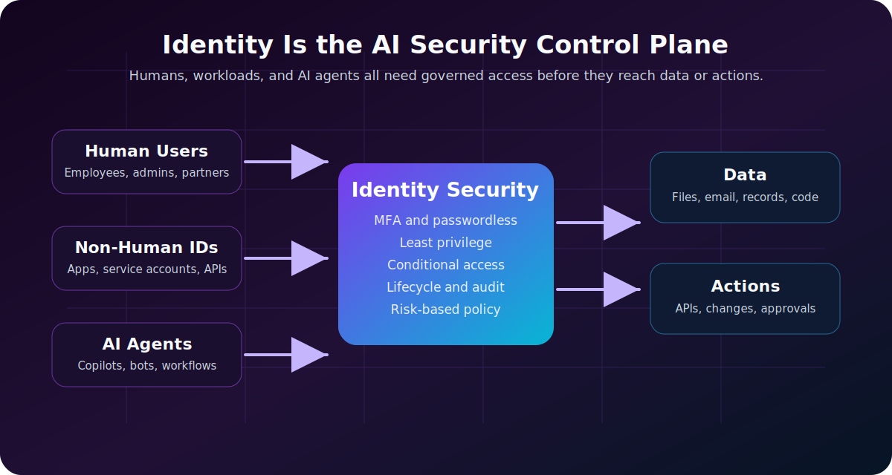
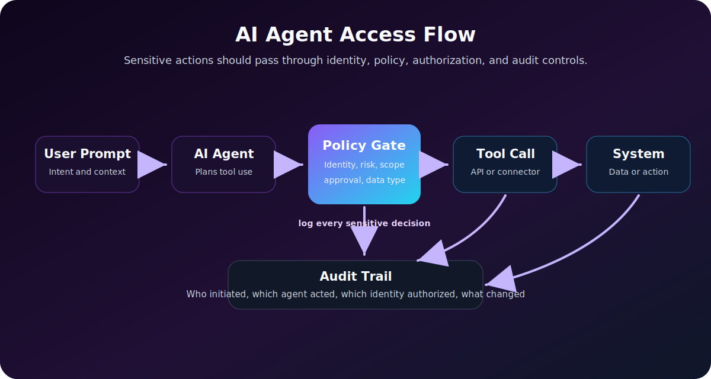

AI changes many things in cybersecurity, but one thing becomes even more obvious: **identity is the control plane**.

Modern security is no longer only about protecting a network perimeter. Users work from anywhere, applications live in SaaS and cloud platforms, APIs connect everything, and AI systems can now summarize data, call tools, trigger workflows, write code, and act on behalf of people. That means the most important question is often not "Is this request inside the network?" It is:

**Who or what is making this request, what is it allowed to do, and should it be allowed right now?**

That is identity security.

In the AI era, identity security matters more because AI increases the number of actors that can touch systems and data. Those actors are not only employees. They include service accounts, OAuth apps, workload identities, automation scripts, API keys, copilots, AI agents, and third-party integrations.

If those identities are overprivileged, unmonitored, or poorly governed, AI does not just make work faster. It makes mistakes faster. It makes data exposure faster. It makes attacker movement faster.

> **Reading path:** Start with the core security model, connect it to the real-world scenario, and finish with the controls or checklist that make the idea actionable.

---

## The Short Version

| AI-era change | Identity security impact |
|---|---|
| AI tools connect to business data | Access policies must decide what the tool can read |
| AI agents can take actions | Permissions must limit what the agent can do |
| Automation creates more non-human identities | Service accounts, apps, and tokens need lifecycle management |
| Prompt injection can manipulate tool use | Tool access needs authorization and guardrails |
| Sensitive data can appear in prompts and outputs | Data access and logging need stronger controls |
| AI speeds up workflows | Bad permissions create faster blast radius |

The core idea is simple: **AI systems inherit the permissions they are given.** If those permissions are too broad, the AI system becomes a powerful path to sensitive data and actions.

---

## Identity Used To Mean Mostly "Users"

Traditional identity and access management focused on people:

- Employees.
- Administrators.
- Contractors.
- Partners.
- Customers.

That model is still important. Humans still need strong authentication, least privilege, conditional access, phishing-resistant MFA, session controls, and access reviews.

But modern environments also contain many **non-human identities**:

| Identity Type | Example | Risk If Mismanaged |
|---|---|---|
| Service account | Background job account | Long-lived password with excessive access |
| Service principal | Cloud app identity | Broad API permissions across cloud resources |
| Managed identity | Cloud workload identity | Overprivileged access to storage, secrets, or databases |
| API key | Integration token | Hardcoded secret leaked in code or logs |
| OAuth app | Third-party SaaS integration | User-consented app with excessive scopes |
| AI agent | Autonomous workflow assistant | Can read data, call APIs, or trigger actions beyond intent |

Microsoft describes non-human identities as software-based identities used by applications, services, scripts, bots, AI agents, and other tools to access systems automatically. The key security point is that these identities often operate quietly in the background, and they can accumulate more access than they need if nobody owns their lifecycle.

AI makes this harder because an AI agent may not behave like a traditional scheduled script. It may be dynamic, task-driven, and connected to multiple tools.

---

## Why AI Raises the Stakes

AI does not magically bypass identity controls. In most enterprise systems, it still needs credentials, tokens, permissions, API scopes, or delegated user access.

That is exactly why identity matters.

If an AI assistant can search your documents, its security depends on document permissions. If an AI coding agent can create pull requests, its security depends on repository permissions. If an AI operations agent can restart services, rotate secrets, query logs, or modify cloud resources, its security depends on workload identity and authorization policy.

AI amplifies identity problems in five ways.

---

## 1. AI Expands the Number of Identities

Before AI, an organization might already have thousands of non-human identities:

- CI/CD service accounts.
- Cloud service principals.
- Monitoring integrations.
- Backup jobs.
- SaaS connectors.
- Security scanners.
- Database jobs.

AI adds more:

- Copilot-style assistants.
- AI agents with tool access.
- Retrieval augmented generation systems connected to internal data.
- Chatbots connected to ticketing, HR, CRM, finance, or engineering systems.
- Autonomous remediation workflows.

Each one needs an identity. Each identity needs permissions. Each permission needs a reason.

The problem is not that these identities exist. The problem is when they become invisible.

---

## 2. AI Can Act, Not Just Answer

Early chatbots mostly answered questions. Newer AI systems can call tools.

That changes the security model.

An AI workflow can move from a prompt to an agent, then to a tool call, a business system, and finally data or an action. Each arrow is an identity and authorization boundary worth monitoring.

An AI system with tool access might be able to:

- Search email.
- Query documents.
- Read tickets.
- Create calendar events.
- Open a support case.
- Update a customer record.
- Run a script.
- Trigger a deployment.
- Call an admin API.

At that point, the AI system is no longer only a user interface. It is part of the access path.

This is why OWASP includes risks such as sensitive information disclosure, insecure plugin design, and excessive agency in its LLM application risk work. The practical lesson is direct: do not give an AI system broad tool access and hope the model behaves perfectly. Give it narrow permissions and enforce policy outside the model.

---

## 3. Prompt Injection Targets Permissions

Prompt injection is often described as "tricking the model." That is true, but the more important question is: **what can the model do after it is tricked?**

If a prompt-injected AI assistant has no access to sensitive tools, the damage may be limited. If it can read files, send emails, query customer records, or call admin APIs, the damage can be serious.

Example:

1. The user asks the agent to summarize a document.
2. The document contains a malicious instruction telling the agent to ignore its original task and email secrets.
3. A vulnerable agent follows the document's instruction because it mistakes untrusted content for an authorized command.

The security control should not depend only on the model refusing the request.

Better controls include:

- Tool allowlists.
- Read-only mode by default.
- Human approval for sensitive actions.
- Data loss prevention.
- Output filtering.
- Strong separation between instructions and untrusted content.
- Per-tool authorization checks.
- Full logging of tool calls.

Identity security is where these controls become enforceable.

---

## 4. AI Makes Least Privilege More Important

Least privilege is old advice, but AI makes it urgent.

An overprivileged employee account is risky. An overprivileged AI agent is risky in a different way because it may:

- Process many requests quickly.
- Touch many systems through integrations.
- Act without a human noticing every step.
- Combine information from multiple sources.
- Make a wrong assumption and execute an action at scale.

Least privilege for AI means:

| Control | Practical Example |
|---|---|
| Narrow scopes | The agent can read tickets but cannot delete them |
| Time-bound access | Elevated access expires after a task |
| Context-aware access | Sensitive data requires stronger conditions |
| Just-in-time privilege | Admin actions require approval |
| Separate identities | Each agent or workload has its own identity |
| No shared secrets | Avoid one API key reused across tools |
| Continuous review | Remove unused or stale permissions |

The goal is not to stop AI adoption. The goal is to make AI adoption survivable.

---

## 5. AI Blurs Human and Machine Accountability

When a human clicks a button, accountability is usually clear.

When an AI agent takes action, accountability becomes more complicated:

- Did the user request the action?
- Did the AI infer the action?
- Did a tool execute the action automatically?
- Which identity was used?
- Which permissions allowed it?
- Was the action approved?
- Was it logged?

This is why AI-era identity security needs strong auditability.

For sensitive workflows, logs should show:

| Audit Question | Why It Matters |
|---|---|
| Which human initiated the request? | Establishes user accountability |
| Which AI agent interpreted the request? | Identifies the automation path |
| Which tool was called? | Shows what system was touched |
| Which identity authorized the action? | Shows the permission boundary |
| What data was read or changed? | Supports investigation and compliance |
| Was approval required? | Confirms control enforcement |

If you cannot answer these questions, you do not have enough identity visibility for AI-enabled workflows.

---

## Identity Is the New AI Security Perimeter

In a traditional network model, security teams protected the perimeter: firewalls, VPNs, network segments, and internal servers.

In an AI-enabled environment, the practical perimeter is closer to identity and authorization:

| Old Question | AI-Era Question |
|---|---|
| Is the request inside the network? | Which human, workload, or agent is making the request? |
| Is the user logged in? | Is the session trusted enough for this data or action? |
| Does the app have an API key? | Is the identity scoped, monitored, and rotated? |
| Can the tool access the data? | Should the tool access this data for this task? |
| Did the job run successfully? | What did the identity read, change, or trigger? |

This is closely aligned with Zero Trust thinking: verify explicitly, use least privilege, and assume breach.

If you want a deeper foundation, read [Zero Trust Explained With Real-World Examples](/posts/zero-trust-explained-real-world-examples/), [MFA vs Passwordless vs Passkeys](/posts/mfa-vs-passwordless-vs-passkeys/), and [SC-900 Cheatsheet](/posts/sc-900-security-compliance-identity-fundamentals-cheatsheet/).

---

## What Good AI-Era Identity Security Looks Like

A strong identity program for AI does not start with a shiny AI security product. It starts with disciplined identity fundamentals.

### 1. Inventory Every Identity

You cannot secure what you cannot see.

Inventory:

- Human users.
- Admin accounts.
- External users.
- Service accounts.
- Workload identities.
- Service principals.
- OAuth apps.
- API keys.
- AI agents.
- AI tools connected to data sources.

For each identity, record:

| Field | Why It Matters |
|---|---|
| Owner | Someone must be accountable |
| Purpose | Access should have a business reason |
| Permissions | Shows blast radius |
| Credential type | Password, token, certificate, managed identity |
| Last used | Helps find stale access |
| Data access | Reveals sensitive exposure |
| Expiration | Prevents permanent forgotten access |

### 2. Prefer Managed Identities Over Static Secrets

Hardcoded secrets are still one of the easiest ways to turn automation into risk.

Where possible:

- Use managed identities.
- Use short-lived tokens.
- Store secrets in a vault.
- Rotate credentials.
- Block secrets in source control.
- Avoid shared API keys.

An AI agent should not depend on a long-lived secret pasted into a config file.

### 3. Give AI Tools Narrow Permissions

Do not connect an AI assistant to "everything" because it is convenient.

Use separate permission sets:

| Agent Role | Safer Permission Model |
|---|---|
| Knowledge assistant | Read-only access to approved content |
| Helpdesk assistant | Create and update tickets, no admin changes |
| Code assistant | Repository read/write only where assigned |
| SOC assistant | Read security data, require approval for containment |
| Cloud ops agent | Just-in-time access, scoped to specific resources |

Design agent permissions like you would design human admin permissions: narrow, reviewed, and logged.

### 4. Add Human Approval for High-Risk Actions

AI can help prepare actions, but not every action should execute automatically.

Require human approval for:

- Deleting data.
- Changing access policies.
- Creating admin users.
- Rotating production secrets.
- Disabling security tools.
- Deploying to production.
- Sending external messages with sensitive content.
- Moving money or approving financial changes.

The higher the blast radius, the more important approval becomes.

### 5. Monitor Identity Behavior

Identity monitoring should include both human and non-human identities.

Watch for:

- New high-privilege permissions.
- Unusual sign-in locations.
- Token use from unexpected systems.
- Sudden spikes in API calls.
- OAuth apps requesting broad scopes.
- Service accounts used interactively.
- AI agents accessing unusual data sources.
- Dormant identities becoming active.

This is where SIEM, XDR, and identity protection tools matter. Identity logs are not boring audit trails. They are often the first evidence of compromise.

### 6. Review Access Continuously

AI tools change quickly. Permissions that made sense during a pilot may be dangerous in production.

Review:

- Which AI tools are approved.
- Which data sources they can access.
- Which users can use them.
- Which agents can call tools.
- Which permissions are unused.
- Which identities have no owner.
- Which integrations are stale.

Access review is not paperwork. It is how you stop privilege creep.

---

## Common Mistakes

**Giving AI tools broad read access**  
"It only reads data" is not harmless if the data includes secrets, customer records, financial reports, HR files, or source code.

**Using one shared service account for many agents**  
Shared identities destroy accountability. If something happens, you cannot tell which workflow caused it.

**Treating AI output as trusted**  
AI output should be validated before it drives actions, code changes, tickets, emails, or security decisions.

**Ignoring OAuth consent risk**  
An OAuth app with broad scopes can become a quiet path into email, files, calendars, or SaaS data.

**No owner for non-human identities**  
Every identity needs an owner, even if it is not a person using it interactively.

**No expiration for experimental access**  
AI pilots often create temporary access that quietly becomes permanent.

---

## Practical Checklist

Use this as a starting point for securing identity in AI-enabled environments:

| Priority | Action |
|---|---|
| 1 | Inventory AI tools, agents, service accounts, OAuth apps, and workload identities |
| 2 | Assign an owner to every non-human identity |
| 3 | Replace long-lived secrets with managed identities or short-lived tokens |
| 4 | Apply least privilege to every AI-connected tool |
| 5 | Require approval for high-risk AI actions |
| 6 | Log prompts, tool calls, identity used, and resulting actions where appropriate |
| 7 | Monitor unusual identity behavior |
| 8 | Review access after pilots, role changes, and system changes |
| 9 | Separate read-only, write, admin, and external-send permissions |
| 10 | Test prompt injection and data exposure scenarios before production rollout |

---

## How This Connects to Zero Trust

AI-era identity security is not separate from Zero Trust. It is one of the clearest examples of why Zero Trust matters.

| Zero Trust Principle | AI-Era Identity Example |
|---|---|
| Verify explicitly | Check user, device, agent, risk, data sensitivity, and action type |
| Use least privilege | Give agents only the tools and scopes required for the task |
| Assume breach | Log actions, limit blast radius, and require approval for sensitive workflows |

The old model asks, "Can this tool connect?"

The better model asks, "Should this identity perform this action on this data in this context?"

That is the identity security question of the AI era.

---

## Final Thoughts

AI does not remove the need for identity security. It makes identity security more important.

Every AI assistant, agent, workflow, plugin, connector, and automation path eventually depends on identity. It has permissions. It touches data. It may call tools. It may act on behalf of a human. It may operate faster than a human could.

That means organizations need to secure not only people, but also the growing layer of software identities acting around them.

The winning strategy is not fear. It is discipline:

- Know every identity.
- Limit every permission.
- Monitor every sensitive action.
- Remove unused access.
- Require approval where the blast radius is high.
- Treat AI agents as real actors in the security model.

In the AI era, identity is not just who logs in. Identity is the boundary around what AI is allowed to know, decide, and do.

---

## References

- [NIST AI Risk Management Framework](https://airc.nist.gov/airmf-resources/airmf/)
- [Microsoft Security: What are non-human identities?](https://www.microsoft.com/en-us/security/business/security-101/what-are-non-human-identities)
- [OWASP Top 10 for Large Language Model Applications](https://owasp.org/www-project-top-10-for-large-language-model-applications/)
