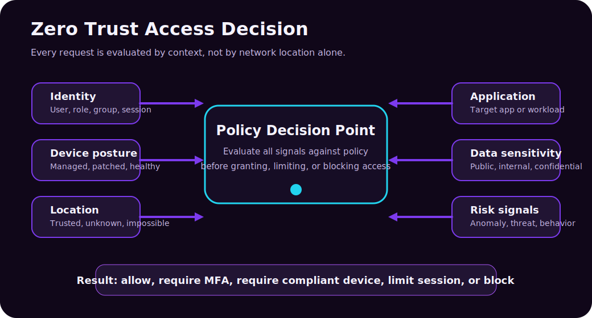
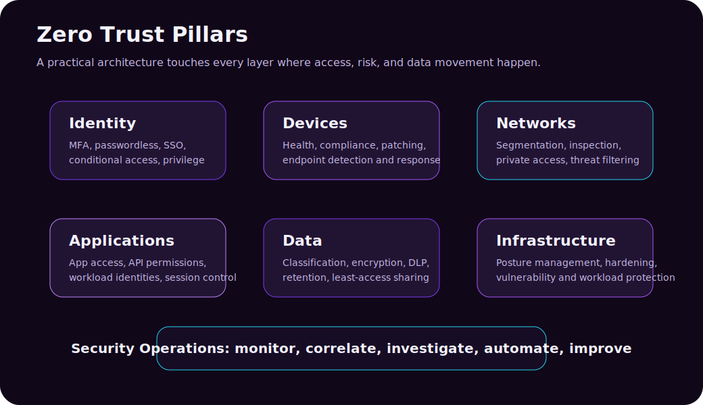
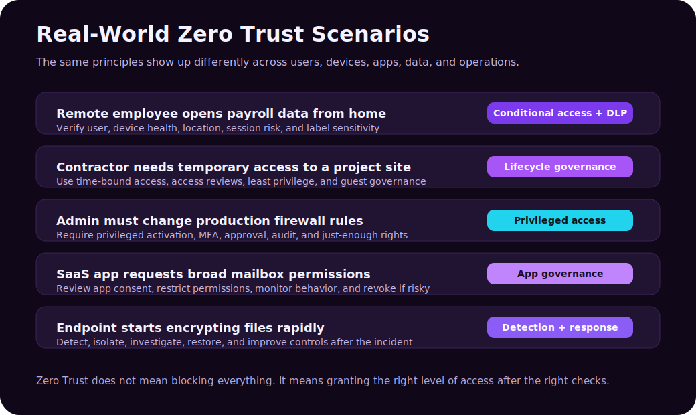

Zero Trust is one of those cybersecurity terms that gets repeated so often it can start to sound like a slogan. "Never trust, always verify" is memorable, but it is not enough by itself. Real Zero Trust is not a product you buy, a firewall rule you enable, or a VPN replacement you install over a weekend. It is a security model for deciding who can access what, from which device, under what conditions, and for how long.

The old security model assumed that the corporate network was mostly trustworthy. If you were inside the office or connected to the VPN, you were often treated as safer than someone outside. That made more sense when apps lived in the datacenter, employees worked from offices, and most sensitive data stayed on internal file servers.

That world is gone. Users work from anywhere. Applications live in SaaS platforms, public cloud, private datacenters, and third-party APIs. Devices may be managed laptops, personal phones, virtual desktops, or workloads running in the cloud. Attackers know this, so they target identities, tokens, devices, and misconfigured permissions instead of only trying to break through a perimeter firewall.

Zero Trust is the answer to that reality: **do not grant access because a request appears to come from a trusted network. Grant access because the request has been verified, authorized, limited, monitored, and continuously evaluated.**

> **Reading path:** Start with the core security model, connect it to the real-world scenario, and finish with the controls or checklist that make the idea actionable.

---

## What Zero Trust Actually Means

NIST describes Zero Trust as a model where trust is never implicit and every request to access a resource is evaluated. Microsoft summarizes the operating model with three principles:

| Principle | Plain-English Meaning | Practical Example |
|---|---|---|
| Verify explicitly | Use all available context before granting access | Check identity, MFA, device health, location, risk, app, and data sensitivity |
| Use least privilege access | Give only the access needed, only when needed | Use just-in-time admin roles instead of permanent global admin rights |
| Assume breach | Design as if one control may fail | Segment access, monitor behavior, detect threats, and limit blast radius |

Zero Trust is not saying "trust nobody ever." Security systems still make trust decisions all day. The difference is that trust is **earned by context** instead of inherited from network location.

For example, compare these two access decisions:

| Old Perimeter Thinking | Zero Trust Thinking |
|---|---|
| "The user is on the VPN, so allow the file share." | "Who is the user, is MFA satisfied, is the device compliant, is the location normal, is the file sensitive, and does the user need this access?" |
| "The server is internal, so other internal servers can talk to it." | "Which workload identity is calling the API, what permission does it have, is the connection encrypted, and is the behavior normal?" |
| "Admins are trusted people." | "Admin sessions need stronger authentication, approval, time limits, monitoring, and only the permissions required." |

The security shift is subtle but huge: Zero Trust makes access **resource-centric and risk-aware**.

---

## Why Zero Trust Became Necessary

Zero Trust is not popular because security teams wanted another framework. It became necessary because the environment changed.

| Change | Why It Breaks Old Security |
|---|---|
| Remote and hybrid work | The office network is no longer the default place where work happens |
| SaaS adoption | Important data lives in Microsoft 365, Google Workspace, Salesforce, GitHub, ServiceNow, and other cloud services |
| Cloud infrastructure | Workloads are dynamic, distributed, and often internet-reachable |
| BYOD and mobile access | Personal devices may access work data if not governed properly |
| Identity-based attacks | Phishing, token theft, MFA fatigue, consent phishing, and password reuse target accounts directly |
| Ransomware and lateral movement | Once attackers get inside, flat networks and overprivileged accounts help them spread |
| Third-party collaboration | Partners and contractors need access without becoming permanent internal users |

In the older model, the perimeter was the main defensive line. In modern environments, the new perimeter is a combination of **identity, device posture, application policy, data protection, and continuous monitoring**.

---

## The Seven Practical Pillars

Different frameworks group Zero Trust slightly differently. CISA emphasizes identity, devices, networks, applications and workloads, and data, with visibility, automation, and governance across them. Microsoft often expands the model to include identity, endpoints, apps, data, infrastructure, network, and security operations.

For practical IT work, this seven-pillar map is useful:

| Pillar | What Zero Trust Looks Like |
|---|---|
| Identity | MFA, passwordless, single sign-on, conditional access, identity protection, access reviews |
| Devices | Device compliance, endpoint detection, patching, encryption, health checks |
| Networks | Segmentation, private access, firewalling, traffic inspection, reduced implicit trust |
| Applications | App access control, API permissions, workload identities, session control |
| Data | Classification, encryption, DLP, retention, least-privilege sharing |
| Infrastructure | Secure configuration, vulnerability management, cloud posture management, workload protection |
| Security operations | Logging, alerting, incident correlation, hunting, automation, continuous improvement |

You do not become "Zero Trust" because one pillar is strong. If identity is hardened but data can be freely downloaded to unmanaged devices, the model is incomplete. If network segmentation is good but privileged access is permanent and unmonitored, the model is incomplete. Zero Trust is an ecosystem.

---

## Real-World Example 1: Remote Employee Accessing Payroll Data

Imagine an HR employee working from home. They open a payroll spreadsheet stored in a cloud document platform.

In a perimeter-first world, the rule might be:

> User connected through VPN, so allow access.

In a Zero Trust world, the access decision asks more questions:

| Signal | Example Check |
|---|---|
| Identity | Is this really the HR employee? Did they complete MFA? |
| Device | Is the laptop managed, encrypted, patched, and compliant? |
| Location | Is the sign-in from the user's normal region? |
| Risk | Is the sign-in behavior unusual or associated with known threat indicators? |
| App | Is the user accessing the expected document platform? |
| Data | Is the file labeled confidential or containing payroll information? |
| Session | Should download, copy/paste, or external sharing be restricted? |

A reasonable Zero Trust policy might allow the user to view the payroll file only if the device is compliant and MFA is satisfied. If the user is on an unmanaged personal device, the policy might allow browser-only access but block downloads. If the sign-in comes from a risky location, the policy might require stronger authentication or block the session.

That is the practical value of Zero Trust: it does not treat all access as equal.

---

## Real-World Example 2: Contractor Access to a Project Site

A contractor joins a three-month project and needs access to a Teams channel, a SharePoint folder, and one project management app.

The old pattern is dangerous:

1. Create a guest account.
2. Add the contractor to broad groups.
3. Forget to remove access after the project ends.

A Zero Trust design is cleaner:

| Control | How It Helps |
|---|---|
| Guest identity governance | The contractor is treated as an external identity with limited access |
| Access package | The contractor receives only the project resources they need |
| Approval workflow | A project owner approves access |
| Expiration date | Access automatically expires after the project |
| Access review | The owner periodically confirms whether access is still needed |
| Conditional Access | External users may require MFA and have stricter session controls |

The important Zero Trust idea is not "never collaborate." It is **collaborate with boundaries**.

---

## Real-World Example 3: Privileged Admin Changing Production Settings

Administrator accounts are high-value targets. If a normal user account is compromised, the damage may be limited. If a privileged account is compromised, the attacker may disable security tools, create new accounts, exfiltrate data, or change infrastructure.

Zero Trust treats privileged access as temporary, visible, and controlled.

| Admin Risk | Zero Trust Control |
|---|---|
| Permanent high privilege | Just-in-time role activation |
| Too many permissions | Just-enough access and scoped roles |
| Weak sign-in | Phishing-resistant MFA or passwordless authentication |
| Unapproved changes | Approval workflow and change records |
| No accountability | Audit logs, session monitoring, and alerts |
| Admin from unmanaged device | Require compliant privileged access workstation |

Example: an engineer needs to change an Azure firewall rule. Instead of being a permanent Owner on the subscription, they activate a privileged role for one hour, complete MFA, provide a justification, make the change, and leave an audit trail.

Least privilege is not only about reducing permissions. It is also about reducing **time**, **scope**, and **blast radius**.

---

## Real-World Example 4: SaaS App Asking for Mailbox Permissions

Consent phishing is a real problem. An attacker may trick a user into granting a malicious app permission to read mail, files, or contacts. The user may never type their password into a fake site, but the attacker still gains access through OAuth permissions.

Zero Trust expands beyond user sign-in and checks application permissions too.

| Question | Why It Matters |
|---|---|
| Who published the app? | Unknown publishers are higher risk |
| What permissions does it request? | "Read all mail" is far more sensitive than "sign in and read profile" |
| Who can consent? | Users should not be able to approve risky tenant-wide permissions |
| Is the app still used? | Unused app permissions should be removed |
| Is behavior normal? | A newly approved app exporting mailbox data is suspicious |

A good policy may require administrator approval for high-risk permissions, restrict user consent, review enterprise applications regularly, and monitor app behavior.

Zero Trust is not only about people. **Applications and workload identities need governance too.**

---

## Real-World Example 5: Workload Identity Calling a Cloud API

Modern systems often communicate service-to-service. A background job reads from a queue, calls an API, writes to storage, and updates a database. No human is signing in, but identity still matters.

Bad pattern:

A weak workload-identity design stores a long-lived secret in a configuration file, grants it broad permissions, never rotates it, and leaves poor evidence of which workload used it.

Better Zero Trust pattern:

| Control | Why It Helps |
|---|---|
| Managed identity or workload identity federation | Reduces stored secrets |
| Scoped permissions | The workload can access only the specific resources it needs |
| Short-lived tokens | Limits usefulness of stolen credentials |
| Network restrictions | API access is limited to expected paths |
| Logging and anomaly detection | Unexpected calls can trigger investigation |

This is where Zero Trust becomes architecture, not just policy. Services should authenticate to each other, use least privilege, and be observable.

---

## Real-World Example 6: Ransomware Starts Moving Laterally

Zero Trust does not promise that attackers will never compromise anything. One of its core principles is **assume breach**. The question becomes: if one account, device, or workload is compromised, how much damage can it do?

In a flat environment, a compromised endpoint may reach many file shares, servers, and admin interfaces. In a Zero Trust environment, several controls reduce the blast radius:

| Phase | Useful Controls |
|---|---|
| Initial access | MFA, phishing-resistant auth, email protection, browser isolation |
| Execution | Endpoint detection, application control, local admin restrictions |
| Lateral movement | Network segmentation, identity protection, privileged access controls |
| Data access | Least privilege, sensitivity labels, DLP, conditional session controls |
| Detection | SIEM/XDR correlation, suspicious behavior analytics |
| Response | Isolate device, revoke sessions, disable account, rotate secrets |

The goal is not magical prevention. The goal is to make compromise harder, movement slower, detection faster, and recovery cleaner.

---

## Zero Trust vs Defense in Depth

Zero Trust and defense in depth are related, but they are not the same thing.

| Concept | Meaning |
|---|---|
| Zero Trust | A security strategy for continuously verifying access to resources |
| Defense in depth | A layered control design that assumes one control may fail |

You can think of Zero Trust as the access philosophy and defense in depth as the layered implementation.

For example:

- Zero Trust says: verify the user and device before access.
- Defense in depth says: also protect the endpoint, segment the network, classify the data, monitor behavior, and prepare incident response.

Together, they produce resilient security.

---

## What Zero Trust Is Not

Zero Trust is often misunderstood. These misconceptions create bad implementations.

| Misconception | Reality |
|---|---|
| "Zero Trust means no one is trusted." | Trust is granted dynamically after verification. |
| "Zero Trust means remove the VPN." | VPN may still exist, but access should not depend only on VPN membership. |
| "Zero Trust is a product." | Products implement controls, but Zero Trust is an architecture and operating model. |
| "Zero Trust blocks productivity." | Good policy enables safe access with the least friction needed. |
| "Zero Trust is only for large enterprises." | Small teams can start with MFA, least privilege, device health, and logging. |
| "Zero Trust is only identity security." | Identity is central, but devices, apps, data, infrastructure, networks, and operations all matter. |

The worst version of Zero Trust is a branding exercise: buy tools, rename policies, and leave the same overprivileged access underneath. The useful version changes how access is designed and reviewed.

---

## A Practical Implementation Roadmap

Zero Trust works best as an incremental program. Trying to redesign every control at once usually fails. Start with the highest-value resources and the riskiest access paths.

### Step 1: Know What You Are Protecting

Inventory the important assets:

The key items here are Identity systems, Email and collaboration data, Source code repositories, Production infrastructure, Databases and storage accounts, Admin consoles, Sensitive documents, and Critical SaaS applications.

Zero Trust is resource-centric. If you do not know the resources, you cannot design access properly.

### Step 2: Strengthen Identity First

Start with identity because most modern attacks touch accounts, tokens, sessions, or permissions.

Good first moves:

- Require MFA for all users.
- Use phishing-resistant MFA for admins and high-risk users.
- Block legacy authentication where possible.
- Centralize sign-in through a trusted identity provider.
- Monitor risky users and risky sign-ins.
- Review privileged roles.

### Step 3: Reduce Standing Privilege

Permanent high privilege is convenient until it is compromised.

Reduce it with:

The key items here are Role-based access control, Just-in-time privilege, Just-enough access, Separate admin accounts, Approval workflows for sensitive actions, and Regular access reviews.

### Step 4: Add Device and Session Conditions

A user with valid credentials on an infected or unmanaged device is still risky.

Useful controls:

- Require managed or compliant devices for sensitive apps.
- Enforce disk encryption and endpoint protection.
- Limit browser sessions from unmanaged devices.
- Block downloads for highly sensitive data.
- Require reauthentication for risky activity.

### Step 5: Protect Data Directly

Data protection should follow the data, not only the network.

Examples:

- Classify sensitive documents.
- Apply sensitivity labels.
- Encrypt highly sensitive files.
- Use DLP to prevent unsafe sharing.
- Audit access and sharing activity.
- Retain regulated records according to policy.

### Step 6: Monitor and Respond

Zero Trust needs feedback. If you cannot see access activity, you cannot improve policy.

Collect and correlate:

The key items here are Sign-in logs, Endpoint alerts, Cloud app activity, Admin changes, Data access and sharing events, Network and workload telemetry, and Security incidents.

Then automate common responses where safe: revoke sessions, isolate devices, disable accounts, require password reset, open tickets, or trigger investigation workflows.

---

## Example Policy Matrix

Here is a simple way to translate business risk into access policy.

| Resource | User Context | Device Context | Data Sensitivity | Access Decision |
|---|---|---|---|---|
| Public intranet page | Any employee | Any device | Low | Allow after normal sign-in |
| HR payroll folder | HR group | Managed and compliant | High | Require MFA, block unmanaged downloads |
| Production admin portal | Approved admin | Privileged workstation | Critical | Require phishing-resistant MFA and JIT role |
| Source code repo | Engineering group | Managed or approved dev device | High | Require MFA, monitor cloning/export |
| Customer records app | Support role | Compliant device | Regulated | Require MFA, restrict export, audit access |
| Contractor project site | Approved external user | Any browser | Medium | Time-bound access, MFA, session restrictions |

This is why Zero Trust is more precise than a simple allow/deny perimeter. It lets access vary based on risk.

---

## Common Mistakes

| Mistake | Why It Hurts |
|---|---|
| Rolling out MFA but ignoring admin privilege | Attackers can still abuse overprivileged accounts |
| Treating the VPN as a trust boundary | A compromised VPN user may still move laterally |
| Forgetting non-human identities | Workload secrets and app permissions can be powerful attack paths |
| Overblocking users without context | Users will find workarounds if policy is too blunt |
| Ignoring data classification | You cannot protect sensitive data well if you do not know what is sensitive |
| Not logging decisions | You need evidence for troubleshooting, detection, and compliance |
| Making exceptions permanent | Exceptions become the real policy over time |

Zero Trust should make access smarter, not merely harder.

---

## A Simple Checklist

Use this as a quick readiness check:

| Question | Good Sign |
|---|---|
| Do all users have MFA? | MFA is enforced, with stronger methods for privileged roles |
| Are admin roles permanent? | Privilege is time-bound, approved, and audited |
| Do unmanaged devices access sensitive data? | Sessions are limited or blocked based on device posture |
| Are applications reviewed? | App consent and permissions are governed |
| Are workload identities scoped? | Services use managed identities or short-lived credentials where possible |
| Is sensitive data classified? | Labels, DLP, and retention policies exist for high-value data |
| Can the SOC see access activity? | Logs flow into SIEM/XDR with useful alerts |
| Are exceptions reviewed? | Exceptions expire or are periodically recertified |

If you can answer these honestly, you are already thinking like a Zero Trust architect.

---

## Practical Summary

Zero Trust is not a magic switch. It is a way of making access decisions that matches modern IT: cloud apps, remote users, mobile devices, external partners, APIs, and constant identity-based attacks.

The simplest mental model is this:

1. Identify the resource.
2. Verify the requester.
3. Evaluate the device, app, data, location, and risk.
4. Grant the least access needed.
5. Monitor continuously.
6. Assume something may fail and limit the blast radius.

That is Zero Trust in real life: not paranoia, not product marketing, but disciplined access design.

---

## Sources

- [NIST SP 800-207: Zero Trust Architecture](https://csrc.nist.gov/pubs/sp/800/207/final)
- [CISA Zero Trust Maturity Model](https://www.cisa.gov/resources-tools/resources/zero-trust-maturity-model)
- [Microsoft Learn: Zero Trust as a security foundation](https://learn.microsoft.com/en-us/security/zero-trust/zero-trust-overview)
- [Microsoft Learn: Zero Trust Guidance Center](https://learn.microsoft.com/en-us/security/zero-trust/)
- [Microsoft Learn: Zero Trust deployment for technology pillars](https://learn.microsoft.com/en-us/security/zero-trust/deploy/overview)
- [Microsoft Learn: Zero Trust security in Azure](https://learn.microsoft.com/en-us/azure/security/fundamentals/zero-trust)
- [Microsoft: Zero Trust security and strategy](https://www.microsoft.com/en-us/security/business/zero-trust)
